# Git & GitHub

* * *

## Git setup

1.  Check that you have Git installed:

```bash
$ git --version
```

2.  Sign up for an account on GitHub.com
3.  Send your GitHub username to Oli on Slack
4.  Check you have SSH keys setup for **passwordless ease**:

```bash
$ ssh git@github.com
"Hi [username]! You've successfully authenticated, but GitHub does not provide shell access."
```

### Key generation

1.  Create an SSH key pair (unless you have already):

```bash
$ ssh-keygen -t rsa -b 4096 -C "email@domain.com"
```

2.  To output your public key:

```bash
$ cat ~/.ssh/id_rsa.pub
```

3.  Then add key to your GitHub account in <https://github.com/settings/ssh>

4.  Test your key with:

```bash
$ ssh git@github.com
```

[Full instructions are here](https://help.github.com/articles/connecting-to-github-with-ssh/)

#### Make sure your identity is set so that Git knows who your commits are made by:

1.  Run the command:

```bash
$ git config --global core.editor "nano"
```

2.  Run the command:

```bash
$ git config --global --edit
```

3.  Edit values as required, uncomment (remove #)

4.  Then, to save and exit, **Control+X, Y (to confirm), Enter**

5.  If you'd like a more familiar editor for Git documents, you can run:

```bash
$ git config --global core.editor "atom"
```

* * *

## What is Git?

A tool (software) that allows us to:

-   keep track of how files change over time (our code)
-   version manage anything (text files, video, images)
-   run everything on the command line (Graphical User Interfaces, or GUI's are available)

### Module Outline

-   Introduction to version management
-   Git architecture and how it works
-   Basic Git commands
-   Git in the real world, giving it a go!
-   Best practice for use
-   Git workflows and project strategy
-   Workflows applied

### Why version manage?

#### Why use an extra tool and process?

-   Control
-   Visibility
-   Predictability
-   Collaboration

### Editing files directly on server

#### Drawbacks of working directly on server

-   no ability to automatically rollback changes
-   requires you to manage keeping backups and different versions of files
    high risk!
-   working with multiple contributors is tricky

#### Drawbacks of working with FTP

-   no ability to automatically rollback changes
-   requires you to manage keeping backups and different versions of files
-   manually keep track of which files have changed and need to be uploaded
-   slow, uploading and downloading each time
-   working with multiple contributors gets messy quickly

#### Working with version management

-   each version of files in the project has a snapshot, and can be reverted to at any point
-   automatically keeps track of which files have changed and need to be uploaded
-   changes have an audit log, who made what change when

### Version control: the basics

Let's say we're editing a text document.
Having multiple people editing the document is fine, as long as people edit the same document sequentially. If two people start editing different copies of the document, then someone has to manually combine the changes. What happens if the changes overlap?

* * *

## Why use git?

-   Git is the most widely used source code management tool

-   1/3 of professional software developers reporting use Git or GitHub as their primary source control system

-   Excellent tooling support, supporting existing workflows and editors

Git stores snapshots, not differences

### Git architecture

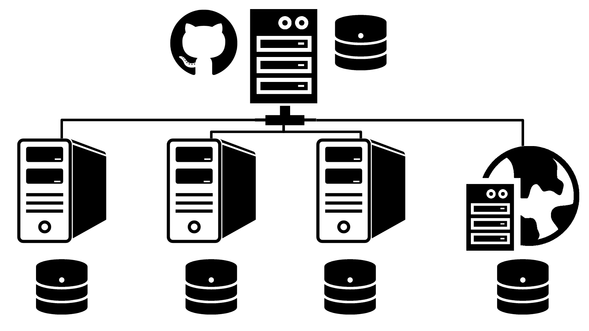

### Git behaviour

#### Most operations are local

-   rolling back to early snapshot
-   creating a branch
-   creating a new snapshot
-   merging branches

Reduces requests over network, increases speed and efficiency, allows working offline

### Git has integrity

-   Everything is check-summed before storage
-   Snapshots are referred to by that checksum
-   Impossible to change the contents of any file or directory without Git knowing about it
-   Checksumming is SHA-1 hash, producing 40-character string, for example:`24b9da6552252987aa493b52f8696cd6d3b00373`

### Git only _adds_ data, it (almost) never _removes_ anything

-   Actions in Git (almost) only ever add data to the Git database
-   It is hard to get the system to do anything that is not undoable or to make it erase data in any way
-   Only way you can lose or mess up changes is if you haven’t pushed your work yet
-   Great safety net for trying things out, and rolling back
-   After you commit a snapshot it is very difficult to lose data, especially if you regularly push to a remote repository

* * *

## Git Terminology

#### repository / repoproject

files and a versioning database, in our example this is hosted on GitHub, but can be hosted on any Git server or your local machine

#### fetch

fetching file versions and information from central repository server, e.g. GitHub

#### checkout

switch your project directory to a certain version of the project, replaces version managed files with the versions from this point in time

#### commit

create a point in time version of the current state of the project files

#### push

push your snapshots (work), to the central project repository, to allow other people to pull and checkout your changes

#### pull

pulling down from the central project repository and updating the branch you are working on

* * *

## Basic workflow

### Common workflow

1.  Make changes
2.  Commit work
3.  Push work
4.  Pull other people's work

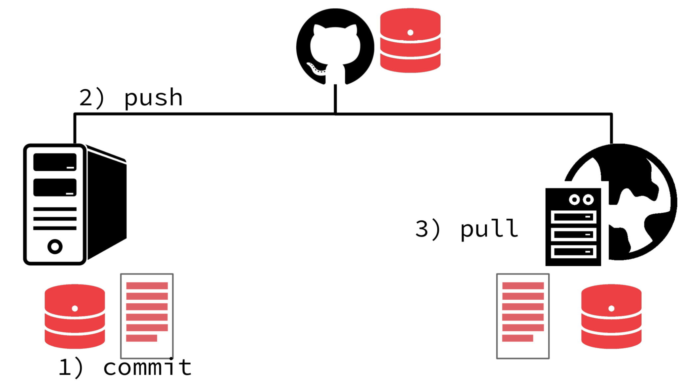

* * *

## Getting started

### New project process

1.  Set up a project on GitHub
2.  Set up project folder locally
3.  Start version managing your folder
4.  Add the remote repository
5.  Make changes
6.  Commit changes
7.  Push changes

* * *

## Exercise 1

### What are we going to do?

1.  Create a project repository on our GitHub accounts
2.  Create a project directory on your machine
3.  Start version managing it with Git
4.  Add a remote repo
5.  Start adding files to our project
6.  Add and commit those files
7.  Push those files to GitHub
    make changes to the files and commit them

### To consider: our first commit

There can be only 1 first commit on a project, so you should plan for this to either be:

1.  On GitHub, by creating a repository with a README.md or another file in it, or

2.  On your computer, doing your first commit in the project folder

### Steps you'll need to take

1.  Make a new project directory
2.  `cd` into your project folder, by running the following command:

    ```bash
    $ cd /path/to/project
    ```

    ...then hit enter.

**Pro tip:** drag folder into terminal to get the path

### Commands we'll need

#### Option 1: first commit on GitHub

```bash
# run as separate commands
$ git init
$ git remote add origin {repository URL, starts git@github.com….}
$ git fetch
$ git checkout master
$ git add {filename}
$ git commit -m "adding my first file"
$ git push
```

#### Option 2: first commit on your computer

```bash
# run as separate commands
$ git init
$ git remote add origin {repository URL}
$ git add {filename}
$ git commit -m "adding my first file"
$ git push
```

#### Using the GitHub interface

Now go to GitHub to see that the your file is there.

### Editing files

#### Edit, commit, push

1.  Make a change to your files

2.  Run the following in command line to stage that change:

```bash
$ git add {filename}
```

3.  Then commit it with:

```bash
$ git commit -m "some message"
```

4.  Finally, push your commit(s) to GitHub:

```bash
$ git push
```

Then go to GitHub to see that the change is reflected there.

### Git cheat sheet

`git init`

initialize (start) git handling in the current directory

`git remote add origin {repository URL}`

add the remote repo location (GitHub)should be SSH version, starting git@github.com...

`git fetch`

fetches all branches and revisions, to your local machine

`git checkout master`

change your project code to the most recent snapshot in the master branch

`git add *`

adds all files to be version managed

`git add {filename}`

add a specific file to be version managed

`git commit -a -m 'message'`

creates a point-in-time snapshot of all changed tracked files (-a), with commit message (-m)

`git commit -m 'message'`

creates a point-in-time snapshot of all files that have been added to staging, with commit message (-m)

`git status`

see what state your files are in

`git rev-parse HEAD`

`git reflog`

### Command line cheat sheet

`pwd`

print working directory, where am I now?

`cd {directory name}`

change/move to working directory

`mkdir {directory name}`

create a new directory

`git clone {repository URL} {folder to create}`

Create a folder, checkout project into it

* * *

## Exercise 2

### What are we going to do?

1.  Create a project directory on your machine

2.  Start version managing it with Git

3.  Add a remote repo that already exists

4.  Fetch and checkout master branch on the project

5.  Make changes, stage changes and commit them

6.  Preview changes in browser

7.  Don't do git push yet


### Steps you'll need to take

1.  Make a new project directory on your machine

2.  `cd` into your project folder, then hit enter.

    ```bash
    $ cd /path/to/project
    ```

3.  Initialise git

    ```bash
    $ git init
    ```

4.  Add remote repository to local machine

    ```bash
    $ git remote add origin git@github.com:develop-me/git-simple.git
    ```

5.  Fetch repo branches and information

    ```bash
    $ git fetch
    ```

6.  Checkout the master branches

    ```bash
    $ git checkout master
    ```

Alternative (and quicker method):

```bash
$ git clone git@github.com:develop-me/git-simple.git {folder name}
```

### Steps you'll need to take

1.  Make changes to files

2.  Review what has changed with

```bash
$ git status
```

3.  Stage changes with

```bash
$ git add *
```

4.  Commit changes with

```bash
$ git commit -m "my change message"
```

5.  Preview changes in browser by viewing index.html

6.  Experiment with both

```bash
$ git commit -am "message"
```

and

```bash
$ git commit -a -m "message"
```

* * *

## Git in teams

`git push`

pushes commits to the remote repository for others to access

`git pull`

pull changes on current branch down from the repository and update working directory to that snapshot

`conflict`

Git is pretty good at merging together various changes from different parts of a file, but sometimes there are overlapping changes. In this situation Git will warn you and you’ll need to fix the conflict yourself.

### Push rejection

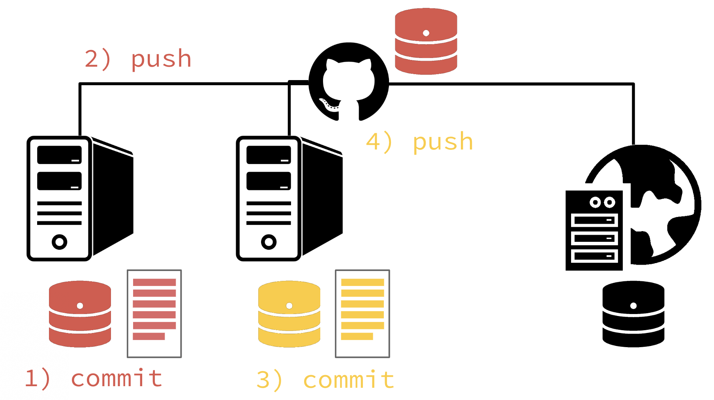

```bash
$ git push
To git@github.com:develop-me/bdf.git
 ! [rejected]        master -> master (non-fast-forward)
error: failed to push some refs to 'git@github.com:develop-me/bdf.git'
hint: Updates were rejected because the tip of your current branch is behind
hint: its remote counterpart. Merge the remote changes (e.g. 'git pull')
hint: before pushing again.
hint: See the 'Note about fast-forwards' in 'git push --help' for details.
```

### Conflicts

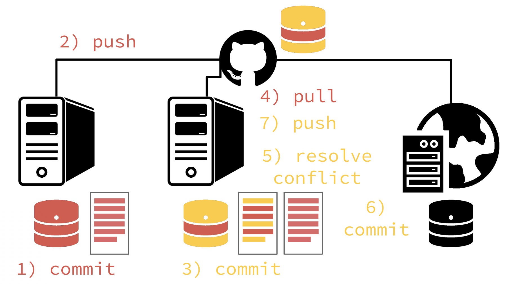

```bash
$ git pull
From github.com:develop-me/bdf
 * branch            master     -> FETCH_HEAD
Auto-merging README.md
CONFLICT (add/add): Merge conflict in README.md
Automatic merge failed; fix conflicts and then commit the result.
```

```bash
$ git status
On branch master
You have unmerged paths.
  (fix conflicts and run "git commit")

Unmerged paths:
  (use "git add <file>..." to mark resolution)

	both added:         README.md
```

### Editing conflicted file

```html
<<<<<<< HEAD
I made these changes to the file.
=======
But someone else made these changes
8dsk329cxlsd93 >>>>>>>
```

### Auto-merge commit message

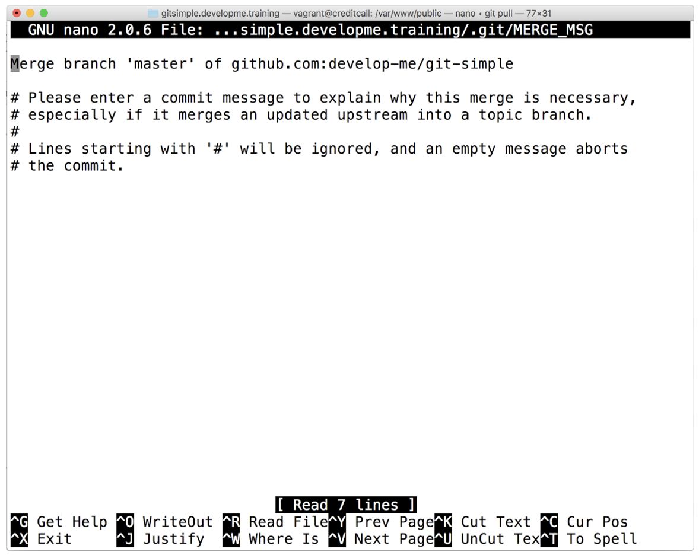

When doing git pull leads to an automatic merge you sometimes get stuck in Vim editor, to get out:

```bash
$ :q [Enter]
```

Git creates a new snapshot after the files have been merged, and this is Git's way of giving you the chance of setting a commit message:

```bash
$ 'Merge branch 'master' of...'
```

* * *

## Exercise 3

Now we're going to start using git push to move our commits up to GitHub, and git pull to get other people's work.

You'll start to get:

-   push rejections (when other people have changed GitHub while you've been working)
-   automatic merges (when others have changed the same file, but a different part)
-   conflicts (where you've both edited the same part of a file)

Starting to push and pull

#### Best Practice

-   communication
-   keep up-to-date with remote (GitHub), by pulling frequently
-   don’t commit credentials/configs - security and environment-dependant

#### Useful commit messages

Be thoughtful when submitting commit messages. Make them clear, and informative for another developer reading them. Consider:

> “another update”

vs.

> “previous styling changes had an issue on Safari mobile, this CSS hack will resolve”

Additional resources:

-   [GDS Git style guide](https://github.com/alphagov/styleguides/blob/master/git.md)
-   [How to Write a Git Commit Message](https://chris.beams.io/posts/git-commit/)
-   [5 Useful Tips For A Better Commit Message](https://thoughtbot.com/blog/5-useful-tips-for-a-better-commit-message)

### Use Git to move or delete files

```bash
# move file
$ git mv {file} {directory}
# delete file and stage deletion
$ git rm {file}
# Remove file from tracking, but retain the file
$ git rm --cached README
```

**Add to .gitignore file** - Ensure file is not added back into tracking in future

* * *

## Git branches

A valuable tool for your development workflow

Can be used in many different ways, for different purposes

#### branch

A single development stream, or split in the project, allowing you to try things out or develop features without affecting other work.

#### merge

Merging of two branches together, for example, your experimental branch back into the normal working branch, to release that experimental code

### Git cheat sheet

```bash
$ git branch my-experimental-branch
```

This creates a new branch from the current commit

```bash
$ git checkout my-experimental-branch
```

This checks out your new 'my-experimental-branch' branch for working on (switches your active branch, so new commits go onto this branch)

```bash
$ git push origin my-experimental-branch
```

This pushes your new branch to the remote repository for others to use

For subsequent changes you can use the command to push only changes to your working branch to the remote, else it will also try to push changes to all other branches too, e.g. master

### Merging branches

```bash
$ git checkout master
```

move to working on the master branch

```bash
$ git pull
```

make sure your master branch is up-to-date

```bash
$ git merge my-experimental-branch
```

merge the my-experimental-branch into master

```bash
$ git branch -a
```

list the branches that exist locally and remotely, with \* for current working branch

```bash
$ git branch -d my-experimental-branch
```

delete local branch, use -D to force

```bash
$ git push origin :my-experimental-branch
```

delete remote branch

### Overwriting one branch with another

Forcibly overwrite the master version with the reset-branch, replacing the master code with reset-branch without merging (replaces all files):

```bash
$ git checkout reset-branch
$ git merge -s ours master
$ git checkout master
$ git merge reset-branch
```

### Full branching process

#### Branch & merge process

```bash
# 1
$ git checkout master
# 2
$ git pull
# 3
$ git branch my-experimental-branch
# 4
$ git checkout my-experimental-branch
# 5
[Do the work]
# 6
$ git commit -am "commit message"
# 7
$ git push origin my-experimental-branch
# 8
$ git checkout master
# 9
$ git pull
# 10
$ git merge my-experimental-branch
# 11
$ git push
```

* * *

## Exercise 4

### What are we going to do?

1.  Create a branch and check it out
2.  Make some changes on that branch
3.  Merge that branch back into master
4.  Push those changes
5.  Review the [network graph](https://github.com/develop-me/git-simple/network) to help you understand branch history

* * *

## Workflows

### Planning and choosing a workflow

Which workflow to use depends on:

-   Team structure
-   Project requirements
-   Project roadmap

### Considerations

#### Who?

-   Who’s going to work on what? Task delegation/ownership.
-   Can the project work be chopped up into chunks/tasks?
-   Is there a clear delegation based on team roles? Front-end, back-end, tech lead.

#### When?

-   What is the project timeline?
-   What are the milestones?
-   Are certain tasks dependant on others?
-   When are things going live?

#### How?

-   Is that work going to be reviewed? How?
-   How is it going to be tested?
-   How is it going merged and deployed?

#### Other considerations

-   Are we releasing in phases?
-   What happens if there’s a bug in the live system?
-   Have we got a branch setup that supports hot-fixes? Or are we working straight on master with new features? Or merging back into master for testing?

* * *

## Git workflows

1.  Centralized Workflow
2.  Feature Branch Workflow
3.  Gitflow Workflow
4.  Forking Workflow

### 1. Centralised workflow

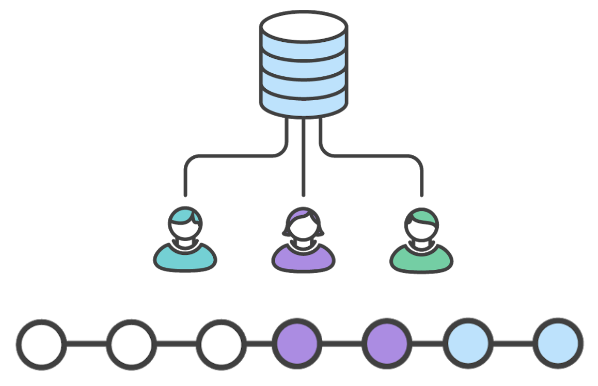

More info at <https://www.atlassian.com/git/tutorials/comparing-workflows>

### 2. Feature branch workflow

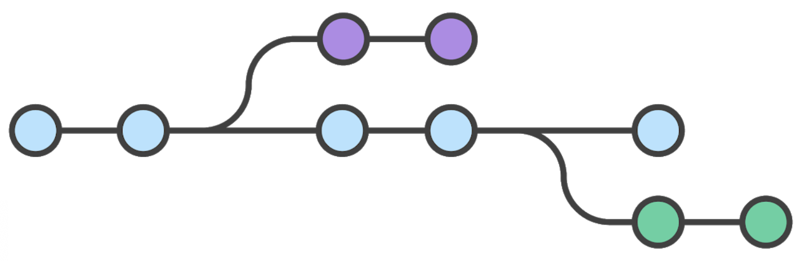

All feature development takes place in a dedicated branch instead of the master branch, with branches merged back into master when ready.

#### Feature branch workflow features

-   Adding feature branches to your development process is an easy way to encourage collaboration and streamline communication
-   Easy for multiple developers to work on a particular feature without disturbing the main codebase.
-   **master** branch will never contain broken code, good for continuous integration environments.

#### Pull requests

You can then use pull requests, which are a way to initiate discussions around a branch.

This gives other developers or lead developer the opportunity to sign off on a feature before it gets integrated into the official project.

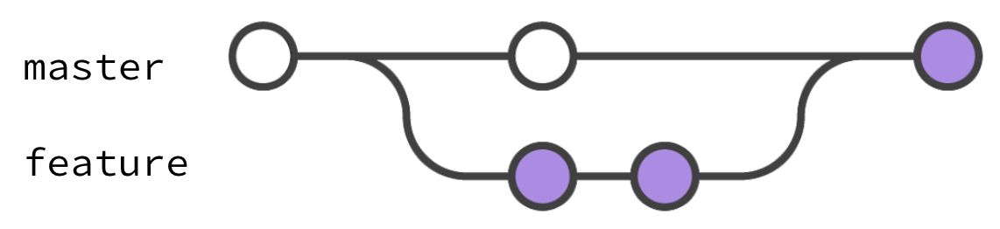

#### The process with pull requests

```bash
# 1
$ git checkout master
# 2
$ git pull
# 3
$ git branch my-feature-branch
# 4
$ git checkout my-feature-branch
# 5
[do work]
# 6
$ git commit -am "commit message"
# 7
$ git push origin my-feature-branch
# cont'd below
```

`# 8`
Go to GitHub

`# 9`
Find your branch in Code > Branches

`# 10`
Create pull request for your branch

#### To receive notifications on pull request

1.  Watch the repository

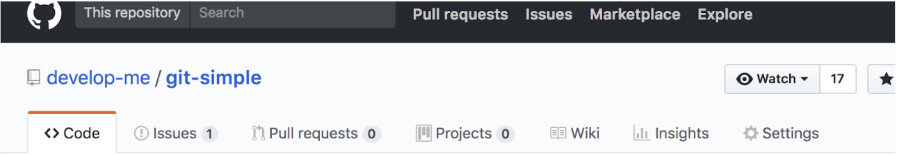

2.  Update your notification settings at [https://github.com/settings/notifications](https://github.com/settings/notifications)

* * *

## Exercise 5

### What are we going to do?

1.  Assign a Tech Lead to review PRs
2.  Continue with feature branch workflow, but request pull requests instead of merging yourself
3.  Rotate Tech Lead

### 3. Gitflow workflow

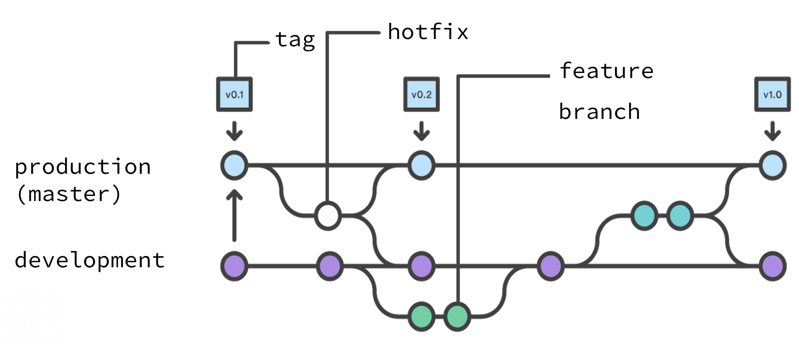

#### Gitflow workflow features

-   All development should take place in a dedicated branch instead of the **master** branch
-   New features should reside in their own branch
-   Instead of branching off of **master**, feature branches use **development** as their parent branch
-   When a feature is complete, it gets merged back into development
-   Features should never interact directly with master
-   Features go live with **development** merging to master

```bash
$ git tag v1.0
```

Tag your commit

```bash
$ git tag -a v1.4 -m 'my version 1.4'
```

Annotated Tags

```bash
$ git push origin --tags
```

Sharing (Pushing) Tags

```bash
$ git push origin <tag_name>
```

Push a single tag name to remote

#### The process with Gitflow

```bash
# 1
$ git checkout development ## Make sure you checkout development ##
# 2
$ git pull
# 3
$ git branch my-feature-branch
# 4
$ git checkout my-feature-branch
# 5
[do work]
# 6
$ git commit -am "commit message"
# 7
$ git push origin my-feature-branch
# cont'd below...
```

`# 8`
Next, go to GitHub.

`# 9`
Find your branch in Code => Branches

`# 10`
Create pull request for your branch (make sure it's going into the development branch)

`# 11`
Continue with next task (back to #1)

* * *

## Exercise 6

### What are you going to do?

Collaborate in your team using the Gitflow workflow

Discuss your working practice, and who will do what in terms of setting up and ongoing roles:

-   Tech lead / pull request reviewer (merging to development)
-   Release manager (merging to master)
-   Product owner (documenting new features)
-   Developers

#### Product Owner

-   Drives direction of the product
-   Understands our customer needs and issues
-   Creates Issues in GitHub documenting new things to be built by development team

#### Tech Lead

-   Manages development team(s)
-   Reviews their pull requests, merging feature branches into **development**

#### Release Manager

-   Schedules new product releases
-   Ensures documentation is updated, customer support teams are trained
-   Reviews pull requests merging **development** into **master**
-   Tags the commit of a new release
-   Writes release notes (in GitHub)

#### Developers

-   Takes Issues and work on them
-   Mark themselves as assignee
-   Branches from **development** branch
-   Issues pull requests back into **development** branch, with Tech Lead as reviewer

### 4. Forking workflow

Instead of using a single server-side repository to act as the “central” codebase, it gives every developer a server-side repository.

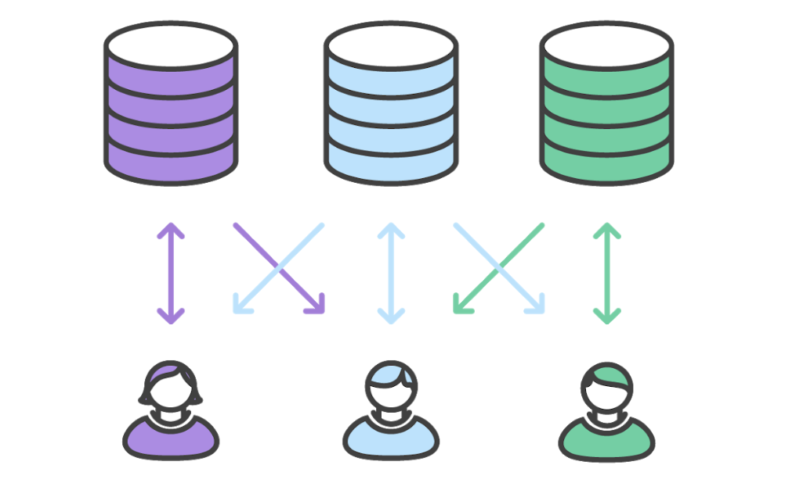

-   Contributions can be integrated without the need for everybody to push to a single central repository.
-   Developers push to their own server-side repositories
-   Only the project maintainer can push to the official repository
-   Allows the maintainer to accept commits from any developer without giving them write access to the official codebase.
-   Distributed workflow that provides a flexible way for large, organic teams (including untrusted third-parties) to collaborate securely.
-   This also makes it an ideal workflow for open source projects.

* * *

## Staged vs. Committed

### Staging

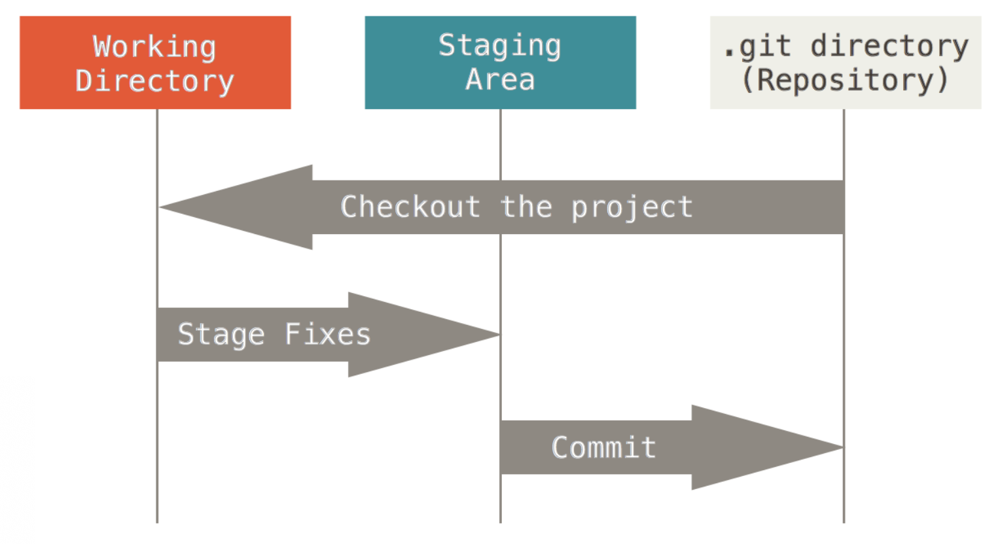

### Adding and editing files

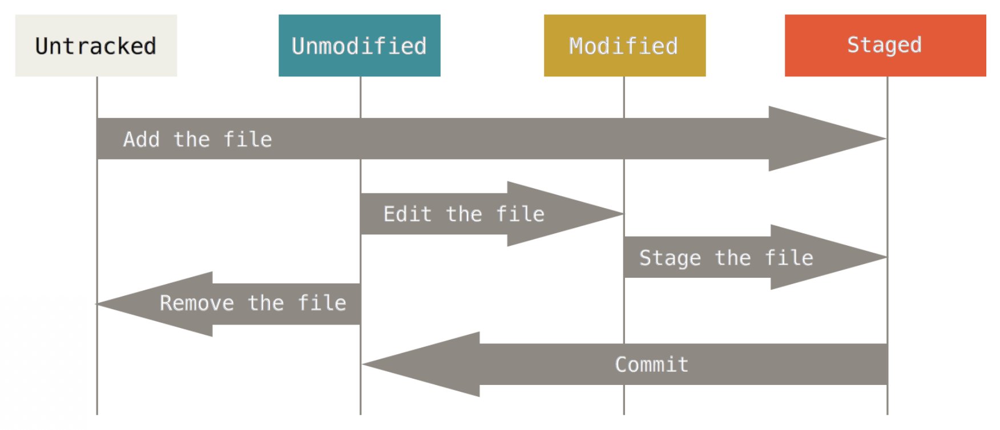

### Modified / Staged / Committed

```bash
$ git status -s

 M README
MM Rakefile
A  lib/git.rb
M  lib/simplegit.rb
?? LICENSE.txt
```

##### Left and right status columns

`MM` - left hand column represents staged changes

`MM` - right hand column represents unstaged changes

##### Status meanings

`A` - Added

`M` - Modified

`??` - Untracked

New files that aren’t tracked have a `??` next to them, new files that have been added to the staging area have an `A`, modified files have an `M` and so on. There are two columns to the output — the left-hand column indicates the status of the staging area and the right-hand column indicates the status of the working tree. So for example in that output, the `README` file is modified in the working directory but not yet staged, while the `lib/simplegit.rb` file is modified and staged. The `Rakefile` was modified, staged and then modified again, so there are changes to it that are both staged and unstaged.
