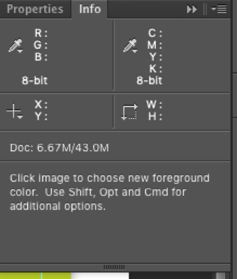

# Lesson 01: Basic HTML

---

## HTML is a data structure

- Hypertext Markup Language (sometimes referred to as just 'markup' or 'marking something up') |
- Based on XML |
- Gives the browser (environment) data (information) |
- Content layer |
	- CSS: Style layer
	- JavaScript: Interaction layer


## Elements

[https://developer.mozilla.org/en-US/docs/Web/HTML/Element](https://developer.mozilla.org/en-US/docs/Web/HTML/Element)

Note:
I'm not going to teach them all to you - I'm going to go over the ones you are going to use on a day to day basis

---

## HTML Sectioning Elements

- `<body>` Contains all content (Can only be one)
- `<header>`, `<footer>`, `<article>`, `<aside>`, `<nav>`, `<main>`
- `<div>`, `<section>`

Note:
**article:** a self-contained composition in a document, page, application, or site, which is intended to be independently distributable or reusable (e.g., in syndication). Examples include: a forum post, a magazine or newspaper article, or a blog entry.

**aside:** a portion of a document whose content is only indirectly related to the document's main content.
section: a standalone section — which doesn't have a more specific semantic element to represent it

**div:** generic container for flow content. It has no effect on the content or layout until styled using CSS


---

## Some HTML Content Elements

- `<h1`...`<h#>`
- `<p>`
- `<ul>`,`<ol>`,`<dl>`
- `<a>` needs `href` attr
- `<blockquote>`, should have a `cite` attr, `<q>`, `<cite>`
- `<pre>` = for printing out code onto your HTML page in block 
- `<code>` = printing out code (HTML elements when inline

---

- `<details`, `<summary>`
- `` needs a `src` *and* an `alt` attr
- `<button>`

---

## The data structure

- Tree structure = parent – child relationships
- Parents and children

```
<article>
	<header>
		<h1>My Website</h1>
	</header>
</article>
```

---

#

## HTML media elements

- ``, `<video>`, `<audio>`
- `<picture>`
- `<source>`
- `<figure>`, `<figcaption>`
- `<canvas>`

---

## HTML tables

To display data! NOT for layout!

```
<table>
	<tr>
		<th>Dessert</th>
		<th>Calories</th>
		<th>Fat</th>
		<th>Carbs</th>
	</tr>
	<tr>
		<td>Frozen yogurt</td>
		<td>159</td>
		<td>6.0</td>
		<td>24</td>
	</tr>
	<tr>
		<td>Ice cream sandwich</td>
		<td>237</td>
		<td>9.0</td>
		<td>37</td>
	</tr>
	<tr>
		<td>Eclair</td>
		<td>262</td>
		<td>16.0</td>
		<td>24</td>
	</tr>
</table>
```
---

# Metadata - All the stuff in the `<head>`

---
```html
<!doctype html>
<html class="no-js" lang="">
	<head>
	  <meta charset="utf-8">
	  <meta http-equiv="x-ua-compatible" content="ie=edge">
	  <title></title>
	  <meta name="description" content="">
	  <meta name="viewport" content="width=device-width, initial-scale=1, shrink-to-fit=no">

	  <link rel="manifest" href="site.webmanifest">
	  <link rel="apple-touch-icon" href="icon.png">
	  <!-- Place favicon.ico in the root directory -->

	  <link rel="stylesheet" href="css/normalize.css">
	  <link rel="stylesheet" href="css/main.css">
	</head>
```

---

## HTML5 Boilerplate

Up to date
https://html5boilerplate.com/

https://github.com/h5bp/html5-boilerplate/blob/master/src/index.html

---

```
<meta charset="utf-8">
Character set of file - different types

<meta http-equiv="x-ua-compatible" content="ie=edge">
<!--Use IE edge is available-->

<title></title>
<!--Put title of page in here-->

<meta name="description" content="">
<!--Description of page goes in content quotes-->
```

---

```
<meta name="viewport" content="width=device-width, initial-scale=1">
<!--Make sure pixel == pixel on retina and zoom works on touch-->

<link rel="apple-touch-icon" href="apple-touch-icon.png">
<!-- Place favicon.ico in the root directory -->
<!--Website icons-->

<link rel="stylesheet" href="css/main.css">
<!--External files - this one is css-->

<script src="js/vendor/modernizr-2.8.3.min.js"></script>
<!--External javascript - not usually here!-->
```

---

# CSS


## Style
our page

---

- Select the HTML element we want to style
- In a variety of ways |
- And add defined properties |

---

About 438 properties & counting

Maintained list here: [https://meiert.com/en/indices/css-properties/](https://meiert.com/en/indices/css-properties/)

---

Give these properties a value

---

```
selector {
	property: value;
}
```

---

Every character makes a difference

---

```
selector {
	property: value;
}
```

---

```
body {
	background-color: red;
}
```

---

```
p {
	font-size: 1em;
}
```

---

```
.myclass {
	display: block;
	width: 50%;
	padding: 20px;
}
```

---

## Selectors can be:

- element
- class
- id
- complex selectors

---

## Let's look at some basic styles

---

- `background`
- `border`
- `box-shadow`
- `border-radius`


```css
.myClass {
	background-color: transparent;
	background-image: url('myimage.png');
	background-repeat: no-repeat;
	background-position: top left;
}
```
---
### `background` is shorthand

```css
.myClass {
	background: transparent url('myimage.png') no-repeat top left;
}
```

This is common - lot's of properties have shorthand

---

```css
\* scrolling *\
background-attachment: scroll;

\* background bounds *\
background-clip: padding-box;
```


You can have a gradient as a background image

```css
background-image: linear-gradient(0deg, yellowgreen, palegreen);
```

---

## `border` also shorthand

---

```
border: 1px solid red;

border-width: 1px;
border-style: solid;
border-color: red;
```

---

## `box-shadow` is not shorthand

```
box-shadow: 1px 1px 1px 0px grey;
```

---

### Selectors (again)

- element
- class
- id

---

### Style two the same: comma

```
.header-main, section {
	background-color: lightgreen;
}
```

---

### Target a child: space

```
article p {
	border-bottom: 2px solid grey;
}
```

---

# CSS Colour Formats

---

### Colour names

Red, blue, green, purple…

Aliceblue, firebrick, goldenrod(!)

https://en.wikipedia.org/wiki/X11_color_names

---

### Hex

3 bit hexidecimal format

Each single or pair represent R G or B channel

- `#000`
- `#FF0000`
- `#F00`

---

### rgb

Each value 0-255 represents red, green or blue channel

- `rgb(255, 255, 255)`
- `rgb(0, 255, 0)`

---

### rgba

Same as rgb but with alpha (opacity/transparency) channel

- `rgba(255, 255, 255, 1)`
- `rgba(0, 255, 0, 0.5)`

---

### hsl

Like rgb, but each value represents *hue*, *saturation* and *lightness* rather than a colour channel

Hue on the colour wheel 0-360 Saturation & lightness percentage

- `hsl(100, 50%, 50%)`

---

### hsla

Same as before but with alpha channel

- `hsla(200, 20%, 20%, 1)`
- `hsla(0, 80%, 90%, 0.5)`

---

### Anywhere you use a colour value

```css
border: 1px solid #fafafa;
background-color: hsla(146, 56%, 48%, 0.8);
```


---

# CSS Box Model


---

HTML element has a default set of styles

**Section, aside, article, p**– all default block-type elements (top to bottom) display: block – vertical flow. Taking up box area.

**img, Strong, I, span** – display: inline-style elements (left  to right)

**user agent stylesheet – chrome’s default styling** 

‘,’ comma sign in selectors means = ‘and’


---
## Display: Block or Inline

Note:
Dev tools intro

One such style is the `display` property

Common default `display` values are `block` & `inline`

Display: inline does not push things around, paddings overlap which can be annoying!


Sectioning elements are block, text elements are inline


[https://developer.mozilla.org/en-US/docs/Web/CSS/display](https://developer.mozilla.org/en-US/docs/Web/CSS/display)

---


Box-sizing: border-box changes default measurement (incl. padding) to measure from border-box – v.important!

---

### `display`

- `inline` |
- `block` |
- `inline-block` |

---

### The Nav

Note:
Display list items as display inline as demonstration, add margins and paddings. Note no width or height!

Display: inline-block solution! Inline flow but also reacts to the box model like a block element does. Great for nav elements
---

### Images

Note:
Inline, then block, gaps, no gaps.

---

### Let's try these properties (codepen?)

- `padding`
- `margin`
- `width`
- (sometimes) `height`
- both `min-` & `max-`
- `box-sizing`

Note:
Show some padding on the header and box-sizing

---


### Googling

- Totally cool
- Check at least 3-4 results
- Check date
- Don't believe w3schools
- Use Stack Overflow with caution

---

### Aside: Let's look at MDN

- Probably the most dependable learning resource
- [https://developer.mozilla.org/en-US/](https://developer.mozilla.org/en-US/)

---

## Moving elements

- `position`
- `transform`

Not for layout, for moving/transforming

Only moves element & contents, not surroundings

---

### position

```
position: static;
position: relative;
position: absolute;
position: fixed;
```
Position property shouldn’t be used that often, not robust – volatile! Better to use padding and margin which affect other elements around them.

-  **Position: static =**-default – means its just there. Doesn’t respond to user left/right/top coordinates

-  **Position: relative =**  changes under coordinates applied by the user *in regards to its parent!*

-  **Position: fixed =** takes element out of flow. Stays in position when you scroll. Other elements don’t give a shit about it. *NOT in regards to its parent, positioned in regards to body!*

-  **Position: absolute =** out of document flow and can be positioned *in regards to its parent IF parent position property is relative! Otherwise positions in regards body*

---

### transform

```
transform: translate(10px,10px);
transform: translateX(10px);
transform: scale(x,y);
transform: rotate(30deg) skewX(25deg);
```

Further reading:
David DeSandro's transforms examples: [http://desandro.github.io/3dtransforms/](http://desandro.github.io/3dtransforms/)
CSS Transforms on CSS Tricks: [https://css-tricks.com/almanac/properties/t/transform/](https://css-tricks.com/almanac/properties/t/transform/)

---

### Floats

```css
/* you can float left, right or none */
header h1, header nav {
	float: left;
}
```

---
Moves element to the left or the right.allowing content to display wrapped around it.

Floating elements make them jump out of the block scope.

Their containing elements can't see them anymore.

We can get around this...

To prevent wrapping = Parent div of floated element should overflow: auto; to stop surrounding elements moving up 

*img default display is INLine!*

Must have enough room either side when floating


---

Give the containing (parent) element a *Block Formatting Context*

This happens when

- is floated
- is positioned absolute
- is displayed inline-block
- has an overflow property
- has a value other than visible


```css
header {}

header h1, header nav {
	float: left;
}
```

---

# Responsive & adaptive design

---


## Responsive

Responding to the environment

Making the webpage/app resize to it's device for instance

---

## Adaptive

Adapting to the device

Serving a different set of files for different set of devices or connections

Note:
I'm sure you seen 'mobile' sites - this is adaptive. We'll be looking into responsive on this course as it's uses a specific coding technique

---

### Designs that work in all environments:

- Screens
- Inside/outside
- Noisy/quiet
- Fibre/2G

---

### How?

- Use relative not absolute CSS units
- CSS Media Queries |
- JavaScript feature and device detection |
- Speedtesting is hard |

---

### Media queries

Different types of media, like print

```css
@media print {

	* {
		background-color: transparent;
	}

}
```
---

### Breakpoints (viewport width)

```css
/* phone */
@media only screen and (max-width: 500px) {

	#left-column {
		display: none;
	}

}
```

---

```css
/* Extra small devices (phones, less than 768px) */
@media (max-width: 767px) { ... }

/* Small devices (tablets, 768px and up) */
@media (min-width: 768px) and (max-width: 991px) { ... }

/* Medium devices (desktops, 992px and up) */
@media (min-width: 992px) and (max-width: 1199px) { ... }

/* Large devices (large desktops, 1200px and up) */
@media (min-width: 1200px) { ... }
```
https://developer.mozilla.org/en-US/docs/Web/CSS/Media_Queries/Using_media_queries

---

## Targeting Devices

---

### JavaScript libraries to detect:

- device type
- touchscreen or desktop
- operating system
- browser

Can add class to body with JavaScript:

```
<body class=“touchscreen tablet windows8 w1024”>
```
---

### Can even detect orientation

```
<body class=“dim-short-600 dim-long-1024 portrait”>
```
```
<body class=“dim-short-600 dim-long-1024 landscape”>
```
https://modernizr.com/

---

### Use CSS where possible

Cleaner, faster and easier to maintain using CSS-only approach and media queries.

New devices come out all the time, and with 1000s of devices out there, unlikely to be able to accurately determine all types.

---

## Planning responsive layout

---

### Consider hierarchy and navigation

- What content is most important? What should come first?
- How can we navigate?
- Is some content worth losing for a simplified mobile experience? E.g. video, slideshow.

---

### Exercise

Add responsive CSS to your layout

---

### Further reading

- [https://responsivedesign.is/](https://responsivedesign.is/)
- [https://en.wikipedia.org/wiki/Responsive_web_design](https://en.wikipedia.org/wiki/Responsive_web_design)

---


# CSS Sizing Units

---

### Used as value

Anything that requires a size

Heights, widths, padding, margins, media, borders, background size...

---

### Pixels

Screens work in pixels: 1px = 1 screen pixel
(Not quite with retina screens but workaround)

```
margin: 10px;
```

ABSOLUTE / FIXED

---

### Percentage

Percentage of container
NB always a width, maybe not height as height is set by content

```
div {width: 50%;}
```

RESPONDS

---

### em

Font measurement - relative to parent

```css
body {font-size: 16px;} /* default */
p {font-size: 1.2em;} /* 16 x 1.2 */
p a {font-size: 1.2em;} /* 16 x 1.2 x 1.2 */
```

---

### rem

Like em but always relative to `root`

```css
body {font-size: 1rem;}
p {font-size: 1.2rem;}
p a {font-size: 1.2rem;}
```
---

### Viewport

- 1vw = 1% of viewport width
- 1vh = 1% of viewport height
- 1vmin = 1vw or 1vh, whichever is smaller
- 1vmax = 1vw or 1vh, whichever is larger

https://developer.mozilla.org/en-US/docs/Web/CSS/length

```
section {height: 100vh;}
```

RESPONDS

---

### Others

- ex - height of ‘x’
- ch - width of ‘0’
- lh - equal to the line-height
- pt - 1/72“
- mm - mm
- cm - cm


[](https://www.youtube.com/watch?v=cYGOv2ToZjY)

---


# Design & Photoshop

[](https://www.youtube.com/watch?v=cYGOv2ToZjY)
---

## Design & Brief


## What should you ask for?


### Design handover

- Artwork file |
- Responsive designs |
- Fonts |
- Other assets (images, icons) - can export from artwork yourself |
- Media (videos, audio) |
- Animations, interactivity (hovers) |

---

### What to expect

> Lots of designs

- Home |
- Standard page: About |
- Contact page |
- Article list page: news |
- Individual article page |

---

### Different program files

- Photoshop (PSD)

> Will have layers to turn on and off access different elements separately.

- InDesign (INDD)

>Vector files, layers, copy text, fonts. May include source images (links).

---

- Possibly Illustrator

>Also vector

- Sketch (not Adobe, mac only)

>Super good at website & app. Vector based.

---

### Flat (image) files ok...

- PDFs
	Good, vector-based, usually not lossy compression, often can copy text.
- PNGs
	Lossless. has transparent background, JPG does not
- JPGs
	Lossy compression, difficult to get clean image from. Potentially different ‘colourspace’.

-  GIF
	only  0 -1 transparency (hence pixelated video look)


> We'll take about image formats later

---

## Photoshop

---

Let's open it and get it set up!

- Crop and re-size - e.g. 1200 width
- Check Image > Mode > “RGB” & “8 Bits/channel”
- Preference units
- Rulers

---

### RGB vs CMYK

Images can have different colour space

Print uses CMYK (4 colour process), but screens have RGB (3 colour pixels)

Use of CMYK images on web can display weirdly Design files can often be set to CMYK, so check!

---

### Open file & tools

- Layers |
- Eyedropper |
- Curve |
- Marquee |
- Create new image from part of design |

Window > Info =



Can also be used for measuring areas with ‘m’ command. Important for converting to CSS.

**Copy merged –** copy everything visible.

---

## Image types

---

### Raster (Bitmap)

- png
	Has transparency, good compression, can be big
- jpg
	No transparency but smaller than png
- tiff
	No place on the web really
- gif
	Transparency, animation, small file size, incredibly big file size

---

### Vector based

- svg

> Scalable (and actually code!)

- fonts
- Adobe Illustrator
- Figma [www.figma.com](www.figma.com) (and more...)

---

## Planning layout

1.	Start with HTMl (roughly) and basic CSS
2.	Remember consistency for margins/padding etc
3.	Remember responsive (media) formats. No need to be pixel perfect = losing battle!
4.	Remember NO HEIGHTS!
5.	CSS File Order:
1) Layout */Stuff to lay out your page structure /* 
2) Generic */Fonts, colours, bullet point styles, link hover state, forms /* 
3) Specific */Page/content specific, e.g. this one button

•	Save for web (legacy)


---

### Create a blueprint

Sketch out and annotate, note dimensions, colours, repeated styles, fonts, naming for classes later.

Use:
- Paper & pen (a lot!)
- Whiteboard
- Photoshop
---


# Project: Homepage

---

## Some help

---

### Planning

- Consistency: What is repeated?
- Content first
- What elements are reused, where?
- Do containers have consistent padding or margin?
- Fixed size? Responsive design... what if content changed?

---

> I am not looking for a pixel perfect design, I am looking for a responsive design, that resizes well

---

### Do a bit of prototyping

HTML sectioning elements first

Think about your boxes…

Layout early, test it

---

### Naming things

- What am I targeting?
- Do I want to target all of them on the whole site, or just for this particular use case?
- ...as that will inform how you target an element to change its styling

---

> I want to see classes being used

---

### The *cascade* is really important

Remember for now, what comes last is added last

It overrides what has been declared before

---

### CSS File Order

```css
/* 1) Layout */
Stuff to lay out your page structure

/* 2) Generic */
Fonts, colours, bullet point styles, link hover state, forms

/* 3) Specific */
Page/content specific, e.g. this one button
```
---

> Don't worry it's going to get messy, we'll talk more about file structure and order with next weeks project

---

### Browsers add styles

Start clean - add reset.css

[https://meyerweb.com/eric/tools/css/reset/](https://meyerweb.com/eric/tools/css/reset/)

- Google it :)
- Either
	- Copy and paste it into the TOP of your CSS
	- Create a new file `reset.css` and remember to include it in your build

---

### Normalize

> Normalize.css is a small CSS file that provides better cross-browser consistency in the default styling of HTML elements.

[https://necolas.github.io/normalize.css/](https://necolas.github.io/normalize.css/)

- Download it
- Set it as first stylesheet
- Then pull in your stylesheet

---

---

### Use comments!

HTML
```
<div class=“header”>

</div><!-- /.header -->
```

CSS
```css
/* forms, input and buttons */
form {
	border: 1px solid red;
}
```

---

### Start as you mean to go on

- Keep your code neat
	- indenting
	- spacing
- keep CSS structured/organised
- USE DEVTOOLS!!

---

### Folder structure & filenames

- lowercase
- NO spaces, use underscore _ or hyphen -
- pick a style and stick to it
- new-january-newsletter-logo.jpg

---

### Something like

- index.html
- styles
	- reset.css
	- style.css
- fonts
	- font files here
- images
	- myimage.jpg
- scripts
 	- javascript would go here

---

# Web Fonts

---

## Web Fonts

- System fonts
	- Whatever is on the users computer
- Custom fonts
	- Served as a file with the website
	- or
	- Used as a 'web font' - loaded via an external resource, like Google Fonts

You’re responsible for making sure users can see custom fonts

---

### You need

- Font files
- Find those fonts:
	- Ask the designer
	- Google
	- Use 'What The Font'...

---

### What the font

Upload an image of the font

[https://www.myfonts.com/WhatTheFont/](https://www.myfonts.com/WhatTheFont/)

---

## Serve yourself

---

### Add the file

- index.html
	- css
	- js
	- images
	- <mark>fonts</mark>

Once you have loaded font-face in css, you can call the font name (‘gotham”) that you have given too it. Eg {font-family: ‘gotham’}

Have to load separate @font-face selectors for bold, italic etc. in css

---

### Include it in your CSS

```css
@font-face {
  font-family: 'Gotham';
  font-weight: normal;
  src: url("fonts/gotham-book.otf") format("opentype");
}
```

---

## Web Font

---

### Include the given link

```html
<link href="https://fonts.googleapis.com/css?family=Gotham" rel="stylesheet">
```

### And then use it as per

```css
h1 { font-family: 'Gotham', Arial, sans-serif; }
```

> Don't forget a system backup

---

### System fonts

The fonts available for you to use by default are those installed on the user’s machine

You don’t know what fonts they have, although certain fonts are common

This is why CSS defines fallbacks:

```css
h1 {font-family: 'Gotham', Helvetica, Arial, sans-serif;}
```

fall-back for serif font – times new roman

sans-serif = no squiggly bits  (little ticks) on end of letters.

Font-family cascade! Affect all child elements


---

### It's actually a lot more complicated than that

[https://css-tricks.com/fout-foit-foft/](https://css-tricks.com/fout-foit-foft/)

[https://css-tricks.com/snippets/css/system-font-stack/](https://css-tricks.com/snippets/css/system-font-stack/)

---

## To serve or not to serve

> What is a CDN?
CDN = Content Distribution Network – like an amazon warehouse has the ship local to you, doesn’t have to come from China.

Cloudflare.com

---

## Styling

---

### Go mad!

```css
p {
	font-size: 1em;
	color: #666;

	line-height: 1.6;
	letter-spacing: 1px;
	word-spacing: 5px;

	text-decoration: underline;
	text-transform: uppercase;
	text-shadow: 1px 1px 1px black;

	text-align: right;
	justify-content: justify;
	text-indent: 2em;

	word-break: break-all;
	overflow-wrap: break-word;
	white-space: nowrap;


}
```

---

### I mean really mad!

-  Text-decoration: underline – underlines elements
-  Text-shadow –
-  Text-align: right;
-  Text-indent: indentation for first line of new paragraph;
-  Word-break: break-all;  - wraps words down top the next line.


-  Font-variant-ligatures : for joined up writing
-  Text-overflow: creates white fade when you scroll up text
-  Font-kerning: none;  bunches up writing


```css
p {
	font-stretch: expanded;
	font-variant-caps: petite-caps;
	font-variant-ligatures: common-ligatures;
	font-size-adjust: 0.5;
	font-variant-numeric: slashed-zero;
	text-overflow: fade(10px);
	font-kerning: none;
}
```

---

# FLEXBOX

https://codepen.io/Rumyra/pen/mKYyeG?editors=0100

**.container MUST have display: flex property;!**

Only affects direct children!

**THREE TO USE**
```
DISPLAY: FLEX;
FLEX-WRAP: WRAP
JUSTIFY-CONTENT: SPACE-BETWEEN;
```
https://flexboxfroggy.com/

https://codepen.io/Rumyra/pen/4e12627056b82f4d7ad3bb50e93e24da?editors=0100

https://css-tricks.com/snippets/css/a-guide-to-flexbox/

# Accessibility
---

### What

- Transport: Inclusive mobility
- About making it available for EVERYBODY
- Not excluding - not catering for a specific subset

---

### Who

- Sight
- Hearing
- Learning difficulties
- Mobility difficulties
- Colour Blindness
- YOU (imagine if you broke your wrist)

---

### Why

- Users == Money/Revenue
- Readable code == happy developers (more productive == money!)
- Legal requirement (Don’t get sued == money!) [http://www.lflegal.com/2017/06/winn-dixie/](http://www.lflegal.com/2017/06/winn-dixie/)

---

### How

- Write good code - use the right element for the right content
- Check design - colours, fonts, interface
- Test: Wave Accessibility Tool [http://wave.webaim.org/](http://wave.webaim.org/)

---

### Consider

- Video captioning
- Big enough buttons
- Cluttered/busy/animated pages
- Lots of text (20ish words per line)
- Font size

---

- Not just using colour as feedback
- Colour contrast
- Zoomable
- Images of text

---

### Aria attributes

In case you use elements that aren't for what they're suppose to be for

For when you want to give users more information about those elements & modules

[https://www.w3.org/TR/html-aria/](https://www.w3.org/TR/html-aria/)

---

### Screen readers use aria

```html
<span id="submit-label" hidden>Submit</span>
<button type="submit" aria-labelledby="submit-label">→</button>
```

http://www.heydonworks.com/article/aria-label-is-a-xenophobe


### Testing your code

-  Speed-testing > lighthouse
-  In different browsers
-  Different devices
-  Testing code
-  Accessibility

www.browserstack.com
www.browserling.com

want to add something new and asupport old browsers? == @supports

Validate your code: www.validator.w3.org

## Reduce load time by:

1. Writing clean concise coad
2. Compress images
3. Lazy loading First Paint loaded, while

---
# Week Two
---

### Overview

- Individually (apart from today) |
- Covering |
	- Requirements Gathering & Project Process
	- CSS Frameworks
	- CSS Grid
	- Sass
	- CSS Methodologies

---

- Design Systems
- Some advanced CSS
- Project: Multipage website |
- Coding templates, from designs, using what we've learnt |

---

## Requirements, Workflow, UX, Scamps, Wireframes

---

# New Project

---

### Each company has it's own work methods

- Waterfall
- Agile
- Lean
- Kanban
- Scrum


[https://toggl.com/developer-methods-infographic](https://toggl.com/developer-methods-infographic)

---
### Waterfall development 


---

### Typical waterfall process

- Get brief
- Sitemap / Information Architecture |
- Review and sign-off |
- Wireframing / Prototyping |
- Review and sign-off |
- Technical Specification |
- Review and sign-off |

---

- Design |
- Review and sign-off |
- Build |
- Profit 💰 |

**Good for specified TIME and BUDGET**

---

### Agile development


More transparent with client involvement more. Small incremental changes.

One part at a time. Good for UNspecified TIME and BUDGET. Adaptable to changing circumstances. 

Scrum master = Project manager = needs to be good!


---
### Lean development


Small team, Stripping everyone out of the process, no client, just developer and designer. Start-ups use this. Testing while in production. 

Designed for fast delivery, minimal time . Get it in front of user so can iterate and adapt to UX.

Pros – Quick! But often not production-ready.

---
### Kanban development


Method for organising work visually with post its on whiteboard. Trello.com – online version

To do / in action / QA / Completed!


### Scrum

Scrum = your team

https://www.smartsheet.com/agile-vs-scrum-vs-waterfall-vs-kanban


---

### Before design (today's exercises)

- Personas & typical behaviours
- Sitemap
- Scamp
- Wireframe
- Sign off (review with class)

---

# Brief/Project

---

Before Design!

**Questions to ask client:**

- Who are your users?
- What are they trying to do?
- What are the business aims
- What technologies are we going to use? Do they need to be able to support it in-house?
- What other systems does it need to work with?

---
**You should**

- Try to understand who they are
- Plan for their needs
- Test for their typical behaviours

---

# Exercise:

[http://apprenticeshiphubwest.co.uk/](http://apprenticeshiphubwest.co.uk/)

---

### Answer

- What is this site for?
- Who are our users (name three)?
- What will they do?
- What technologies will they use?


---

# This weeks brief

---

### Business background

I’m a professional photographer with an established portfolio.

I’d like to increase my online presence and promote my business through digital means.

---

### Brief

Build a website that showcases the photographers work.

Interested parties should be able to get in touch.

The client should be able to add work and other interesting content.

---


---

# Sitemap

---

### Articulates page structure of a website

Think about:

- Hierarchy of content
- Sections and pages
- User journeys

---

### Simply a list


---

### Or a flow diagram


---

### Make a sitemap

[http://quirktools.com/smaps](http://quirktools.com/smaps)

[https://bubbl.us/](https://bubbl.us/)

---


---

# Scamping & Wireframing

---

### Articulates elements and layout

Start to think about:

- Content hierarchy on the page
- Layout + UI
- User journeys - how to get around
- Responsive behaviour

---

**No visual design**

Literally just what is where & how it works

---

Crucially, a way of thinking about the content and behaviour **before visual design is considered.**

That’s why wireframes will look **bland and grey.**

We want to **focus on the function** of the site before we start thinking about style.

---

# Scamps

---

A quick sketch with a pen and paper

As your discussing the site, just sketch it out

You can throw it out and start again easily

---


---
Detailed scamp


---

---

# Wireframes

---

**Think detail**

Give to a designer to create designs from.

All elements & functionality.

Include notes and interaction.

Include all element’s and functionality
Lots of notes and interaction
Include responsive designs


---


---


---

### Pro tip

*Explain what it is for*

When sending a wireframe link to a client you should include an explanation of what a wireframe is for, what feedback is useful, and what isn’t

“It works well but I don’t like the grey”


*Explain what it’s for on the wireframe*

Clients will circulate a wireframe link within the organisation, often without your helpful explanation of what a wireframe is for...

...so add the description to the wireframes front page!

---


---

### Wireframe software

- Balsamiq: [https://balsamiq.com/products/](https://balsamiq.com/products/)
- Wires: [http://quirktools.com/wires/](http://quirktools.com/wires/)
- UXPin: [https://www.uxpin.com/](https://www.uxpin.com/)
- AdobeXD: [https://www.adobe.com/uk/products/xd.html](https://www.adobe.com/uk/products/xd.html)
- [List on Creative Bloc here](https://www.creativebloq.com/wireframes/top-wireframing-tools-11121302)

---

### Features to look for

- Share online / export as HTML to upload
- Separate clickable and linkable elements
- Ability to annotate by clients
- Support for versions? /v1/wireframe.html, /v2/wireframe.html...

---

### Exercise: Wireframe

Use Balsamiq to create detailed wireframes of the website.

Include all functionality, interactions, annotations etc...

---
# Prototyping
---

### Wireframing is good

- Send to client |
- Comments & Discussions |
- Adjustments |
- Problems |
- Versions |
- Visualise & planning |

** BUT....Wireframing doesn't give you**

- Interactivity

> Without the usability of something is can be hard to visualise

---

## Solution - Prototypes!

---

> A _quick_ interactive workable solution


Let's create a working prototype of a page

To do this we're going to use a CSS Framework

---

### Frameworks, libraries, APIs

-  A **library** is a collection of functions / objects that serves one particular purpose. you could use a library in a variety of projects. 

Bit of code you include in your site. Eg. so that you can call pre-written code.
*Examples: J-Query, React*


-  A **framework** is a collection of patterns and libraries to help with building an application.

Frameworks are written in languages. Ruby is the language for Rails (framework)
*Examples: Bootstrap, Angular, Rails(Ruby), Node.js*
https://getbootstrap.com/docs/4.0/getting-started/introduction/


-  An **API** is an interface for other programs to interact with your program without having direct access.

Part of site that is built that is GIVING YOU DATA
*Examples: Google Maps, Weather API, Social API*


---

To put it another way, think of a library as an add-on / piece of an application , a framework as the skeleton of the application, and an API as an outward-facing part of said app.

[http://programmers.stackexchange.com/questions/54451/library-vs-framework-vs-api](http://programmers.stackexchange.com/questions/54451/library-vs-framework-vs-api)


---

# So what is a framework now?

---

> "a collection of patterns and libraries"

I'm sure you've realised by now you can re-use the code you're writing

---

# There are loads of CSS Frameworks

---

### Bootstrap


---

### Foundation


---

### Skeleton


---

### Bulma


---

### UIkit


---

### Semantic


---

### Pure


---

### Milligram


---

### bootstrap docs

[https://getbootstrap.com/docs/4.0/getting-started/introduction/](https://getbootstrap.com/docs/4.0/getting-started/introduction/)

---

### Bootstrap under the hood

[https://github.com/twbs/bootstrap/tree/v4-dev/scss](https://github.com/twbs/bootstrap/tree/v4-dev/scss)

---

### Good

- Quicker (once you've learnt) |
- Work done for you |
- Kept up to date |

---

### Bad

- Tied into a system, 'breaking out' is more work
- Bespoke styling is hard
- No control over support
- So. Much. Code!


# CSS Grid

Why grids?

Designers have been using grids for a very long time


This transferred over to web design

---

### So we started it with CSS


---

- Usually 12 columns
- Put classes on your sectioning elements
- Span the number of columns you specify

---

**There are loads**

- Of CSS grid systems
- Included in frameworks
- Just have a google!


**CSS Grid is here**


- Not tied into a system
- No addons needed
- No added classes

---

**Used for laying out a page**

- Popping content in the right place
- It's pretty new
- It's DOM dependent

### How to use CSS Grid

```css
.page__home {
	display: grid;
}
```


**Specify the amount of cols & rows**

```css
.page__home {
	display: grid;
	grid-template-rows: 20vh 1fr 1fr 16vh;
	grid-template-columns: repeat(3, 1fr);
}
```

---

This is an explicit grid:

We specify the grid areas.

If we didn't set cols & rows the grid would do it for us and be an _implicit_ grid

---

**A couple of notes**

The `fr` unit is only available for grid

(We are considering it as a global unit \o/)

There's also a minmax() function

And you can put a gap between these areas

```css
grid-template-rows: 20vh 1fr 1fr 16vh;
grid-template-columns: repeat(3, 1fr);
grid-gap: 1rem;
```

---

# How do we get things in places

---

We can name the areas we have created

```css
.page__home {
	display: grid;
	grid-template-rows: 20vh 1fr 1fr 16vh;
	grid-template-columns: repeat(3, 1fr);
	grid-template-areas:
		"header header header"
		"main main aside"
		"main main ."
		". footer ."
	;
}
```

---

**Then we can reference those names when we're styling the child sections**

```css
.header-main {
	grid-area: header;
}
```

---

Or....We don't have to do that at all

Grids have number lines automatically


---

```css
.header-main {
	grid-row: 1 / 2;
	grid-column: 1 / 4;
}
```

Shorthand

```css
.header-main {
	grid-area: 1 / 1 / 2 / 4;
}
```

---

Note there is more, you can name grid lines, there's a `span` keyword, and `minmax()` function

---

### Setting size on implicit grid

Explicit is what you know, implicit is what you don't know

```css
.page__home {
	grid-auto-rows: 140px;
	grid-auto-flow: column;
}
```

---

### Aligning children

```css
/* on parent */
.page__home {
	justify-items: start;
	align-items: stretch;
}

/* on individual child */
.header-main {
	justify-self: end;
	align-self: center;
}
```
---

### Support

Polyfills: (you don't need one)

[https://www.smashingmagazine.com/2017/11/css-grid-supporting-browsers-without-grid/](https://www.smashingmagazine.com/2017/11/css-grid-supporting-browsers-without-grid/)

[https://caniuse.com/#search=grid](https://caniuse.com/#search=grid)

---

**Todays task**

Mark up all the pages and lay them out with CSS grid

NO STYLING TODAY

We're using Sass tomorrow for this

Focus on HTML and grid - USE FIREFOX

---

### HELP!

[https://mozilladevelopers.github.io/playground/css-grid](https://mozilladevelopers.github.io/playground/css-grid)

[http://learncssgrid.com/](http://learncssgrid.com/)


# Design Systems

---

### Styleguides & Pattern Libraries

---

### Style Guide

How things look - colours, fonts, styles etc…

[https://alistapart.com/about/style-guide](https://alistapart.com/about/style-guide)

---

### Pattern Library

Collection of elements you’d use in your website

[http://patterns.alistapart.com/](http://patterns.alistapart.com/)

---

### Exercise

Find three common patterns/repeated elements within this site

[https://www.bristol.gov.uk/](https://www.bristol.gov.uk/)

---

### Styleguide

[http://style.bristol.gov.uk/](http://style.bristol.gov.uk/)

They could use a pattern library

---

### There are tools

Fractal is the most common

[https://fractal.build/](https://fractal.build/)

You build your components and it acts a good place to keep them and a reference for the team

---

### Resources

[https://adactio.com/links/tags/patterns](https://adactio.com/links/tags/patterns)

[http://styleguides.io/](http://styleguides.io/)

# CSS Methodologies

---

**Some things to know**

- OOCSS
- Atomic Design
- BEM
- SMACSS

---

### OOCSS: Object Orientated CSS

---

Encourages reuseable, scalable CSS

Example: button used on site, regardless of code surrounding it

---

### Separates structure from skin

---

```css
button {
	width: 100px;
	margin: 0px auto;
}
a.button {
	display: block;
	width: 200px;
}
.skin {
	background-color: green;
	border: 1px solid blue;
}
```
---

# Atomic Design

---

### Way of thinking about structure:

**Atoms:** Elements (input, p, button etc...)

**Molecules:** Set of elements (search form)

**Organism:** Set of Molecules (site header)

**Templates:** Set of Organisms (repeated)

**Pages:** Final site

---

# BEM (Block Element Modifier)

---

### Class naming convention

```css
/* This is the Block */
.block {}

/* This is an element, that helps to form the block as a whole */
.block__element {}

/* This modifies the element or a block*/
.block--modifier {}
```

---

### Example

```
<ul class="menu">
  <li class="menu__item">
    <a class="menu__link">
      <span class="menu__text"></span>
    </a>
  </li>
</ul>

.menu {}
.menu__item {}
.menu__link {}
.menu__text {}
```

---

# SMACSS (Scalable and Modular Architecture for CSS)

---

Way of structuring/organising CSS with conventions

- Base rules
- Layout rules
- Module rules
- State rules
- Theme rules

---

### Further reading

- [http://oocss.org/](http://oocss.org/)
- [http://atomicdesign.bradfrost.com/](http://atomicdesign.bradfrost.com/)
- [http://getbem.com/](http://getbem.com/)
- [https://smacss.com/](https://smacss.com/)


# Some COOL CSS 

---

### Cursor

```css
/* little hand 👆 */
button {
	cursor: pointer;
}
```

There a quite a few different ones [https://developer.mozilla.org/en-US/docs/Web/CSS/cursor](https://developer.mozilla.org/en-US/docs/Web/CSS/cursor)

You can put an image in

---

### List style

Shorthand 🤗

```css
ul {
	list-style: none;
}
```

For
- `list-style-type`
- `list-style-position`
- `list-style-image`

Easier to use a background image on list items for bullets

---

# Some Cool CSS

---

### Transforms

```css
transform: translate(10px,10px);
transform: translateX(10px);
transform: scale(x,y);
transform: rotate(30deg) skewX(25deg);
```

---

# Transitions & Animations

---

### Transitions

```css
a {
	color: white;
	transition: color 0.2s ease;
}
a:hover {
	color: grey;
}
```

Further reading CSS Tricks: [https://css-tricks.com/almanac/properties/t/transition/](https://css-tricks.com/almanac/properties/t/transition/)

---

### Animations

Declare your animation (can be done anywhere in a CSS file)

```css
@keyframes move {
	0% {
		transform: translate(0px, 0px);
	}
	100% {
		transform: translate(50px, 50px);
	}
}
```

Use anywhere

```css
button {
	animation: move 1s ease-in-out infinite;
}
```

---

### Blend modes

Background images

```css
section {
	background-color: purple;
	background-image: url(image.jpg);
	background-blend-mode: multiply;
}
```

Elements

```css
h1 {
	mix-blend-mode: screen;
}
```

Further reading CSS Tricks: [https://css-tricks.com/basics-css-blend-modes/](https://css-tricks.com/basics-css-blend-modes/)

---

### Filters

For media (images & video)

```css
/* can be blur, brightness, contrast, drop-shadow, grayscale, hue-rotate, invert, opacity, saturate, sepia */

image {
	filter: blur(1px) hue-rotate(90deg);
}
```

---

### CSS Shapes


---

I want to mention them but not well supported yet.

[https://www.html5rocks.com/en/tutorials/shapes/getting-started/](https://www.html5rocks.com/en/tutorials/shapes/getting-started/)

[https://www.sarasoueidan.com/blog/css-shapes/](https://www.sarasoueidan.com/blog/css-shapes/)


---

### Custom properties

(Sort of) variables in CSS - the spec is just about to expand...

```css
:root {
	--brandCol: red;
}

p {
	color: var(--brandCol);
}
```

More to be said [https://developer.mozilla.org/en-US/docs/Web/CSS/Using_CSS_variables](https://developer.mozilla.org/en-US/docs/Web/CSS/Using_CSS_variables)

---

### Maths

```css
body {
	padding: 20px;
}
section {
	width: calc(100vw - 40px);
}
```

---

### All those links!

I know there were loads of them, [you can find them here](https://github.com/develop-me/fellowship-wk2-adv-html-css/blob/master/day08/02coolCSS/README.md)


# CSS Complex Selectors

https://learn.shayhowe.com/advanced-html-css/complex-selectors/

---

### More than just

```css
element {}
.class {}
#id {}
```

---

### Child & Sibling

```css
/* direct child */
parentEl > childEl  {}

/* sibling */
a ~ img  {}

/* ajacent sibling */
a + img  {}
```

---

### Attribute

```css
/* given attr is present */
section[class] {}

/* attribute */
input[type=”submit”]  {}

/* any part of attr */
a[href*=”http”]  {}

/* begins with */
a[href^=”https”]  {}

/* ends with */
a[href$=”pdf”]  {}

/* space separated */
a[class~="btn"] {}

/* hyphen separated */
[class|="page"] {}
```
---

### Pseudo classes

```css
a:link
a:visited
a:hover
a:active
a:focus

input:enabled
input:disabled
input:checked
input:indeterminate
```

Indeterminate [https://css-tricks.com/indeterminate-checkboxes/](https://css-tricks.com/indeterminate-checkboxes/)

---

### Targeting children

```css
el:first-child {}
el:last-child {}
el:only-child {}

el:first-of-type {}
el:last-of-type {}
el:only-of-type {}

el:nth-child(1) {}
el:nth-last-child(2n) {}

el:nth-of-type(2n) {}
el:nth-last-of-type(3) {}

/* Has id which is linked to via <a> with # */
section:target {}

/* no children */
div:empty {}

/* does not have */
article:not(.about) {}
```

---

### Pseudo elements

```css
div::before
section::after

p::first-letter
p::first-line
p::selection
```

---
# CSS Specificity

---

Specificity determines, which CSS rule is applied by the browsers.

It’s usually the reason why your CSS-rules don’t apply to some elements, although you think they should.

---

### Rules

Every selector has its place in the specificity hierarchy.

1. Inline styles
2. IDs
3. Classes, attributes & pseudo classes
4. Elements & pseudo elements

If two selectors apply to the same element, the one with higher specificity wins.

---

Order is important - latest rule still applies...

Unless specificity value is higher

```
<div id=”thing”>Content Here</div>

#thing {background-color: red;}
div {background-color: blue;}
```

---

### Devtools is your friend

Also specificity calculator:

[https://specificity.keegan.st/
](https://specificity.keegan.st/
)


  