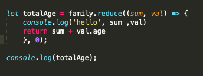
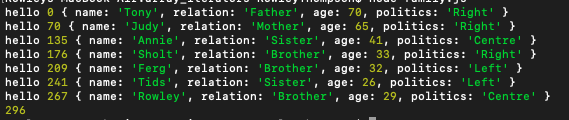

## Marks Amazing notes

* [JavaScript Fundamentals (PDF)](https://github.com/elev8now/CodeCheat/raw/master/docs/assets/DevelopMe_Javascript.pdf)
* [Javascript in the Browser (PDF)](https://github.com/elev8now/CodeCheat/raw/master/docs/assets/DevelopMe_Javascript_DOM.pdf)


## Programming Fundamentals

- Node
    - REPL
    - Script mode
    - Errors
        - Error in file
        - Module not found
    - `console.log()`
    - Command-line Fu
        - `ls`
        - `pwd`
        - Up arrow for previous command
        - Tab to auto-complete

- Key Concepts:
    - Types: Sorts of things
    - Variables: Remembering things
    - Conditionals: Deciding things
    - Loops: Repeating things

- **But first**: Hello, World example


## Basic Types

- Numbers
    - Examples:
        - Integer
        - Negative
        - Decimal
        - Scientific
        - `Infinity`
        - `0`
        - `-0`
    - Operators
        - Addition
        - Subtraction
        - Division
        - Multiplication
        - Modulus
    - Exercises: `4 % 3`, `0.1 + 0.1`, `0.1 + 0.2`, `0.2 * 0.2`

- Strings
    - Examples:
        - double quotes
        - single quotes
        - spaces
    - The empty string
    - String literals
    - Concatenation: *need to include spaces*
    - turn strin 

- Numbers & Strings
    - Examples
        - Number `+` Number
        - Number `+ `String of Number
        - String of Number `+` Number
        - Number `+` String of Word
        - Number `*` String
    - Using `+` to **cast** to number: coming from DOM
    - Exercises


# Variables

- Demonstrate in **Sublime**
- Way of storing a **value** to use it later
- Can give it a name to make code more readable
- Need to **declare** a variable with `let`
- Then **assign** a value
    - If don't assign a value then `undefined`
- Can reassign a value later
- Can then use the values
- Generally **declare and assign at same time**
- Variable types:
    - `let`
    - `const`
    - `var`
- Naming variables
    - Pick a sensible name
        - Not too short
        - Not too long
        - Descriptive
    - Can contain:
        - alphanumeric characters
        - underscores
        - the dollar sign
    - Can't:
        - contain spaces
        - contain hyphens
        - start with a number
        - be a reserved word
    - use camel-case (as opposed to snake-case): convention
    - Exercies: (In Sublime)
        - `age`
        - `my-name`
        - `1stPerson`
        - `for`
        - `FavouritePodcast`
        - `favourite food`
        - `helloTo`
        - `$`
- Template strings: include variables/code in a string *interpolation* (In Sublime)
    - Tidier than concatenation


## Comments

- `// blah`
- `/* blah */`
- Comments shouldn't explain what code *does*, hopefully that should be obvious
- Comments are for explaining unusual things - more *why* than *what*


# Basic Logic

- Boolean logic: `true` and `false`
- **Don't use quotes!** (``let fakeNews = "false"``)
- Equality:
    - `===`: same type, not same type
    - `<`
    - `>`
    - `<=`
    - `>=`
    - `!==`
    - `==`: type coercion
    - Exercises:
        - "12" === 12
        - 1/2 === 0.5
- Logic Rules
    - `and`: false if either value is false
    - `or`: true if either value is true
    - `not`: switches truth value - unary operator
    - Exercises:
        - `("ben" === "ben") && ("ben" === "Ben")`
        - `(12.00 === 12) || (3/5 === 0.75)`
        - `(50 >= -50) && (12 !== 12)`
        - `!(("12" - 2) >= 10) || !("ben" === "Ben")`

# Conditionals

- Only run code in certain situations
- Can use equality and logic rules to make decisions
- `if` statements
    - single `if`: may not run
    - `if` with `else`: one side always runs
    - `if` with `if else`
    - bit in brackets is "truth condition": evaluates to `true` or `false`
- Ternary operator
    - statement vs expression: expression equates to a value
    - `x === 10 ? true : false` same as `x === 10`
- Switch statements: checking same value
    - `default` on last line
    - need `break` on all but last line
- Exercise: `if.js`


## Indentation

- Every time you start a new code block `{` indent
- Every time you close a code block `}` outdent
- Trust your code editor
- Won't change how the program works, but makes it easier to find bugs
- Fix indentation straight away


# Loops

- Do something similar more than once
- `for` loop
    - The most common loop structure
    - When you need to loop a known number of times
    - Three parts:
        - setup a counter variable
        - loop condition: run while true
        - post-loop: usually increment by 1
- `while` loop
    - keep doing something until condition is false
    - useful if you don't know how many times it needs to run
- Infinite loops: be careful!


## FizzBuzz

- write some code that will output the numbers 1 to 100 in the console
- *unless* the number is divisible by 3, in which case output "Fizz"
- *or* the number is divisible by 5, in which case output "Buzz"
- *if* the number is divisible by 3 *and* 5, output "FizzBuzz"


# Functions

- In **Sublime**
- A function is a block of code that does a specific thing
- We can use it as many times as we like
- Show anonymous addition function first
- Can assign a function a variable like any of value
- Functions don't run until you **call** them
- When you call a function you can pass it **arguments**
- Functions normally return values
- **Fat arrow** syntax
    - one line
    - multi-line with `return`
    - not *identical* to normal function, but advanced topic
- You can put as much as you like inside a function
- You should declare your functions before you use them, they won't run until **call** them (`order.js`)
- Examples
    - `greet.js`
    - multiple three numbers
- Writing functions:
    1. Think of a sensible name for the function: a short way of describing its purpose
    2. Think about how many arguments the function needs to accept: this will depend on what you're trying to do
    3. Think about what type of thing the function should return
    4. Write out the boilerplate
    5. The thinky bit: Work about how to turn the arguments into the return value
    6. Test it with a few values you know the answer to
- Example: `let celsius = fahrenheit => (fahrenheit - 32) / 1.8;` - make sure to test it


# Advanced Functions

### Scope

- The visibility of variables
- Global scope
- `let` and `const` are **block scoped**
- *Parameters* and `var` are always scoped to the function they belong to
- Functions also count as blocks
- Variables created without declaring them will go into **global** scope
- Examples

### Function Composition

- Don't touch functions once you've written them
- Black boxes
- Complexity from simplicity
- The output of one function is the input to another function. 
- Important to note that the type of output data must be the same as the required input data type for the next function to work


### Pure Functions

- Same input gives same outputs every time
- No side effects
- Examples:
    - Add
    - Shock: `a + "!"`
    - Greet
    - Random
    - `console.log()`
    - `divisibleBy3Square()`

# Recursion

- A function can call itself, creating a looping structure
- Show `factorial` example
    - **Don't forget base case**: `if (num === 1) { return 1; }`
- "In order to understand recursion, one must first understand recursion"


# Arrays

- Arrays are ordered collections of values.
    - Empty array
    - Array of numbers
    - Array of strings
- Add items
    - `push`
    - `unshift`
- Getting values
    - `pop`
    - `shift`
    - square bracket syntax - doesn't mutate
- `.length`: "property"
- Iterating
    - use a `for` loop and `.length` along with square bracket notation
    - Examples:
        - adding up all numbers in an array
        - keep only even numbers
- An array is a *single* value
    - store in a single variable
    - when passed to a function it's a single argument
- Useful operations
    - `.sort()`: *alphabetic* sort
    - `.concat(otherArr)`: merging two arrays
    - `.join(seperator)`: array to string
    - `.indexOf(term)`: index of first matching item, or `-1`
    - `.slice(start, finishBefore)`: part of an array
- Spread operator:
    - copying an array
    - merging an array
    - add to beginning/end of copied array


# Array Iterator Methods

- All the iterator methods accept a function as the first argument
    - JavaScript calls the function for you
- `forEach`: nicer than a `for` loop
- `find`: returns first value that matches "predicate"

## Filter 

funtion on the array that acepts another function in its argumentwhich it will use to create anew filter version of the array.

- filter accepts one argument = ANOTHER FUNTION. THIS FUNCTION IS CALLED A CALL-BACK FUNCTION. Filter iterators will iterater over the array and call the call-back function over each item. The call-back function returns either true or false. All the true results will be filtered into the filter array. 

```js
const ages = [33, 12, 20, 16, 5, 54, 21, 44, 61, 13, 15, 45, 25, 64, 32];

/ For loop

let canDrink = [];
for(let i = 0; i < ages.length; i++) {
  if(ages[i] >= 21) {
    canDrink.push(ages[i]);
  }
}
console.log(canDrink)

// Using FILTER METHOD INSTEAD - Get 21 and older

const canDrink = ages.filter(function(age) {
  if(age >= 21) {
    return true;
  }
});

console.log(canDrink)

// ShortHand using arrow funtion. Whatever statement appears after the arrow function will be implicitely returned.

const canDrink = ages.filter(age => age >= 21);

console.log(canDrink)

```

Another Example of FILTER METHOD

```js
const companies= [
  {name: "Company One", category: "Finance", start: 1981, end: 2004},
  {name: "Company Two", category: "Retail", start: 1992, end: 2008},
  {name: "Company Three", category: "Auto", start: 1999, end: 2007},
  {name: "Company Four", category: "Retail", start: 1989, end: 2010},
  {name: "Company Five", category: "Technology", start: 2009, end: 2014},
  {name: "Company Six", category: "Finance", start: 1987, end: 2010},
  {name: "Company Seven", category: "Auto", start: 1986, end: 1996},
  {name: "Company Eight", category: "Technology", start: 2011, end: 2016},
  {name: "Company Nine", category: "Retail", start: 1981, end: 1989}
];

const retailCompanies = companies.filter(function(company) {
  if(company.category === 'Retail') {
    return true;
  }
});

console.log(retailCompanies);


OR....

const retailCompanies = companies.filter(function(company) {
  return company.category === 'Retail';
     true;
});


console.log(retailCompanies);

// Amother OR....SAME AS ABOVE but with arrow function:

const retailCompanies = companies.filter(company => company.category === 'Retail');
// just replacing anonymous function with arrow
//and remove return keyword
console.log(retailCompanies);

```
## Map

Map transforms each value in array to another value:

Map has different call-back function than filter. 

Filter method expects its call-back function to return either true or false value that determines whether or not the item is included in the filtered array.

Map will include ALL items in the array but will expect the call-back function to return a transformed object that it puts into the new array.

```js
const family = [
{name: "Tony", relation: "Father", age: 70, politics: "Right"},
{name: "Judy", relation: "Mother", age: 65, politics: "Right"},
{name: "Annie", relation: "Sister", age: 41, politics: "Centre"},
{name: "Sholt", relation: "Brother", age: 33, politics: "Right"},
{name: "Ferg", relation: "Brother", age: 32, politics: "Left"},
{name: "Tids", relation: "Sister", age: 26, politics: "Left"},
{name: "Rowley", relation: "Brother", age: 29, politics: "Centre"}
];


MAP method

let ages = family.map(x => x.name + ' is ' + x.age + ' years old');

console.log(ages)


Map and Filter methods combined:

let brothers = family.filter(x => x.relation === 'Brother');

let brothersPolitics = brothers.map(x => x.name + " is a " + x.politics + "-leaning individual");

```

## Reduce

    - can be used to do any of the others
    - takes an array and "reduces" it into a single value
    - initial value: second argument
    - default value: first item in array, will skip first iteration
    
    - will throw an error if array is empty

        Just like Map and fILTER, REDUCE is a function on the aray object.

        Just like MAP and FILTER, it takes a call-back funtion. 

        UNLIKE MAP and FILTER, it wants an object. think of it  as a starting point for our sum. Sum will passed as the first argument. 

         Just like MAP and FILTER, it will recieve the itereated item, BUT this will be the SECOND ARGUMENT. 


 
 


```js

let numbers = [1, 2, 3, 4, 5, 6];
<--iterates over the array, passing in previous return value and new value - the final value is the return value from the final iteration -->
<--the value of total the first time it runs is 0, reduce's second
􏰀→ argument-->
let sum = numbers.reduce((sum, val) => total + val, 0);
console.log(sum); // 21
```
-  Functional programming: show `reduce` with `add` - **reuse** existing functions


# Objects

- Objects are unordered collections of values.
- Examples:
    - empty object
    - address
    - person with address object
- When written out it's an "object literal"
- Dot notation to read/set
    - Nested dot notation
- Can add new properties after created
- Array-like notation
    - Can be used for invalid naming
    - Most useful for using variable to access different properties
- Functions as values: **methods** - (`maths.js`)
- Already used methods with arrays (`.sort()`, etc.)
- Methods **are** properties - so name can't be same as other properties
- `this` keyword: access value in object (`mark.js`)
- Methods often don't take arguments - data stored on the object


## Standard library:

- Strings:
    - `.length`
    - `.charAt(index)`
    - `.substr(start, length)`
    - `.search("blah")` - index if found or `-1`
    - `.toLowerCase()`
    - `.toUpperCase()`
    - `.split(" ")` - with space
    - `.split(", ")`
    - `.split("")` - with empty string
- Date
    - `new Date()` - now
    - `new Date("2018-08-24")` - specific date
    - `.getFullYear()`
    - `.getDate()`
    - `.getDay()`
    - `.getMonth()` - Aaaaargh!
    - `.getTime()`
    - Moment library generally better
- Math
    - `.PI`
    - `.E`
    - `.floor()`
    - `.ceil()`
    - `.round()`
    - `.sqrt()`
    - `.pow()`
    - `.log()`
    - `.cos()`


# Advanced Object Techniques

- Destructuring: pull property values out of an object and into variable
    - variable declarations
    - function parameters
    - assign new name with destructuring
- Spread operator
    - Copy objects
    - Change whilst copying
    - Merge objects
    - Show complex nested example
- `Object.keys(obj)` and `Object.values(obj)`
    - Useful when using objects as an array - for quick access
    - Sometimes called a "Map"
- `map`, `filter`, and `reduce` with objects
    - without destructuring
    - with destructuring


# Classes

- Classes let us create objects with the same structure/methods (convert `mark.js`)
- Object **instances** (as opposed to literals)
- Examples:
    - Book: title, author on creation, price set to null, `getPrice` and `setPrice`
    - Good practice to use methods to access property values
- Returning `this`
    - From *setter* methods: e.g. `Book`'s `.setPrice()` method
    - Show chaining
    - Only makes sense from methods without a sensible return value

