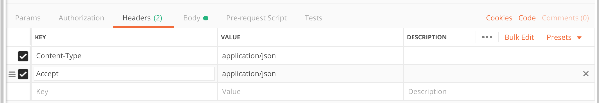

## Marks Amazing Notes

* [Laravel Notes (PDF)](https://github.com/Royce-Coolidge/Rowleys_Coding_CheatSheet/raw/master/docs/assets/laravel_api.pdf)

# Laravel

- modern php framework. Php first came out in 94, was only a templating language, not even a programming language. It was made so you can have two html files that used the same code without having to copy and paste things around.

- laracasts is better than stack overflow for laravel related issues.

- laravel forge allows you to easily host laravel app. (not free)

- remember to vagrant ssh before running any artisan commands

## Terminology:

**Framework:**

- Like bootstrap, collections of pre-writted code that you can use in your own code. You can write eloquent code as the framework under the hood will do all the grisly php.

**Variable:**
- storage unit for values; Bit of computer memory

**Function:**
- piece of code that takes an input and produces an output once called.

**Object:**
- A way of storing various types of information (properties or instance methods) in key/value pairs

**Class:**
- A way of encapsulating code as a template/blueprint for instantiating an Object instance, or creating reusable code

**Property**
- A variable within a Class 

**Method**
- A function within a Class.

**Instance/instantiate:**
- the output of a class. instantiating is creating an object. that object created is an instance of that class or an instantiated calss

**Class method:**
- A function you can use without instantiating a class.

**Instance method:**
- A specific function uniqure to that object. only created once you have instantiated that class

**MVC Model View Controller:**
- Where to locate your code. a way of organising your code
    - A **Model** is where you put the code that is responsible for putting data into and getting it out of the database.
        -  Model = Articles - (always singular) = each model is connected to a table in mySql 
    - The **View** is the UI componmentns, what renders in tyhe DOM.
    - A **Controller:** is where you put the code responsible for handling HTTP requests
        -  Controller = Articles - (always plural) = taking it , interpretting it, responding to it.

**OOP (Object-Orientated Programming):**
- Paradigm for Organsing Code = focus on objects and encapsulation.

**API (Application Programming Interface):**
- Allows programs to talk to each other and share data. Think of it as a layer that translates a request from another program so that the recieving program can understand the request.

**HTTP Hypertext Transfer Protocol:**
- Hypertext Transfer Protocol (HTTP) is essentially a well defined text format or standard that the browser is able to interpet into a web page. 
- By default, servers liten on port 80 for any request that looks like HTTP. If it receives a valid request, it sends back an HTTP response.

**Migration:**
- Blueprints for the database structure (tables and columns) !! it doesn't hold any content

**Resource:**
- type of class that laravel gives you that Lets you control the format of the JSON response.

**Mass Assignment Vulnerability**
- Prevents users from accessing or 'filling' data they're not authorised to access  

**Route Model Building:**
- This prevents a request being fulfilled if the requested resource does not exist  

**Validation:** 
- A Request Class provides rules for checking incoming data and gives back relevant error messages 

**Public:**
- property or method accessible outside of the class or object intance it resides in.

**Private:**
- property or method un-accessible outside of the class or object intance it resides in.

**Static:**
- static property that is available on the class, not the instance .

 - `::` = static methods that exists on the class without having to instantiate it first.
`$this->my_method static::_my_method `


## HHTP Request consists of:

1. The METHOD (GET, POST etc)
 -  GET = can i have some data?
 -  POST = send some data , to database generally.
 -  PUT = edit.
 -  PATCH = edit stuff
 -  DELETE

2. The URI fragment
http://developme.training/courses < courses is the URI fragment

3. The HTTP version (HTTP)

4. Host (developme.training)

5. Accept(what format to return application/json)
json - all languages understand json

#####  JSON:
- Is the object that gets returned
- Its keys are in double quotes `"title":"Bogalzay"`
- Commas between items in the array, but not at the end

##### Error Responses 
- Look out for 500 Server errors. thats a problem with our API code.

---

# Creating an API in Laravel


## 1. API Setup

1. Install the Laravel installer package (ONLY ONCE):

```shell
composer global require laravel/installer
```
Only need to run this once (or if you get a new computer).


## To create a new Laravel project run:

```shell
laravel new bog-api
```

**Note**: `blog-api` is just the project name.

- once the app is made, the project will be set up. The vendor folder is the equivalent of node modules, we will only really use the folders: routes, app, database.

- we won't use scotchbox, because it's for basic php stuff. Homestead is setup specifically for doing laravel stuff.

*Navigate to blog-api directory:*

```shell
composer require laravel/homestead --dev
// sets up homestead
```
```shell
vendor/bin/homestead make
// Change the second line of `Homestead.yaml` memory: 512
```

```shell
vagrant up

//Once Vagrant has finished loading visit `http://homestead.test`

// if you move directories, change the folders: - map: url part of the Homestead.yaml file.
```

```shell
vagrant ssh
```

```shell
cd code
```
---

## Routing - mapping pages to urls.
- we need to take a URL and use it to determine what we want to do.

Go to /routes/api.php, delete everything that's already in there, then:

```php
$router->group(["prefix" => "articles"], function ($router) {

    
    $router->post("/", "Articles@store");
    // '/' means the prefix, which is articles in this case
    // above, Articles@store is a controller (articles) and a method(store)

});
```
Articles@store referes to the class type Articles, which is a controller, and the @ refers to its method, store

---

## Controllers

Routes point to **controllers**. 

- Controllers: a file that gets called by a route. The controller then tells Laravel what to do.

Run inside your Vagrant box<sup>†</sup> to create an Articles controller:

```shell
artisan make:controller Articles --api

```

- the `--api` part puts in all the methods that we want to use. This will make a controller file in app/Http/Controllers/ that contains a load of methods (including the store method we used above). The next thing to do is to put code in these methods so that Laravel knows what to do when we call them.
Laravel has added a `store` method to `Articles`:


```php
public function store(Request $request)
{
    // get post request data for title and article
        $data = $request->only(["title", "article", "tags"]);

        // create article with data and store in DB
        $article = Article::create($data);
}
```

<p class="footnote">† <i>All</i> commands should be run inside Vagrant</p>

---

# Database Migrations

Structuring your datababse.

scripts that set up the database in the same way that it was set up at the original location. They are run by Laravel when we run: `$ artisan migrate`


## Creating a Model/Migration


```shell
artisan make:model Article -m
```

`make:model` creates an Article in the model class type (in `app/Article.php`) 

`-m` creates a database migration (in the `database/migrations` directory).


---

## Database Migrations


```php
public function up()
{
    Schema::create('articles', function (Blueprint $table) {
        $table->increments('id');
        $table->string("title", 100);
        $table->text("article");
        $table->timestamps();
    });
}
```


`public function up()` - creates the migrated tables

`public function up()` - destroys migated file


By default Eloquent will expect create at or updated at columns with `timestamps()` If you do not wish to have these columns automatically managed by Eloquent, set the $timestamps property on your model to false:


```
<?php

namespace App;

use Illuminate\Database\Eloquent\Model;

class Article extends Model
{
    /**
     * Indicates if the model should be timestamped.
     *
     * @var bool
     */
    public $timestamps = false;
}
```


```shell
$  artisan migrate
```

We should now have an `articles` table in the database.

The migrations table keeps track of which migrations have already run to keep from running duplicate migrations.

**Note**: if you make a mistake in your migration file, you can run `artisan migrate:rollback` to undo the last set of migrations that you ran.

---

# Models

The `Article` model **extends** the Eloquent Object Relational Mapper (0RM) model. 

ORM turns db queries into php classes and methods.So we can use the model to interact with the data from the database.

For example,

`Article::create()` - creates article in the db

`Article::all()` - gets all articles out of the db


Once we have an `Article` object we can access the data from the database. For example:
```php
class Article extends Model
{
  protected $fillable = ["title", "article"];
}

$article->title; // gives us the article title
$article->title = "Blah blah blah"; // set the article title
$artilce->save(); // save it to the db.
```

You can read more above models on the [Eloquent ORM Documentation](http://laravel.com/docs/5.6/eloquent#introduction).

---

## Store()

method to store user date in ourr database

put `use App\Article` to tell php to import something. This is namespacing.

```php
// make sure you add this near the top, undereath the namespace declaration
use App\Article;
```

```php
public function store(Request $request)// here, the request is the request the user made.
{
    $data = $request->only(["title", "article"]); // an object with an only method. This only method filters out everything but what you give it from the request.

    $article = Article::create($data); // a static method. This does all the mysql stuff and then stores the response in a variable called $article. Article:: uses the model we made earlier.

    return response($article, 201); // return the article along with a 201 status code
}
```

can be slimmed down:

```php
public function store(Request $request)
{
  $data = $request->only(["title", "article"]);
  return Article::create($data);
}
```


Now we can try doing a `POST` request with Postman.

---

## Mass Assignment Vulnerability

If we're not careful we might accidentally allow users to update fields that they should have access to. Laravel guards against this by default.

We can update the `Article` model to tell it which fields to expect.

```php
<?php

namespace App;

use Illuminate\Database\Eloquent\Model;

class Article extends Model
{
    // Only allow the title and article field to get updated via mass assignment
    protected $fillable = ["title", "article"];
}
```

Now try doing a `POST` request with Postman.

---

## GET method / @index method

1. go to routes/api
2. add a get, second arg: Articles@index
3. go into controller, `function index()`
4. fill function body with `return Article::all();`


```php
//grouping router groups:

$router->group(["prefix" => "articles"], function ($router) {
  $router->get("", "Articles@index");
  $router->post("", "Articles@store");
  $router->get("{article}", "Articles@show"); // this creates a url parameter
})
```
update the `index` method in the `Articles` controller:

```php
public function index()
{
    // get all the articles
    return Article::all();
}
```

That's all there is to it: Laravel does all the hard work for us once we've setup our model.

---

## Reading

Next we want to add a route for `GET` to something like `/articles/1`.

First, add a route:

```php
// we can group all our articles routes together
$router->group(["prefix" => "articles"], function ($router) {
    // ...previous routes...

    // {article} is a url parameter representing the id we want
    $router->get("{article}", "Articles@show");
});
```

And update the `show` method in `Articles`:

```php
// the id gets passed in for us
public function show($id)
{
    return Article::find($id);
}
```

---

## Editing

Next we'll add editing. We'll need a `PUT` route for `/articles/{article}`.

Add a route:

```php
$router->group(["prefix" => "articles"], function ($router) {
    // ...previous routes...

    $router->put("{article}", "Articles@update");
});
```

And update the `update` method in `Articles`:

```php
public function update(Request $request, $id)
{
    // find the current article
    $article = Article::find($id);

    // get the request data
    $data = $request->only(["title", "article"]);

    // update the article
    $article->fill($data)->save();

    // return the updated version
    return $article;
}
```

---

## Deleting

Finally, let's add a `DELETE` route.

Add a route:

```php
$router->group(["prefix" => "articles"], function ($router) {
    // ...
    $router->delete("{article}", "Articles@destroy");
});
```

And update the `destroy` method in `Articles`:

```php
public function destroy($id)
{
    $article = Article::find($id);
    $article->delete();

    // use a 204 code as there is no content in the response
    return response(null, 204);
}
```

---

## Key Terms

- **ORM**: Object Relational Mapper - allows us to access data from a database using standard objects
- **Controller**: a piece of code that is run for a specific route, whose job it is to get/update the relevant data and return a response to the user

---

## Additional Reading

- [Routing](https://laravel.com/docs/5.6/routing)
- [Controllers](http://laravel.com/docs/5.6/controllers)
- [Requests](https://laravel.com/docs/5.6/requests)
- [Responses](https://laravel.com/docs/5.6/responses)
- [Database Migrations](http://laravel.com/docs/5.6/migrations)
- [Eloquent](http://laravel.com/docs/5.6/eloquent)

# Creating an API

with Laravel

---

## Route Model Binding

What if we try to update `/articles/34849`? Currently we'll get a 500 error as there is no article with ID 34849.

However, we can use **Route Model Binding** to automatically fix this for us.

```php
public function show(Article $article)
{
    return $article;
}

public function update(Request $request, Article $article)
{
    $data = $request->only(["title", "article"]);
    $article->fill($data)->save();
    return $article;
}

public function destroy(Article $article)
{
    $article->delete();
    return response(null, 204);
}
```

Less code and more functionality. Laravel is your friend.

---

## Resources

It would also be good if we had some control over how our data comes back. For example when we're listing the articles we probably don't want to send the full article text and when we might not want to send the `created_at` and `updated_at` properties.

This is where **Resources** come in. They let us control the format of the JSON output.

First, we create one using `artisan make:resource ArticleResource`.

Then we edit the file to list the properties we need:

```php
public function toArray($request)
{
    // just show the id, title, and article properties
    // $this represents the current article
    return [
        "id" => $this->id,
        "title" => $this->title,
        "article" => $this->article,
    ];
}
```

---


Next, we need to update the `Articles` controller to use the resource for output:

```php
use App\Http\Resources\ArticleResource;

// ...

public function store(Request $request)
{
    // ... store code

    // return the resource
    // automatically uses the right status code
    return new ArticleResource($article);
}

public function show(Article $article)
{
    // return the resource
    return new ArticleResource($article);
}

public function update(Request $request, Article $article)
{
    // ... update code

    // return the resource
    return new ArticleResource($article);
}
```

---

## Resources

We also want to make the `list` method only show the `id` and `title` properties.

Again, we'll make a resource: `artisan make:resource ArticleListResource`

```php
public function toArray($request)
{
    return [
        "id" => $this->id,
        "title" => $this->title,
    ];
}
```

And update the `Articles` controller:

```php
use App\Http\Resources\ArticleListResource;

// ...

public function index()
{
    // needs to return multiple articles
    // so we use the collection method
    return ArticleListResource::collection(Article::all());
}
```

As we're returning a collection of articles rather than a single article we use the `Resource::collection()` method.

---


# Validation

---

## Validation

You should always validate any data that gets submitted to your site.

`4xx` errors can be dealt with by the client side, `5xx` errors cannot.

To avoid MySQL errors:

- `required`: any database fields that cannot be `null` should have the `required` validation
- `max:255`: if you're storing data in a `VARCHAR` then make sure you have max length validation that matches the `VARCHAR` length
- `date`/`integer`/`string`: check formats before inserting into MySQL (you will also need the `nullable` validation if the field is not required)


---

## Validation

To add validation we need to create Request classes.

Run `artisan make:request ArticleRequest`.

request class type allows us to write rules of validation

```php
class ArticleRequest extends FormRequest
{
    public function authorize()
    {
        return true;
    }

    public function rules()
    {
        return [
           "title" => ["required", "string", "max:100"],
           "article" => ["required", "string", "min:50"],
        ];
    }
}
```

Set rules in the rules method

Remember in postman to change 2 headers: 
Accept: Application / json 
Content/type : Application / json 



---

## Validation

Then update the `Articles` controller to use our validated request instead of the standard `Request` object:

```php
use App\Http\Requests\ArticleRequest;

// ...

public function store(ArticleRequest $request) { /* ... */ }

// ...

public function update(ArticleRequest $request, Article $article) { /* ... */ }
```

## One to Many Relationships

We want to store comments on their own table in the database. But we'll need some way of linking a comment to the article that it belongs to.

Each article can have **many** comments, but each comment can only belong to **one** article. For this reason it is called a **one to many** relationship.

We can store this relationship by referencing the ID of the article for each comment we create. That way we will know which article each comment belongs to.

Under the hood, MySQL can really efficiently use this structure to join together related data.


### Comments
---

## Commenting

A comment belongs to an article and has an email address and the comment text.

```bash
artisan make:model Comment -m
```
* model remmebr for in and out of db

```php
public function up()
{
    Schema::create("comments", function (Blueprint $table) {
        $table->increments("id");
        $table->string("email", 100);
        $table->text("comment");
        $table->timestamps();

        // link up to articles table
        $table->integer("article_id")->unsigned();
        $table->foreign("article_id")->references("id")->on("articles")->onDelete("cascade");
    });
}
```

```bash
artisan migrate
```

We need to let our articles know that they have a relationship to comments. That way Eloquent can automatically join them together for us.

Let's update our Article model to let it know that it can have comments:

```php
class Article extends Model
{
    // Only allow the title and article field to get updated via mass assignment
    protected $fillable = ["title", "article"];

    public function comments()
    {
        return $this->hasMany(Comment::class);
    }
}
```
does lots of clever stuff under the hood.

---

## Commenting

And let's update the Comment model while we're at it:

```php
class Comment extends Model
{
    protected $fillable = ["email", "comment"];

    public function article()
    {
        return $this->belongsTo(Article::class);
    }
}
```

---


## Commenting

We just need to set up a route to capture the comment `post`:

```php
$router->group(["prefix" => "articles"], function ($router) {
    ...
    $router->post("{article}/comments", "Comments@store");
});
```

We'll need to create the Comments controller too:

```shell
artisan make:controller Comments --api
```

---

## Commenting

Update the `store` method in the `Comments` controller:

```php
use App\Article;
use App\Comment;

class Comments extends Controller
{
    public function store(Request $request, Article $article)
    {
        $comment = new Comment($request->only(["email", "comment"]));

        // store the comments on the article
        $article->comments()->save($comment);

        return $comment;
    }
}
```

---

** add in two extra headers in postman

## Commenting

Now, let's add some comment validation.

```bash
artisan make:request CommentRequest
```

```php
class CommentRequest extends FormRequest
{
    public function authorize()
    {
        return true;
    }

    public function rules()
    {
        return [
            "email" => ["required", "email", "max:100"],
            "comment" => ["required", "string"],
        ];
    }
}
```

---

## Commenting

And update the `Comments` controller to use the validated request:

```php

// need to import Comment Request
use App\Http\Requests\CommentRequest;

// ...

public function store(CommentRequest $request, Article $article) { /* ... */ }
```

---

## Commenting

Finally, let's list all the comments for an article:

```php
$router->group(["prefix" => "articles"], function ($router) {
    ...
    $router->get("{article}/comments", "Comments@index");
});
```

```php
class Comments extends Controller
{
    // ...

    public function index(Article $article)
    {
        return $article->comments;
    }
}
```

---

## Resource - filtering the data

Let's create a resource for comments: `artisan make:resource CommentResource`

```php
public function toArray($request)
{
    return [
        "id" => $this->id,
        "email" => $this->email,
        "comment" => $this->comment,
    ];
}
```

And then update our `Comments` controller:

```php
use App\Http\Resources\CommentResource;

// ...

public function index(Article $article)
{
    return CommentResource::collection($article->comments);
}

public function store(CommentRequest $request, Article $article)
{
    // ... store code
    return new CommentResource($comment);
}
```

---

## Key Terms

- **One to Many**: a relationship between two tables of a database where the items of table A can be linked to many items from table B, but items from table B can only be linked to one item in table A.
- **Foreign Key**: a relationship between two tables in MySQL that is enforced by the database

---

## Additional Reading

- [Validation](https://laravel.com/docs/5.6/validation)
- [Eloquent: One to Many Relationships](http://laravel.com/docs/5.6/eloquent-relationships#one-to-many)

# Building an API

with Laravel

---

# Tags

---

## Many to Many Relationships

Tags and articles have a more complex relationship than comments and articles. An article can have any number of tags, but a tag can also belong to any number of articles.

We can't just reference the article or tag ID from the other table in this case, as that way we could only reference a single item.

In this case we need a **pivot table**. The pivot table *just* stores the relationship between articles and tags.


---

## Tags

Let's add tags to our articles. First, let's create a Tag model: `artisan make:model Tag -m`

```php
public function up()
{
    Schema::create("tags", function (Blueprint $table) {
        $table->increments("id");
        $table->string("name", 30); // tags just need a name property, don't need timestamps for tags
    });

    Schema::create("article_tag", function (Blueprint $table) {
        $table->increments("id");
        $table->integer("article_id")->unsigned(); // just for positive integars
        $table->integer("tag_id")->unsigned();
        $table->foreign("article_id")->references("id")->on("articles")->onDelete("cascade");
        $table->foreign("tag_id")->references("id")->on("tags")->onDelete("cascade");
        //tag id containts data from id from tags table , if delete that tag, will delete article_tag row 
    });
// UP function creates tables -->

public function down()
{
    Schema::drop("article_tag");
    Schema::drop("tags");
}
// function: deletes tables you've just made -->
```
to RUN the down function = ```artisan migrate: rollback```
this is used when you want to creat a new column and start a new table - only to be used in development as will delete all the data in the table


```artisan migrate``` - NEED TO DO THIS TO CREATE SQL TABLE
---


## Tags

We'll need to setup our `Article` model to link to tags:

```php
public function tags()
{
    return $this->belongsToMany(Tag::class);
}
```

---

## Tags

Next, let's update our `Tag` model to include the `articles` relationship:

```php
class Tag extends Model
{
    public $timestamps = false; // don't need timestamps
    protected $fillable = ["name"]; // name should be fillable

    public function articles()
    {
        return $this->belongsToMany(Article::class);
    }
}
```

---

## Tags

We'll need to add validation rules for tags to `ArticleRequest`:

```php
public function rules()
{
    return [
       "title" => ["required", "string", "max:100"],
       "article" => ["required", "string", "min:50"],
       "tags" => ["required", "array"], // check tags is an array
       "tags.*" => ["string", "max:30"], // check members of tags are strings
    ];
}
```

---

## Tags

Now, we'll need to update our `Articles` controller to add tags to the model:

```php
use App\Tag;

// ...

public function store(ArticleRequest $request)
{   
    // get post request data for title and article
    $data = $request->only(["title", "article"]);

    // create article with data and store in DB
    $article = Article::create($data);

    $tags = Tag::parse($request->get("tags")); // trimming, create the tags in the Tags DB
    $article->setTags($tags); //store the relationship between article and tags

    return $article;
}


public function update(ArticleRequest $request, Article $article)
{
    // ...

    $tags = Tag::parse($request->get("tags"));
    $article->setTags($tags);

    // ...
}
```

---

## Tags

The `Tag::parse()` and `$article->setTags()` methods don't exist yet, so we'll need to create them ourselves.

In the `Tag` model:

```php
// accepts the array of strings from the request
public static function parse(array $tags)
{
    // turns into a collection and maps over
    return collect($tags)->map(function ($tag) {
        // remove any blank spaces either side
        $string = trim($tag);
        $string = lowercase($tag);
        return static::makeTag($string);
    });
}

private static function makeTag($string)
{
    // check if tag already exists
    $exists = Tag::where("name", $string)->first();

    // if tag exists return it, otherwise create a new one
    return $exists ? $exists : Tag::create(["name" => $string]);
}
```

---

## Tags


In the `Article` model:

```php
use Illuminate\Support\Collection;

// ...

public function setTags(Collection $tags)
{
    // update the pivot table with tag IDs
    $this->tags()->sync($tags->pluck("id")->all());
    return $this;
}
```

---

## Resource

Finally, let's update our article resources to include tags.

In `ArticleResouce` and `ArticleListResource`:

```php
public function toArray($request)
{
    // make sure tags are up to date
    $this->resource->load("tags");

    return [
        // ... other properties
        "tags" => $this->tags->pluck("name"), // just return a list of tag names
    ];
}
```

---

## Key Terms

- **Many to Many**: a relationship between two tables of a database where the items of table A can be linked to many items from table B, and the items from table B can be linked to many items in table A.

---

## Additional Reading

- [Eloquent: Many to Many Relationships](http://laravel.com/docs/5.6/eloquent-relationships#many-to-many)
- [Collections](https://laravel.com/docs/5.6/collections)


#  Authentication

- Stop any old fucker editing deleting or posting shit on ur site.


ACCESS TOKEN - a "visa" for access to your api

- When user input matches data in the DB, access token sent is given as a response.

- encryped passport

## Learning Objectives
- Understand how an API authenticates requests
- Be able to setup Laravel Passport to handle request authentication
- Update your API to authenticate routes in different ways

## Key Language
- Authentication
- Access Token

## Authentication
APIs typically use tokens to authenticate users. The process is as follows:
- The user makes a request to a dedicated authentication endpoint, providing credentials such as username and password
- The API checks whether these credentials are valid
- If valid, the API returns a token that is unique to the user
- The user makes all future requests supplying this token in the header
- The API checks the validity of the token
- The API grants or denies requests based on whether the user is valid and who the user is
- ACCESS TOKEN - a "visa" for access to your api
- When user input matches data in the DB, access token sent is given as a response.
- like an encryped passport

### Installation
Install Laravel Passport
````
composer require laravel/passport
````
* remember composer is the equivalent of npm

Create database tables to store access tokens in (vagrant ssh)
```
vagrant ssh
```

```
cd code
```

```
artisan migrate
```


Install Laravel Passport
````
artisan passport:install
````
--> creates database table to store acess tokens.

Make a note of the password grant Client ID and Client Secret that are returned following successful installation. These look something like:
````
...
Password grant client created successfully.
Client ID: 2
Client secret: QtE4syo8QFwvw4bMEK5Ej2zaJ3jgF3RYmF1JjZmU
````

In App/User.php add the HasApiTokens trait:
````
use Laravel\Passport\HasApiTokens;
...

class User extends Authenticatable
{
    use HasApiTokens, Notifiable;
    ...
}
````


In AuthServiceProvider.php use the Passport class to add all necessary routes to your app. This saves you having to write them yourself.  
````
use Laravel\Passport\Passport;
...
class AuthServiceProvider extends ServiceProvider
{
    ...
    public function boot()
    {
        ...
        Passport::routes();
    }
}
````

Finally, in config/auth.php config file, set the driver of the api authentication guard to 'passport'.
````
'guards' => [
    ...

    'api' => [
        'driver' => 'passport',
        'provider' => 'users',
    ],
],
````


Create a single user on the command line...
````
artisan tinker
App\User::create(array('name' => 'An Author', 'email' => 'an.author@gmail.com', 'password' => Hash::make('password')));
````

tinker allows us to open a shell to write laravel code
gives new prompt prefix  `>>>`

App\User::create(array(`name` => 'An Author'))


You should now be able to make a request in Postman to POST `http://homestead.test/oauth/token` with the body:  
* USe the 2nd client id - `Password grant client created successfully.`
````
{
    "grant_type": "password"
    "client_id": "<your_client_id>",
    "client_secret": "<your_client_secret>",
    "username": "an.author@gmail.com",
    "password": "password"
}
````
If everything is setup correctly, the token that gets returned can be stored then sent as a Bearer Token with each following request.

### Simple authentication

If a valid access token is sufficient authentication, Laravel provides some simple methods. In `routes/api.php`:

#### Single route
Add the `auth:api` middleware to any routes that require a valid access token:
````
$router->get("", "Articles@index")->middleware('auth:api');
````
Try calling `GET http://homestead.test/api/articles` in Postman (remember to add the header `Accept: application/json`). You should get a 401 response.

This time choose `Bearer Token` in the Authorization tab and paste in the access token you got back from the `oauth/token` endpoint. Your request should now authenticate successfully and return the usual response.

#### Groups
To add authentication to the entire group:  
````
$router->group(["prefix" => "articles", "middleware" => ["auth:api"]], function ($router) {
    ...
}
````

### More complex authentication
In reality our blog api probably needs different levels of authentication. Posts should be open to anyone, only the owner of the blog should be able to write and edit blog posts, and only logged in users should be able to comment.

This suggests two user roles - `Author` and `Subscriber`. Slightly contrived, normally many authors contributing to a blog site

#### Modify Users table
We'll need to modify the Users table to be able to store the user role.
````
artisan make:migration modify_users_table

````
If you migrate before making changes to the migration folder. You will need to remove any changes you have made from the migration file and run `artisan migrate:rollback`.

this will make artisan think that it has not already migrated the file. If you dont `rollback` , artisan will not allow you to re-migrate the file.


In the generated migration file, add your new column in the up() method, and drop it in the down() method:
````
class ModifyUsersTable extends Migration
{
    public function up()
    {
        Schema::table('users', function (Blueprint $table) {
            $table->string('role')->after('name')->default('subscriber');
        });
    }

    public function down()
    {
        Schema::table('users', function (Blueprint $table) {
            $table->dropColumn('role');
        });
    }
}
````

````
artisan migrate
````
`mysql`
`show databases`
`use homestead`
`select * from users;`

We'll need to update our Users model to make this new column fillable.
````
class User extends Model
{
    protected $fillable = ['name', 'email', 'password', 'role'];
}
````

Now let's update our existing user to have the role of `'author'` and generate a new user with the role `'subscriber'`.

````
artisan tinker
App\User::where('id', 1)->update(['role' => 'author']);
App\User::create(array('name' => 'A Subscriber', 'role' => 'subscriber', 'email' => 'a.subscriber@gmail.com', 'password' => Hash::make('password')));
````

#### Checking user role
Laravel provides a simple way for us to check who is making the request. In the `authorize()` method on the FormRequest classes that we extended, `$this->user()` will return an instance of User associated with the token sent with the request.  

Let's create a new request for storing articles:
````
artisan make:request ArticleStoreRequest
````

The `rules()` method should return the same validation as ArticleRequest:
````
public function rules()
{
    return [
        "title" => ["required", "string", "max:100"],
        "article" => ["required", "string"]
        "tags" => ["required", "array"], // check tags is an array
        "tags.*" => ["string", "max:30"], // check members of tags are strings
    ];
}
````

But let's write a conditional outcome in the `authorize()` method:  
````
public function authorize()
{
    return $this->user()['role'] === 'author';
}
````

in auth.php, need to change 'guard'
```
'defaults' => [
    'guard' => 'api',
    'passwords' => 'users",'
]
```

We'll need to tell the `store()` method in Articles.php to use this new Request:
````
use App\Http\Requests\ArticleStoreRequest;

class Articles extends Controller
{
    ...
    public function store(ArticleStoreRequest $request)
    {
        ...
    }
}
````

In Postman, make a call to `POST /oauth/token`, supplying the body as before, replacing the user details with the subscriber we generated above. Make a call to `POST /api/articles` suppling the returned access token as a the Bearer Token. Your request should receive a 403 response. Replace the token with your author token. This should authenticate and a new Article should be returned.

### Extension Tasks
- Validate comment routes so that only subscribers and authors can comment
- Authenticate update and delete routes so that only the writer of the article/comment etc. should be able to edit it. (Hint: you'll need to set up a relationship between Users and Articles)
- Add another role of `admin` and generate an admin user. Admins should be able to do everything on the site, including deleting comments and articles that they didn't write.
- Extend your API providing endpoints for users to sign up to your blog

### Hosting Laravel App on AWS


