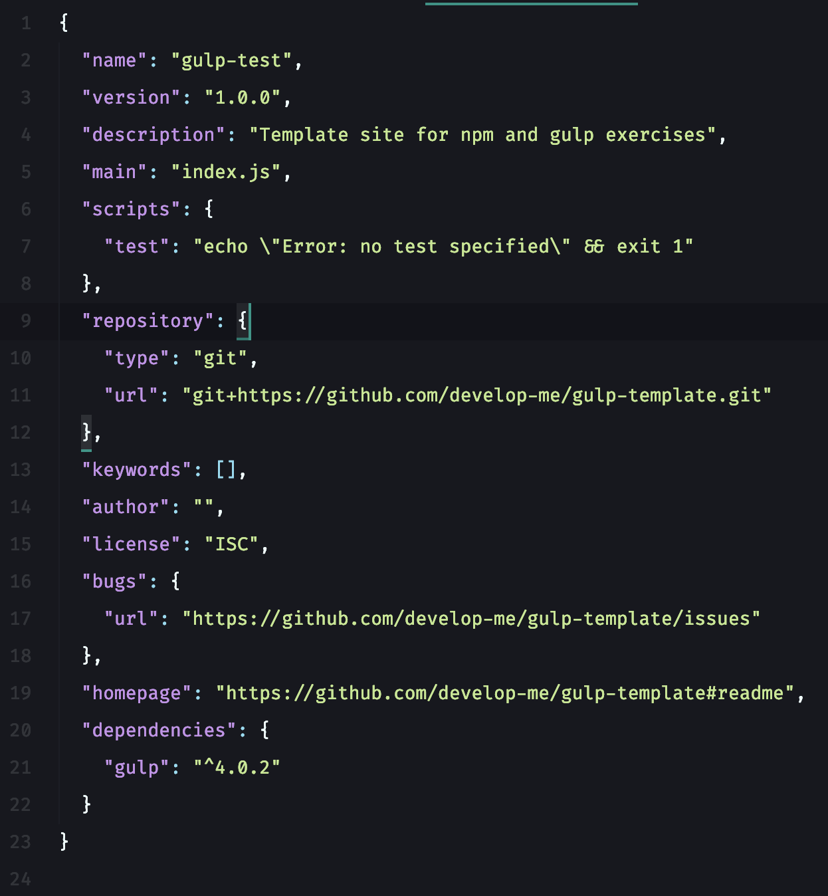
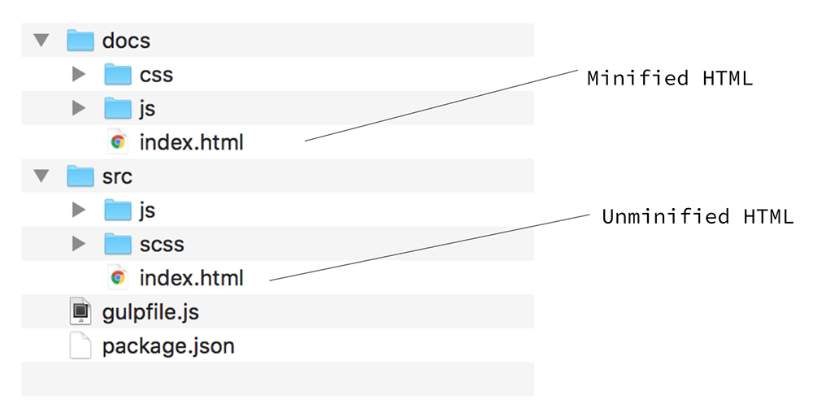

# NPM & Gulp

* * *

### Check that you have node, npm and gulp installed:

```bash
$ node -v
$ npm -v
$ gulp -v
```

If you don't have gulp, install with npm:

Run both:

```bash
$ npm install gulp-cli -g
$ npm install gulp -D
```

You may need to run these with sudo at the start, to run them as administrator (superuser).

### Checking gulp installed

If gulp and the gulp command line tool is installed then when you run

```bash
$ gulp -v
```

You should get something like:

```bash
[09:44:18] CLI version 1.4.0
[09:44:18] Local version 3.9.1
```

* * *

## Tooling: doing things better, faster, smarter

### Module Outline

-   Learn about gulp
-   Refresher about npm package manager
-   The role of package.json
-   Implement gulp plugins to automate tasks
-   Build a site using these tools

### What is gulp?

> "a toolkit for automating painful or time-consuming tasks in your development workflow"

#### What can we use it for?

##### 3727 plugins for gulp, for example:

-   minify CSS and JS - [gulp-clean-css](https://www.npmjs.com/package/gulp-clean-css/), gulp-jsmin
-   compile Sass to CSS - gulp-scss
-   refresh browser on save - gulp-refresh
-   convert spaces to tabs - [gulp-tabify](https://www.npmjs.com/package/gulp-tabify/)
-   enforce coding styles - gulp-jscs
-   create css sprites from images - [gulp-css-sprite](https://css-tricks.com/css-sprites/)

### gulp is installed with npm

#### npm is a package manager for JavaScript.

When you install a plugin with npm, it creates a **package.json** file, which allows you to:

1.  specify packages your project uses, and minimum versions (enables your team to collaborate and have the latest versions of plugins)
2.  makes your build reproducible, which means that it's much easier to share with others

```bash
$ npm init
```

creates a **package.json** file

This allows you to:

1.  keep track of packages your project uses, and minimum versions
2.  makes your build reproducible, which means that it's much easier to share with others

### Installing packages from package.json

```bash
$ npm install {module name}
# for example,
$ npm install bootstrap
```

Creates node_modules folder, downloads and installs packages (modules) into that folder

Link: [npm website](https://www.npmjs.com)

* * *

## Using gulp

### Using the gulpfile.js file

**gulpfile.js** allows you to:

-   define and pull in dependencies (plugins)
    -   [gulp Clean CSS](https://www.npmjs.com/package/gulp-clean-css)
    -   [gulp Rename](https://www.npmjs.com/package/gulp-rename)
-   map plugin function to variable
-   define tasks that can be run, the order, and what they do

### Example gulpfile.js

```javascript
let gulp = require('gulp');
let cleanCSS = require('gulp-clean-css');
let rename = require('gulp-rename');

gulp.task('minify-css', () => {
  return gulp.src('css/*.css')
    .pipe(cleanCSS({compatibility: 'ie8'})) // minify css
    .pipe(rename({suffix: '.min'})) // rename css files to e.g. style.min.css
    .pipe(gulp.dest('./dist/')); // output into distribution folder
});
```

Run a task in the command line:

```bash
$ gulp minify-css
```

### Process Overview

-   Initialise npm
-   Install npm packages for gulp gulp-clean-css gulp-rename
-   Create gulpfile.js
-   Run task

* * *

## Exercise 1

### Checkout our template site from GitHub

#### Template site repo:

<https://github.com/develop-me/gulp-template>

```bash
$ git clone git@github.com:develop-me/gulp-template.git gulp-test
```

This command does git init and checks out master into new folder called gulp-test

#### A tour of our basic site

1.  A Bootstrap v4 site
2.  Uses Sass, compiles scss/styles.scss to css/styles.css, from many Sass files
3.  Uses some JavaScript files:
    -   js/jquery-3.2.1.slim.js
    -   js/popper.js
    -   js/bootstrap.js

### What do we want to do to improve it?

We want to automate:

-   Enforce coding style: spaces to tabs
-   Check JS syntax with linter
-   Compiling Sass to CSS
-   Minify CSS files
-   Combine JS files
-   Minify JS file

### Process

To automate these tasks we will:

1.  Install the packages we need with npm
2.  Create some tasks with gulp (in gulpfile.js)
3.  Run the tasks to do the work

#### Start with npm, install gulp

Create **package.json**

This starts a command line questionnaire where you can set some details about your project:

```bash
$ npm init
```

To skip questionnaire:

```bash
$ npm init --yes
```

#### Setting package details

Edit package.json in code editor.



### Advantages of package.json

-   Creates a portable configuration, defining any dependencies our project has
-   Allows other developers to get setup quickly, with an identical environment
-   If version managed, we can track changes to project dependencies over time

### Adding packages to our project

Packages bring functionality.

Command for installing a package to your project folder and adding it to package.json file as a dependency:

```bash
$ npm install <package_name> --save
```

### Add gulp as a dependency

Either, edit package.json in code editor to add dependency

Or, on command line:

```bash
$ npm install gulp --save
```

#### The node_modules folder is created by npm install

This folder stores the files for the npm packages, and the dependency of those packages

If using Git, you should add this folder to **.gitignore** so it's not added to the project repository

* * *

## Exercise 2

### Install gulp plugins we'll need

gulp plugins to install:

-   gulp-sass
-   gulp-clean-css
-   gulp-rename
    Install the plugins with the following command:

```bash
$ npm install <package-name> --save
```

### Setup your gulpfile.js

```javascript
let gulp = require('gulp');
let cleanCSS = require('gulp-clean-css');
let rename = require('gulp-rename');
let sass = require('gulp-sass');
```

### Setup your first task

```javascript
gulp.task('sass', function () {
    var stream = gulp.src('./scss/styles.scss')
        .pipe(sass())
        .pipe(gulp.dest('./css/'))
        .pipe(rename('styles.css'));
    return stream;
});
```

### Run your first gulp task

1.  Make a change to scss/customisations.scss
2.  Run:

```bash
$ gulp sass
```

3.  Verify it updated css/styles.css

* * *

## Minification & performance

### Combining and minifying files

Optimising asset delivery improves load speed, user experience and search engine ranking

Editing minified files is hard!

So we keep the originals, and use a tool like gulp to combine and produce minified versions

* * *

## Exercise 3

### Setup your second task

```javascript
gulp.task('minify-css', () => {
  return gulp.src('css/styles.css')
	.pipe(cleanCSS({compatibility: 'ie8'}))
	.pipe(rename({suffix: '.min'}))
	.pipe(gulp.dest('./css/'));
});
```

### Run your second gulp task

1.  Run:

```bash
$ gulp minify-css
```

2.  Verify it produced a css/styles.min.css file
3.  Switch your site to use that CSS file instead

* * *

## Combining tasks

#### **gulp.series** allows us to run gulp tasks in series

Define a new task and test it:

```javascript
gulp.task('styles', gulp.series('sass', 'minify-css'));
```

* * *

## Exercise 4

### Verify combined task is working

1.  Make a change to scss/customisations.scss or similar
2.  Run this command:
    ```bash
    $ gulp styles
    ```
3.  Verify it produced the change in css/styles.min.css file

* * *

## Combining it all together

### How to automate our workflow

What if we could get gulp to combine our Sass files and minify them, every time we change any Sass in our project?

No need to manually run command

Easier and faster to work

### gulp.watch

**gulp.watch** allows us to watch files for change, then run a gulp task

```javascript
gulp.task('watch', function () {
	return gulp.watch('./scss/**/*.scss', gulp.series('styles')); // **/ includes subfolders
});
```

* * *

## Exercise 5

### Automate your workflow with watching

1.  Create a task that will automatically run your other tasks in order
2.  Test it

* * *

## Updating tasks while watching

If you try to update a task, while a watch task is already running, then that running task will use the old version.

You need to **stop** then **restart** the watch task for that change to take effect.

* * *

## Exercise 6

### Combine then minify JS files

gulp functions you'll need:

1.  `src()` - find source files
2.  `concat()` - from [gulp-concat](https://www.npmjs.com/package/gulp-concat) package to combine files
3.  `uglify()` - from [gulp-uglify-es](https://www.npmjs.com/package/gulp-uglify-es) package to minify
4.  `dest()` - save file(s) to destination

### Useful `src()` tips

`src()`'s argument is a file path, or array of file paths, for example:

```javascript
src('js/*.js')

src(['js/script1.js', 'js/script2.js'])
```

You can also exclude certain files with `!`:

```javascript
src(['js/*.js', '!js/not-this-script.js'])
```

* * *

## npm, gulp and Git

### What to track and not track

#### Do track

-   package.json
-   package-lock.json
-   gulpfile.js

#### Don't track

-   node_modules

* * *

## Exercise 7

### In teams

You're going to build a website.

First, plan your website's purpose in your team.

### Exercise 7.1 - Getting Set Up

#### Getting project repo and workflow set up

**Do only once** (on 1 computer, "pair" programming-style):

1.  Create a GitHub repository for your project, invite your teammates to it (Settings > Collaborators)
2.  Add npm and gulp to your project
3.  Install the packages from our example
4.  Add the appropriate files to GitHub, including package.json

#### Then, other people in the team can:

1.  Checkout the GitHub repository
2.  Install dependencies from package.json with:

```bash
$ npm install
```

3.  Each person can now make some changes, start using the gulp tasks, and push changes to GitHub

### Exercise 7.2 - Setup workflow

1.  Implement plugins to handle:
    -   compiling sass to CSS, and minifying your CSS
    -   JS combining and minification
    -   enforce code style for tabs or spaces
2.  Set up gulp tasks to use these plugins
3.  Building a site, with a team workflow using the plugins, gulp and gitflow

### Exercise 7.3 - Best practice

#### Repo is tidy

-   No excess files
-   Files and folders logically named and arranged

#### Project is portable

package.json and gulpfile.js have everything that is needed to start contributing

#### Project well documented

-   README.md includes setup instructions, detail on gulp tasks and their intended use (for new developers) - this is written in Markdown
-   A TODO list or use of GitHub issues to track any bugs or things that need to be done

#### Process-driven working practice

-   Using Gitflow or other defined branching process
-   Defined roles or review process

### Exercise 7.4 - Minify HTML

#### Consider approach

We want to keep originally, unminified HTML.

##### Approach 1

/index-dev.html → /index.html

##### Approach 2

/src/index.html → /dist/index.html

##### Optional

/src/js/scripts.js → /dist/js/scripts.min.js

For example:



### Exercise 7.5 - Refresh browser

Look into, and implement, a gulp plugin that will auto-refresh browser when files change.

Suggested plugin: [Browsersync](https://www.browsersync.io/docs/gulp)

### Exercise 7.6 - GitHub pages

#### You can use GitHub to host your site!

The feature, called [GitHub Pages](https://help.github.com/articles/configuring-a-publishing-source-for-github-pages/), can be enabled by going to Settings on the project repository and choosing how you want to publish.

You can publish from the **master** or **gh-pages** branch, or can have a docs/ folder where you put your built site files.

You can access on: `<username>.github.io/<repo-name>`

E.g. [oliward.github.io/rainbow-drops/](https://oliward.github.io/rainbow-drops/) (try clicking)

### Merge conflicts in build processes

If you get merge conflicts while working in this way, what to do depends on where the merge conflicts are.

Regardless, you will need to checkout the branch locally, merge the branches from the Pull Request, and deal with the conflicts there.

#### Merge conflict in source files (original JS file, or SCSS file)

1.  Resolve the merge conflicts in the source files
2.  Run your gulp tasks to recreate your combined and minified files
3.  Commit the resulting files

#### Merge conflict in output files: (combined CSS or JS file, or minified file)

1.  Run your gulp tasks to recreate your combined and minified files from the source files, overwriting them
2.  Commit the resulting files


### gulpfile.js example

```javascript
// We require the following packages
let gulp = require('gulp');
let cleanCSS = require('gulp-clean-css');
let rename = require('gulp-rename');
let sass = require('gulp-sass');
let concat = require('gulp-concat');
let uglify = require('gulp-uglify-es').default;
let browserSync = require('browser-sync').create();

// SCSS and CSS tasks
// Create a gulp task to combine and convert all scss files to single css file
gulp.task('sass', function () {
    let stream = gulp.src('./scss/styles.scss')
        .pipe(sass())
        .pipe(gulp.dest('./css/'))
        .pipe(rename('styles.css'));
    return stream;
});

// Create a gulp task to minify css file
gulp.task('minify-css', () => {
  return gulp.src('./css/styles.css')
	.pipe(cleanCSS({compatibility: 'ie8'}))
	.pipe(rename({suffix: '.min'}))
  .pipe(gulp.dest('./css/'));
});

// Create gulp series (series of tasks) to run css related tasks simultaneously
gulp.task('styles', gulp.series('sass', 'minify-css'));

// JavaScript tasks
// Create gulp task to combine all javascript files
gulp.task('concat', function() {
  return gulp.src('./js/jquery-3.3.1.slim.min.js', './js/popper.min.js', 'node_modules/bootstrap/dist/js/bootstrap.bundle.min.js')
    .pipe(concat('scripts.js'))
    .pipe(gulp.dest('./js/dist/'));
});

// Create gulp task to minify combined javascript file
gulp.task("minify-js", function () {
    return gulp.src("./js/dist/scripts.js")
        .pipe(uglify())
        .pipe(rename({suffix: '.min'}))
        .pipe(gulp.dest("./js/dist/"));
});

// Create gulp series (series of tasks) to run javscript related tasks simultaneously
gulp.task('scripts', gulp.series('concat', 'minify-js'));

// Create function to reload browser
function reload(done) {
  browserSync.reload();
  done();
}

// Create function to initiate browser load on local server, on root directory
function serve(done) {
  browserSync.init({
    server: {
      baseDir: './'
    }
  });
  done();
}

// Create function to watch for changes in any sass or js files, and run series of gulp tasks on change
const watch = () => gulp.watch(['./scss/**/*.scss', './js/*.js'], gulp.series('styles', 'scripts', reload));

// Make `gulp` the default keyword for running the 'serve' and 'watch' series of tasks
gulp.task('default', gulp.series(serve, watch));
```
