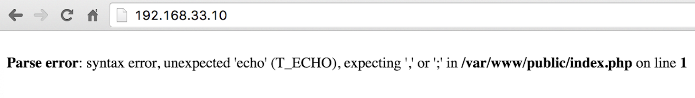
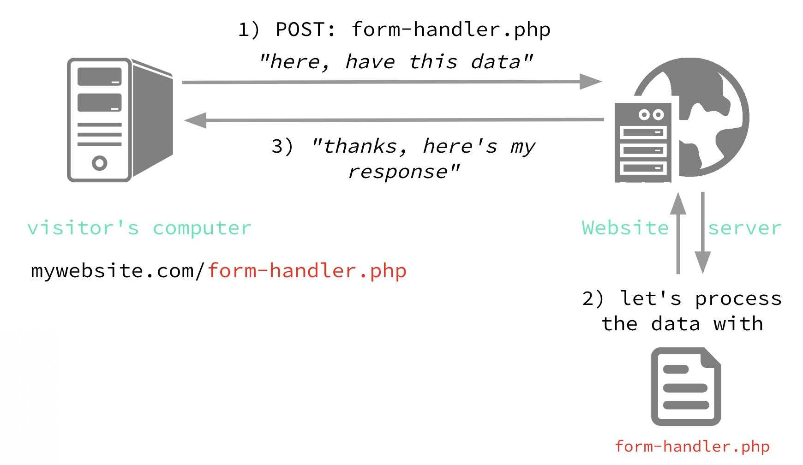

# PHP & the Backend

#### We'll start to be strict on:

-   Code is correctly indented and tidy
-   ↑ = ALWAYS, even if you copied it from elsewhere
-   File and folder names are consistent (avoiding spaces)
-   Functions, variables, classes are consistent in style
-   `camelCase` `kebab-case` `snake_case`

#### Developing your debugging process

-   Testing often (change & test, change & test)
-   Sense check what you are doing
-   Writing checks in your code
-   Check spelling and consistency (copy and paste is your friend)
-   Take a break
-   Ask others
-   Google

* * *

## On to PHP

### Overview

Introduction to backend development, PHP basics.

### Work method

Individually, on local machine

### New Tools

LAMP, Vagrant, MySQL

### Project

1.  Build a calculator
2.  Build a simple application with registration, email verification and login functionality.

### Module Outline

-   Basic syntax, variables, conditional logic, loops, arrays
-   Forms and user data
-   Building a calculator
-   Databases, sessions and cookies
-   Building a login system

* * *

## What is PHP?

PHP is a **server-side**<sup>1</sup>, **dynamic scripting**<sup>2</sup> language.

<sup>1</sup> Runs on a web server, which 'compiles' a page of HTML, as well as performing other actions. E.g. sending email, saving files, fetching data, formatting data.

<sup>2</sup> Allows for content to change each time a page is loaded.

#### HTML = static content

[Demo](https://developme.training/demo/time.html)

```html
<p>It's 12:41:32</p>
```

#### JavaScript = dynamic content on client

[Demo](https://developme.training/demo/time-with-javascript.html)

```html
<body onload="startTime()">
    <p>It's <span id="time">time goes here</span></p>
</body>
```

#### PHP = dynamic content on server

[Demo](https://developme.training/demo/time.php)

```html
<p>It's <?php echo date("H:i:s"); ?></p>
```

### Summary

|                | Runs where?      | Runs how?            |
| -------------- | ---------------- | -------------------- |
| **HTML & CSS** | Client (browser) | Once - static        |
| **JavaScript** | Client (browser) | Continuous - dynamic |
| **PHP**        | Server           | Once - dynamic       |

* * *

## Web Servers

### Hosting Environment

PHP needs to run server-side, so you'll need a web server to 'run' PHP scripts.

E.g. **Apache** on Linux or **IIS** on Windows (Internet Information Services)

### Why the server?

#### Centralised infrastructure


Database server

#### How PHP 'compiles' a page

```html
<h1>What time is it?</h1>
<p>It's
<?php
echo date("H:i:s");
?>
</p>
```

PHP creates a buffer, fills it with the content of the PHP file, and then sends that buffer to the browser.

```html
[Buffer]
<h1>What time is it?</h1>
<p>It's
[run code] 12:41:32
</p>
[Send]
```

* * *

## Vagrant

### LAMP

The most common server 'stack' in the world.

-   **Linux** operating system computer
-   **Apache** web server
-   **MySQL** database
-   **PHP** scripting language

#### Vagrant is somewhere to run your PHP

[Vagrant](https://www.vagrantup.com/) is a tool to create and control **virtual machines**; which are virtual computers (guests) that **run on your computer** (hosts).

We'll build and run a virtual LAMP computer with Vagrant.

### Getting setup with Vagrant

Check all is installed with:

```bash
$ vagrant -v
```

The result should be:

```bash
Vagrant 2.1.2
```

### Setup a new project folder

1.  Create a folder for your first PHP project in your projects folder, maybe called "week6"
2.  Open cmd/terminal and navigate to this project directory with:

    ```bash
    $ cd [path to your folder]
    ```

### Create your first Vagrant box (virtual machine)

[Download Scotch Box](https://github.com/scotch-io/scotch-box), an Ubuntu-based LAMP box, unzip, and put the files into your project folder


**Vagrantfile** defines what machine that Vagrant will build.

**public** is where you will put your files (PHP, HTML, CSS)

#### Turn on your machine (box)

'Spin up' (turn on) your box with:

```bash
$ vagrant up
```

#### Test your box is working

1.  Visit <http://scotchbox> or on Windows <http://192.168.33.10/>
2.  Verify "Welcome to Scotch Box"


#### Making your own domain (hosts entry)

1.  Edit the hosts file on your computer

```bash
$ sudo nano /etc/hosts
```

2.  Add a new entry that resolves to the new box's IP address, e.g.

```bash
192.168.33.10		oli.ward
```

3.  Save and exit nano with `Ctrl+X` then type `Y` and hit `Enter`

4.  Visit your new domain in your browser, e.g. <http://oli.ward/>

### Vagrantfile

#### Vagrantfile describes the machine

```bash
# -_- mode: ruby -_-

# vi: set ft=ruby :

Vagrant.configure("2") do |config|

    config.vm.box = "scotch/box"
    config.vm.network "private_network", ip: "192.168.33.10"
    config.vm.hostname = "scotchbox"
    config.vm.synced_folder ".", "/var/www", :mount_options => ["dmode=777", "fmode=666"]

    # Optional NFS. Make sure to remove other synced_folder line too
    #config.vm.synced_folder ".", "/var/www", :nfs => { :mount_options => ["dmode=777","fmode=666"] }

end
```

#### Start changing the files


* * *

## Programming with PHP

### Syntax


### Short syntax

```php
<?php echo 'hello world!'; ?>
```

```php
<p><?php echo 'hello world!'; ?></p>
```

```php
<?php echo 'hello'; echo ' world!'; ?>
```

### What will the HTML output be when this page is compiled?

```php
One<br />
<?php echo 'Two'; ?>
Three<br />
<?php 'Four'; ?>
Five<br />
```

#### Answer

```html
One<br />
TwoThree<br />
Five<br />
```

### What will the HTML output be when this page is compiled?

```php
One<br />
<?php echo 'Two'
echo 'Three' ?>
Four<br />
Five<br />
```

#### Answer

```php
One<br />
Parse error: syntax error, unexpected 'echo' (T_ECHO), expecting ',' or ';' in /var/www/public/index.php on line 3
```

* * *

## Exercise

### Create your first PHP file

1.  Use echo to output a string of text
2.  Save the file as echo.php file
3.  'run' the file in the browser and verify the output

* * *

## Strings

### String delimiters


### String concatenation


* * *

## Variables

### How PHP does variables

```php
<?php
$count = 3;
$type_of_fruit = 'apples';

echo $count; // how many?
echo ' '; // then a space
echo $type_of_fruit; // now the type of fruit
?>
```

### Variable names

```php
<?php
$2count = 3; // no
$count2 = 3; // yes
$type of fruit = 'apples'; // no
$type-of-fruit = 'apples'; // no
$type_of_fruit = 'apples'; // yes
$typeOfFruit = 'apples'; // yes
```

### Variables in strings: a little trick

```php
<?php
$type_of_fruit = 'apples';
echo 'I would like some '.$type_of_fruit.' please';
echo "I would like some $type_of_fruit please";
```

* * *

## Exercise

### Output your name

1.  Set a variable with your first name
2.  Set a variable with your surname
3.  echo out your full name using the variables
4.  Save as **name.php**

* * *

## Data types: strings and integers

```php
<?php
$number = 3;
$text = '3';
$more_text = 'banana';
```

### Maths

```php
<?php
$a = 3;
$b = 4;

echo $a + $b;
```

* * *

## Exercise

### How many seconds in a year?

1.  Setup variables with number of days in year, hours in day, etc.
2.  Write an expression which will output the number of seconds in a year, by doing maths on your variables
3.  Save as **year.php**

### Advanced: How far to the pub?

1.  Develop Me's space is at 51.4429178,-2.5693264 (lat, long)
2.  The Hare pub is at 51.4411688,-2.6022332
3.  Create a PHP script that works out the distance as the crow flies

* * *

## Errors

### Errors happen on the server

These may or may not be passed to the client to see



### Errors may not be 'visible'

The server may not pass errors to the user, so you'll need to access the server error log file to find them.

### Error file on Scotch Box

1.  SSH into your box:

    ```bash
    $ vagrant ssh
    ```

2.  Elevate to super-user (all the permissions)

    ```bash
    $ sudo su -
    ```

3.  View the end (tail) of the error log file:

    ```bash
    $ tail /var/log/apache2/error.log
    ```

4.  To get out of superuser (back to vagrant user)

    ```bash
    $ exit
    ```

5.  To get out of vagrant user (back to host machine)

    ```bash
    $ exit
    ```

* * *

## Logic / conditional statements

### If

```php
<?php
if (true) {
    // do this
}

if (false) {
    // not this!
}

// Important: Remember your indentation!
if ($today == 'Monday') {
    echo 'I hate Mondays!';
}
```

### If, else

```php
<?php
if (false) {
  // not this!
} else {
  // yes! this!
}

if (3 == 4) {
    echo 'maths is broken!';
} else {
    echo 'everything is fine';
}
```

### If, elseif, else

```php
<?php
if (false) {
    // not this!
} elseif (false) {
    // not this!
} else {
    // yes! this!
}
```

* * *

## Exercise

### What month is it?

1.  Set the numeric month of the year in a variable
2.  Write conditional statements (if, elseif, else) to test the month variable and give a different output for each month, e.g. `echo "It's October";`

* * *

## Logical operators

### And, or

```php
<?php
if ((true) and (false)) {
    // not this!
}

if ((true) or (false)) {
    // do this
}
```

### And (&&), or (||)

```php
<?php
if ((true) && (false)) {
    // not this!
}

if ((true) || (false)) {
    // do this
}
```

### Logical operators

```php
<?php
if (($today == 'Friday') && ($hour > 17)) {
    echo 'Beer time!';
}
```

* * *

## Comparison operators

Useful: <http://php.net/manual/en/language.operators.comparison.php>

### Equals

```php
<?php
if (3 == '3') {
    echo 'Threes!';
}
```

### Not equals

```php
<?php
if (3 != 4) {
    echo 'Maths still works!';
}
```

### Identical

```php
<?php
if (3 === '3') {
    echo 'Not equivalent! ';
}
```

### Not identical

```php
<?php
if (3 !== '3') {
    echo 'Not equivalent! ';
}
```

### Less than

```php
<?php
if (2 &lt; 3) {
    echo 'Of course 2 is smaller!';
}
```

### More than

```php
<?php
if (4 > 3) {
    echo 'Of course 4 is bigger!';
}
```

* * *

## Yoda Conditionals

### From

```php
<?php
if ( true == $the_force ) {
    $victorious = you_will( $be );
}

if (value == $variable) { ...
```

### Reduces mistakes

```php
<?php
$number = 4;
if ($number = 3) {
    echo 'Threes!';
}
vs.
if (3 = $number) {	// syntax error
    echo 'Threes!';
}
```

* * *

## Arrays

### Store an array of items, which have keys.

```php
<?php
$days = [
	0 => 'Monday',
	1 => 'Tuesday',
	2 => 'Wednesday'
];
```

### Another array, non-numeric keys

```php
<?php
$fruit = [
	'green' => 'apple',
	'yellow' => 'banana',
	'red' => 'raspberry'
];

echo $fruit['green']; // apple
```

* * *

## Loops

### Loops and arrays

```php
<?php
$fruit = [
	'green' => 'apple',
	'yellow' => 'banana',
	'red' => 'raspberry'
];
```

### Accessing values in arrays

```php
<?php
echo $fruit['green'];

// Output:
apple
```

### Other ways to populate arrays

```php
<?php
$fruit = array();
$fruit['green'] = 'apple';
$fruit['green'] = 'pear';
$fruit['yellow'] = 'banana';
$fruit['red'] = 'raspberry';
```

### Foreach, getting key and value

```php
<?php
foreach($fruit AS $key => $value) {
    echo $value.'s are '.$key.'<br />';
}
```

### Foreach, getting key and value

```php
<?php
foreach($fruit AS $colour => $type_of_fruit) {
    echo $type_of_fruit.'s are '.$colour.'<br />';
}
```

### Foreach, getting just value

```php
<?php
foreach($fruit AS $type_of_fruit) {
    echo $type_of_fruit.'<br />';
}
```

#### Output

```html
apples are green<br />
bananas are yellow<br />
raspberrys are red<br />
```

* * *

## Exercise

### Where do we live?

1.  Create an associative array of people and places
2.  Loop through the array to output in format:  
    "Oli lives in Bedminster"  
    "Tom lives in Clifton"  
    ...

* * *

## Debugging

### Viewing arrays - var_dump($array)

```php
<?php
var_dump($fruit);

array(3) {
	["green"] =>
	string(5) "apple"
	["yellow"] =>
	string(6) "banana"
	["red"] =>
	string(9) "raspberry"
}
```

* * *

## Arrays in arrays

### Fruit array

```php
<?php
$fruit = [
	'green' => 'apple',
	'yellow' => 'banana',
	'red' => 'raspberry'
];
```

#### Output

```html
apples are green<br />
bananas are yellow<br />
raspberrys are red<br />
```

### Nested arrays

```php
<?php
$fruit = [
	'green' => ['apple', 'apples'],
	'yellow' => ['banana', 'bananas'],
	'red' => ['raspberry', 'raspberries']
];
```

```php
<?php
array(3) {
  ["green"]=>
  array(2) {
    [0]=>
    string(5) "apple"
    [1]=>
    string(6) "apples"
  }
  ["yellow"]=>
  array(2) {
    [0]=>
    string(6) "banana"
    [1]=>
    string(7) "bananas"
  }
  ["red"]=>
  array(2) {
    [0]=>
    string(9) "raspberry"
    [1]=>
    string(11) "raspberries"
  }
}
```

* * *

## For loops

Iterative loops: for

```php
<?php
for( $i = 1; $i &lt;= 10; $i++) {
    echo $i.'<br />';
}

// Output
1
2
3
4
5
6
7
8
9
10
```

* * *

## Exercise

### Even numbers

Create a **for loop** that only outputs the even numbers between 0 and 100.

#### Advanced: 3 other approaches

For the same problem, create 3 other, different versions
credit for how unconventional your approach is

* * *

## While loops

### Research and use 'while'

Create a while loop that only outputs the odd numbers between 0 and 100.

## Switches

```php
<?php
$day = 5;

switch($day) {
    case 6:
	echo 'Saturday';
	break;
    case 7:
        echo 'Sunday';
        break;
    default:
        echo 'Weekday';
}
```

```php
<?php
$day = 5;

switch($day) {
    case 6:
    case 7:
        echo 'Weekend';
        break;
    default:
	echo 'Weekday';
}
```

* * *

## Exercise

### Sunrise and sunset

Create a for loop that goes through the hours of the day, starting at 0:00. Write a switch statement to print whether it is light or not.

For example:

"0:00 is dark"  
...  
"8:00 is light"  
...  
"23:00 is dark"  

#### Advanced: how short can you make it

How many characters can you do the previous exercise in?

* * *

## Functions

### Defining your function

Functions can be passed variables, and can do work on them.
They are ways of modularising functionality, for re-use.
Functions

```php
<?php
function format_email($name, $email) {
    $formatted = $name . ' &lt;' . $email . '>';

    return $formatted;

}
```

### Using your function

```php
<?php
echo format_email('Oli Ward', 'oli@developme.training');

// Output:

Oli Ward <mailto:oli@developme.training>
```

```php
<?php
$output = format_email('Oli Ward', 'oli@developme.training');
echo $output;

Output:

Oli Ward <mailto:oli@developme.training>
```

* * *

## Exercise

### Formatting Twitter handle

1.  Create a function that takes Twitter username in any form, e.g.:

    `oliward → @oliward`

    `@MR_BUBBLES → @mr_bubbles`

    `@hashtag%warrior → @hashtagwarrior`

2.  Format and return in form '@oliward' (lowercase)

    Hint: see PHP's built-in `strtolower()` function, `str_replace()`, preg_replace() (for regular expression help: <https://regexr.com>)

### Formatting Twitter handle (Advanced)

Also account for user inputting:

<https://twitter.com/oliward>

<http://twitter.com/@oliward>

<https://twitter.com/oliward#home>

* * *

## Homework

1.  Formatting credit card numbers

    1.  Create a function that takes CC numbers in any form, e.g.:

        41112222333344445

        4111 2222 3333 4444

        4111x2222x3333x4444

        4111-2222-3333-4444

        4111-2222-3333-4444-5555

    2.  Format and return in form '4111-2222-3333-4444'

        Hint: see PHP's built-in substr() function

2.  Fizz Buzz

    Write a script that prints the numbers from 1 to 100. For multiples of 3, print "Fizz" instead of the number. For multiples of 5, print "Buzz". For numbers which are multiples of both 3 and 5, print "FizzBuzz".

3.  Complete PHP Fizz Buzz in fewest characters.

* * *

## Forms and data


\-


* * *

## Form action

### Defines what page will load when form is submitted

```html
<form action="form-handler.php">
    <input type="text" name="email" />
    <input type="submit" value="Send" />
</form>
```

#### Example process

1.  Visit contact.html
2.  Fill in form
3.  Submit form
4.  Form data sent to server, to **form-handler.php** document
5.  Server sends response to browser, visitor is now on **form-handler.php** page

### Form/HTTP methods

#### HTTP Request Methods: GET and POST verbs

Two most common methods for a request-response between a client and server are:

-   **GET** - Requests data from a specified resource
-   **POST** - Submits data to be processed by a specified resource


.



* * *

## POST method

### HTML form with 'POST' method

```html
<form action="form-handler.php" method="post">
    <input type="text" name="email" />
    <input type="submit" value="Send" />
</form>
```

### Accessing the POST variables

`contact.html`

```html
<input name="email" type="text" />
```

`form-handler.php`

```php
<?php
echo $_POST['email'];
?>
```

* * *

## GET method

### HTML form with 'GET' method

```html
<form action="form-handler.php" method="get">
    <input type="text" name="email" />
    <input type="submit" value="Send" />
</form>
```

### Accessing the GET variables from the URL


### Which method to use?

#### POST - Use if:

-   Form collects sensitive data, e.g. online shop, creating an account, health data!
-   Form result/handler page doesn't need to be bookmarkable or shareable

#### GET - Use if:

-   Form result page should be bookmarkable or shareable, as values form part of URL
-   Suitable for:
    -   Search results
    -   Filtering content

* * *

## Single vs. multi page form handling

### Multi page/document process


### Single page process


* * *

## Building a calculator

## Exercise

### Calculator form


#### Calculator document order (single page)

```php
<?php
    // work out answer here
?>
<form>
    [X] + [Y] = output answer here
</form>
```

#### Calculator exercise steps

1.  Build the form. Think about:

    -   **action**
    -   **method**
    -   input **names**

2.  Check you can submit the form and output the values (just echo them out)

3.  Start building the functionality to do different calculations

#### Calculator PHP steps

You will need to:

-   Check they've submitted the form with `if ($_POST){`
-   Get the numbers
-   Identify the operation
-   Do the maths
-   Store the result
-   Output the result

#### Calculator pro features

-   Input fields are pre-filled with 0, and assume 0 if left empty
-   Answer defaults to '?' before submission of form
-   Input fields are repopulated with user input on submission
-   Operation dropdown re-selects chosen operation
-   Making it look pretty

#### Calculator show-off features

-   A 'tape printout' feature, which remembers all the calculations you've done so far
-   Implement ALL the scientific operators (sin, cos, tan, √, etc…)
-   Allow free-form text input (e.g. ((3 + 2) \* 4 + 1))

* * *

## Introduction to databases

### Databases

**Database** → like a spreadsheet document

**Table** → like a tab or sheet of the document

### Table structures

**Columns**	→ different data fields, e.g. name, age, price

**Rows** → different entries, e.g. people, purchases, products

### Table structure, example data


* * *

### Accessing your database

#### MySQL on your vagrant box

1.  SSH into your virtual server:

    ```bash
    $ vagrant ssh
    ```

2.  Access MySQL with the root user account

    ```bash
    $ mysql -u root -p
    ```

3.  Password is `root`

    Or, you can type:

    ```bash
    $ mysql -u root -proot
    ```

### Database queries

#### See what databases you have access to

`mysql> SHOW DATABASES;`

    mysql> show databases;
    +--------------------+
    | Database           |
    +--------------------+
    | information_schema |
    | mysql              |
    | performance_schema |
    | scotchbox          |
    +--------------------+
    4 rows in set (0.00 sec)

#### Use 'scotchbox' and see the tables

``mysql> USE `scotchbox`;``

`mysql> SHOW TABLES;`

    mysql> use scotchbox;
    Database changed
    mysql> show tables;
    Empty set (0.00 sec)

#### Creating tables

    CREATE TABLE `test` (
      `id` int(11) NOT NULL AUTO_INCREMENT,
      `fullname` varchar(255) NOT NULL,
      `location` varchar(255) NOT NULL,
      `age` int(11) NOT NULL,
      PRIMARY KEY (`id`)
    ) ENGINE=InnoDB  DEFAULT CHARSET=latin1 AUTO_INCREMENT=1 ;

#### Populating table with data

    INSERT INTO `test` (`id`, `fullname`, `location`, `age`) VALUES
    (1, 'Oli Ward', 'Bedminster', 32),
    (2, 'Simon Capet', 'College Green', 46),
    (3, 'Simon New', 'Montpelier', 34),
    (4, 'Kasia Pranke', 'Bedminster', 30),
    (5, 'Josh Sweet', 'Redland', 28);

#### Fetch (select) data

``SELECT * FROM `test`;``

    +----+--------------+----------------+-----+
    | id | fullname     | location       | age |
    +----+--------------+----------------+-----+
    | 1  | Oli Ward     | Bedminster     | 32  |
    | 2  | Simon Capet  | College Green  | 46  |
    | 3  | Simon New    | Montpelier     | 34  |
    | 4  | Kasia Pranke | Bedminster     | 30  |
    | 5  | Josh Sweet   | Redland        | 28  |
    +----+--------------+----------------+-----+
    5 rows in set (0.00 sec)

#### Fetch (select) data based on a condition

``SELECT * FROM `test` WHERE `age` < 30;``

    +----+--------------+----------------+-----+
    | id | fullname     | location       | age |
    +----+--------------+----------------+-----+
    | 5  | Josh Sweet   | Redland        | 28  |
    +----+--------------+----------------+-----+
    1 row in set (0.00 sec)

``SELECT * FROM `test` WHERE `location` = 'Bedminster';``

    +--------------+
    | fullname     |
    +--------------+
    | Oli Ward     |
    | Kasia Pranke |
    +--------------+
    2 rows in set (0.00 sec)

#### Exit MySQL

    mysql> exit

* * *

## Exercise

### Populate your database

1.  SSH into your box, log into MySQL, and set to use `scotchbox` database
2.  [Download SQL](http://resources.developme.training/wp-content/uploads/2016/06/test-sql.txt) for test table, or see below:

        CREATE TABLE IF NOT EXISTS `test` (
          `id` int(11) NOT NULL AUTO_INCREMENT,
          `fullname` varchar(255) NOT NULL,
          `location` varchar(255) NOT NULL,
          `age` int(11) NOT NULL,
          PRIMARY KEY (`id`)
        ) ENGINE=InnoDB  DEFAULT CHARSET=latin1 AUTO_INCREMENT=6 ;

        INSERT INTO `test` (`id`, `fullname`, `location`, `age`) VALUES
        (1, 'Oli Ward', 'Bedminster', 32),
        (2, 'Simon Capet', 'College Green', 46),
        (3, 'Simon New', 'Montpelier', 34),
        (4, 'Kasia Pranke', 'Bedminster', 30),
        (5, 'Josh Sweet', 'Redland', 28);

3.  Copy and paste SQL into MySQL prompt
4.  Hit 'Enter'
5.  Verify tables with:

        mysql> SHOW TABLES;

#### Fetch data using a SELECT query

Example: ``SELECT * FROM `table name`;``

    +----+--------------+----------------+-----+
    | id | fullname     | location       | age |
    +----+--------------+----------------+-----+
    | 1  | Oli Ward     | Bedminster     | 32  |
    | 2  | Simon Capet  | College Green  | 46  |
    | 3  | Simon New    | Montpelier     | 34  |
    | 4  | Kasia Pranke | Bedminster     | 30  |
    | 5  | Josh Sweet   | Redland        | 28  |
    +----+--------------+----------------+-----+
    5 rows in set (0.00 sec)

#### Fetch just the name field using a SELECT query

Example: ``SELECT `field name` FROM `table name`;``

    +----+--------------+----------------+-----+
    | id | fullname     | location       | age |
    +----+--------------+----------------+-----+
    | 1  | Oli Ward     | Bedminster     | 32  |
    | 2  | Simon Capet  | College Green  | 46  |
    | 3  | Simon New    | Montpelier     | 34  |
    | 4  | Kasia Pranke | Bedminster     | 30  |
    | 5  | Josh Sweet   | Redland        | 28  |
    +----+--------------+----------------+-----+
    5 rows in set (0.00 sec)

#### Update Josh's age with UPDATE SQL query

Example: ``UPDATE `table name` SET `field name` = 'value' WHERE `field name` = 'value');``

    +----+--------------+----------------+-----+
    | id | fullname     | location       | age |
    +----+--------------+----------------+-----+
    | 1  | Oli Ward     | Bedminster     | 32  |
    | 2  | Simon Capet  | College Green  | 46  |
    | 3  | Simon New    | Montpelier     | 34  |
    | 4  | Kasia Pranke | Bedminster     | 30  |
    | 5  | Josh Sweet   | Redland        | 29  |
    +----+--------------+----------------+-----+
    5 rows in set (0.00 sec)

#### Add more data for Pete using INSERT query

Example: ``INSERT INTO `table name` (`field name`, `field name`, `field name`) VALUES ('value', 'value', 'value');``

    +----+--------------+----------------+-----+
    | id | fullname     | location       | age |
    +----+--------------+----------------+-----+
    | 1  | Oli Ward     | Bedminster     | 32  |
    | 2  | Simon Capet  | College Green  | 46  |
    | 3  | Simon New    | Montpelier     | 34  |
    | 4  | Kasia Pranke | Bedminster     | 30  |
    | 5  | Josh Sweet   | Redland        | 29  |
    | 6  | Pete New     | Easton         | 32  |
    +----+--------------+----------------+-----+
    6 rows in set (0.00 sec)

* * *

## SQL rules

### "Special" words written in uppercase

`USE DATABASE ...;`

`SELECT * FROM ...;`

`CREATE TABLE ...;`

### Quotes and backticks

`` `table name` ``

`` `field name` ``

`'string value'`

`"string value"`

* * *

## Exercise

1.  Add a new column for 'favourite beverage' and populate with data

        +----+--------------+----------------+-----+--------------------+
        | id | fullname     | location       | age | favourite beverage |
        +----+--------------+----------------+-----+--------------------+
        | 1  | Oli Ward     | Bedminster     | 32  | coffee             |
        | 2  | Simon Capet  | College Green  | 46  | coffee             |
        | 3  | Simon New    | Montpelier     | 34  | tea                |
        | 4  | Kasia Pranke | Bedminster     | 30  | tea                |
        | 5  | Josh Sweet   | Redland        | 28  | water              |
        | 6  | Pete New     | Easton         | 32  | herbal tea         |
        +----+--------------+----------------+-----+--------------------+
        6 rows in set (0.00 sec)

2.  **Add a new column for 'last updated'**

    The single column should store the date and time the row was last updated (make these times up!).

    There are various data types that are suitable for storing dates and times, so do a bit of research.

3.  **Create a search query**

    Find a way of returning just the rows that have `fullname` starting with 'Simon'.

4.  **Totalling up columns**

    Find the total age from the rows that have a "t" in the location.

#### Optional Extras:

1.  Make another table to store information about pets owned by the people in our `test` table.
2.  Include an `id` field for the pet's id, but also an `owner id` field to relate it back to the people that own them.
3.  Add some data (pets) for each person.
4.  Try writing some SELECT queries to get a person and their pets in a single query. (Hint: see JOINs)

* * *

## Building a login system

### Common account sign up process

1.  Register with email and password
2.  Verification email sent (best email validation method!)
3.  Click link to activate account
4.  Login
5.  Profit

### Registration handling

#### What steps do we need on our registration page?

Think about the calculator, what steps do we need to code for the registration to work?

* * *

## Exercise

### Live coding - register.php

1.  Form
2.  PHP form handling
3.  Check user input
4.  Create an activation code
5.  Save in database
6.  Send email
7.  Success message

* * *

## Database transactions with PHP

### Connecting to the database

#### Step 1: Connecting to a database

```php
<?php
$db_server = "localhost";
$db_username = "root";
$db_password = "root";
$db_database = "scotchbox";

// Create connection
$db_connection = new mysqli($db_server, $db_username, $db_password, $db_database);
```

#### Step 2: Test connection to the database

```php
<?php
// Check connection
if ($db_connection->connect_error) {
    die("Connection failed: " . $db_connection->connect_error);
}
```

### Sanitising user input

#### Step 1: Make user data safe

```php
<?php
$clean_email = mysqli_real_escape_string($db_connection, $email);
$clean_password = mysqli_real_escape_string($db_connection, $password);

$clean_activation_code = mysqli_real_escape_string($db_connection, $activation_code);
```

### Writing database data

#### Step 1: build an INSERT query

```php
<?php
$query = "INSERT INTO users (`email`, `password`) VALUES ('$clean_email', '$clean_password');";
```

#### Step 2: run a query through your connection

```php
<?php
$result = mysqli_query($db_connection, $query);
```

#### Step 3: checking the query ran okay

```php
<?php
if ($result) {
    // query ran okay
    if (mysqli_affected_rows($db_connection) == 1) {
	// and we changed 1 or more rows of data
    } else {
	// Uh oh, something went wrong
    }
} else {
    // Uh oh, query didn't run! A problem with the query
}
```

#### For reference: how to get **id** of the new row

```php
<?php
if (mysqli_affected_rows($db_connection) > 0){
    echo 'New record ID is '.mysqli_insert_id($db_connection);
}
```

### Reading database data

#### For reference

You'll need to be able to read data from the database in your activation page

#### Step 1: build a SELECT query

```php
<?php
$query = 'SELECT * FROM test';
```

#### Step 2: run the query

```php
<?php
$result = mysqli_query($db_connection, $query);
```

#### MySQL result object

```php
<?php
var_dump($result);
object(mysqli_result)#2 (5) {
  ["current_field"]=>
  int(0)
  ["field_count"]=>
  int(4)
  ["lengths"]=>
  NULL
  ["num_rows"]=>
  int(6)
  ["type"]=>
  int(0)
}
```

#### Step 3: accessing the result data

```php
<?php
if (mysqli_num_rows($result) > 0){
    while($row = mysqli_fetch_assoc($result)){
	var_dump($row);
    }
}
```

#### Row data

```php
<?php
array(4) {
  ["id"]=>
  string(1) "1"
  ["fullname"]=>
  string(8) "Oli Ward"
  ["location"]=>
  string(10) "Bedminster"
  ["age"]=>
  string(2) "32"
}
array(4) {
  ["id"]=>
  string(1) "2"
  ["fullname"]=>
  string(11) "Simon Capet"
  ["location"]=>
  string(13) "College Green"
  ["age"]=>
  string(2) "46"
}
```

#### Step 4: outputting row data

```php
<?php
if (mysqli_num_rows($result) > 0){
    while($row = mysqli_fetch_assoc($result)){
	echo $row['fullname'].' lives in '.$row['location'];
	echo '<br />';
    }
}
```

* * *

## Securely storing passwords

### Saving hashed passwords

```php
<?php
$password = 'letmein';
$hashed_password = password_hash($password, PASSWORD_DEFAULT);
// $2y$10$vM29l9nq7wS1V9r7hrWdYOCRxTd8tuNMkwf0ZQE63j3sKfel7GucK
INSERT INTO users (email, password) VALUES ('oli@oli.com', '$2y$10$vM29l9nq7wS1V9r7hrWdYOCRxTd8tuNMkwf0ZQE63j3sKfel7GucK');
```

### Saving the hashed password

`password_hash()` function produces 60 character hash.

You need **60 characters** to store in a database.

<sub>**Although beware: <http://php.net/manual/en/function.password-hash.php>:**</sub>

<sub>Note that this constant is designed to change over time as new and stronger algorithms are added to PHP. For that reason, the length of the result from using this identifier can change over time. Therefore, it is recommended to store the result in a database column that can expand beyond 60 characters (255 characters would be a good choice).</sub>

### Checking passwords

If we've hashed password (one way) and stored that in database, how do we know if the given password is correct in future?

With `password_verify()` PHP function.

So, if we have this stored in database:

`$2y$10$vM29l9nq7wS1V9r7hrWdYOCRxTd8tuNMkwf0ZQE63j3sKfel7GucK`

```php
<?php
$password = $_POST['password']; // = wrongpassword
if (password_verify($password, $row['password'])){ // false

$password = $_POST['password']; // = letmein
if (password_verify($password, $row['password'])){ // true
```

* * *

## Sending email

### PHP's send email function (basic)

`mail($to_email, $subject, $message);`

### Setting email headers

Headers can optionally be passed to the mail() function to set other attributes.

For example to allow HTML email, set a reply-to address, set the from address, CC or BCC people, etc.

You can use them like this:

```php
<?php
$headers = "From: Dev Me <team@example.com>\r\n";
$headers .= "Reply-To: Help <help@example.com>\r\n";
$headers .= "MIME-Version: 1.0\r\n";
$headers .= "Content-Type: text/html;\r\n";
mail($to_email, $subject, $message, $headers);
```

### [MailHog](https://github.com/mailhog/MailHog) on Scotch Box

Sending email, especially from a local server, is tricky.
For ease we'll pick up the email on the server instead of sending to an email address.

To see your email inbox visit <http://192.168.33.10:8025> or <http://scotchbox:8025>

* * *

## Common procedural PHP structures

```php
<?php
// set initial variables

if (form was submitted) {
    // check user input

    if (user input okay) {
	// do database stuff

        if (database updated) {
	    send email
	}
    }
}
if (success) { ?>
	Well done!
<?php } else { ?>
	<form></form>
<?php } ?>
```

* * *

## Sessions and Cookies

### Storing state

How do we know if someone is logged in or not?

We can store data in:

#### Sessions

data destroyed when browser is closed

#### Cookies

data saved until deleted by user, or they expire

### To use sessions you need to start sessions

```php
<?php
session_start(); // start session

$_SESSION['logged_in'] = 'YES'; // use session
```

### Setting and accessing session data

```php
<?php
if ($inputted_password == $password_from_database){
$_SESSION['logged_in'] = 'YES';
}
if (isset($_SESSION['logged_in'])){
    if ('YES' == $_SESSION['logged_in']){
        echo 'Welcome to your account!';
    }
}
```

### Setting and accessing cookie data

```php
<?php
setcookie($name, $value, $expire);

setcookie('logged_in', 'YES', time()+3600);

if ('YES' == $_COOKIE['logged_in']){
    echo 'Welcome to your account!';
}
```

### Optional extras

#### Registration

-   Check password strength at registration (greater than 8 characters, must have a letter, number and symbol)
-   Check email passes basic validation at registration (use `filter_var()`)
-   Check you don't already have that email in your database with an activated account (think about a further check you might want to add to the activation page)

#### Login page

-   Check the user isn't already logged in before showing them the form
-   Either redirect them or prompt them to go straight to the account page

#### Logout page

-   Create a page where people can logout, destroying the session or cookie.

#### Forgotten password

-   Implement a forgotten password page
-   This page should allow people to give their email address and we send them a password reset link (including a unique code) if we find it in the database
-   The reset link brings them back to a reset page where they can choose a new password

#### My account

-   Implement an "update your details" page where people can change their password when logged in

#### Improving the system

-   Collect more data from the use, e.g. their name, so we can great them "Hello Dave…" when they arrive on the account page
-   Consider: how will we know which user they are after they've logged in?
-   Implement `password_hash()` on registration page and `password_verify()` on login page, instead of storing plain text passwords

* * *

## Password security

### Hashing

Hash functions are 'one-way' transformation of data to data of a fixed size.


### PHP hash functions

```php
<?php
echo md5('letmein'); // 0d107d09f5bbe40cade3de5c71e9e9b7
echo md5('somethingelse'); // 79526cea4dd176949019b2e7dcfe1f8d
echo hash('sha256', 'letmein'); // 34ca062314edaa193e03f318ae20ae134274b358
```

### Hashing of data larger than output → collision

```php
<?php
echo md5('It was the best of times, it was the worst of times, it was the age of wisdom, it was the age of foolishness, it was the epoch of belief, it was the epoch of incredulity, it was the season of Light, it was the season of Darkness, it was the spring of hope, it was the winter of despair, we had everything before us, we had nothing before us, we were all going direct to Heaven, we were all going direct the other way – in short, the period was so far like the present period, that some of its noisiest authorities insisted on its being received, for good or for evil, in the superlative degree of comparison only.');
```

→ <span style="color:red">`2f7fbc15df493551692711f6fe30d544`</span>

`1,532,495,540,865,900,000,000,000,000,000,000,000,000,000,000,000,000,000 outputs`

### Saving hashed passwords

```php
<?php
$password = 'letmein';
$hashed_password = password_hash($password, PASSWORD_DEFAULT);
// $2y$10$vM29l9nq7wS1V9r7hrWdYOCRxTd8tuNMkwf0ZQE63j3sKfel7GucK
INSERT INTO users (email, password) VALUES ('oli@oli.com', '$2y$10$vM29l9nq7wS1V9r7hrWdYOCRxTd8tuNMkwf0ZQE63j3sKfel7GucK');
```

### Checking passwords

If we've hashed password (one way) and stored that in the database, how do we know if the given password is correct in future?

With `password_verify()` PHP function.

So, if we have this stored in database:

`$2y$10$vM29l9nq7wS1V9r7hrWdYOCRxTd8tuNMkwf0ZQE63j3sKfel7GucK`

```php
<?php
$password = $_POST['password']; // = wrongpassword
if (password_verify($password, $row['password'])){ // false

$password = $_POST['password']; // = letmein
if (password_verify($password, $row['password'])){ // true
```

### Why is that useful? What if we get hacked?

Username: oli@oli.com

Password: 0d107d09f5bbe40cade3de5c71e9e9b7

#### Try to log in with these details

```php
<?php
$_POST['password'] = '$2y$10$vM29l9nq7wS1V9r7hrWdYOCRxTd8tuNMkwf0ZQE63j3sKfel7GucK';

echo password_hash($password, PASSWORD_DEFAULT);
```

→ <span style="color:red">`95689b85b58c9f2613ef6fd4494c6e3f`</span>

### Hash functions are one-way, right?

#### Right?

### Rainbow tables

    a	→	0cc175b9c0f1b6a831c399e269772661
    b	→	92eb5ffee6ae2fec3ad71c777531578f
    c	→	4a8a08f09d37b73795649038408b5f33
    d	→	8277e0910d750195b448797616e091ad
    aa	→	4124bc0a9335c27f086f24ba207a4912
    ab	→	187ef4436122d1cc2f40dc2b92f0eba0
    ac	→	e2075474294983e013ee4dd2201c7a73
    ad	→	523af537946b79c4f8369ed39ba78605

    4124bc0a9335c27f086f24ba207a4912   →  aa

1-10 characters (a-z, 0-9) = 316 GB!!!!

### Hashing and salting

Add salt to a password, hash that:

```php
<?php
$password = 'letmein';
$salt = 'RaNd0m!';
$salted_password = md5($password.$salt);
```

Requires hacker to create a rainbow table for every possible password + your salt.

1-10 characters (a-b, 0-9) = 316 GB!!!!

* * *

## Vagrant hostsupdater without password

### Mac only (sorry)

Run `sudo nano /etc/sudoers.d/vagrant_hostsupdater`

Enter your password

Paste in this text:

```bash
# Allow passwordless startup of Vagrant with vagrant-hostsupdater.
Cmnd_Alias VAGRANT_HOSTS_ADD = /bin/sh -c echo "*" >> /etc/hosts
Cmnd_Alias VAGRANT_HOSTS_REMOVE = /usr/bin/sed -i -e /*/ d /etc/hosts
%admin ALL=(root) NOPASSWD: VAGRANT_HOSTS_ADD, VAGRANT_HOSTS_REMOVE
```

Then `Ctrl+X` then `y` then `[Enter]` to save changes
