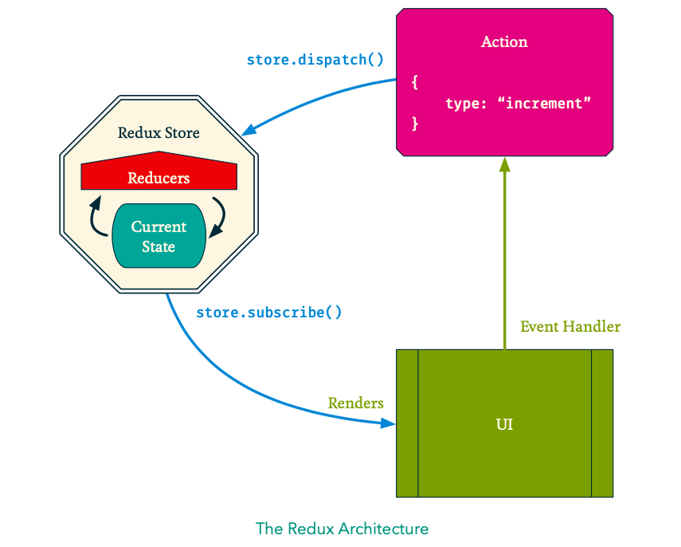

## Marks Amazing Notes
* [React/Redux Notes (PDF)](https://github.com/Royce-Coolidge/Rowleys_Coding_CheatSheet/raw/master/docs/assets/react_redux.pdf)


#  Redux
Moving on from Programming to Software Architectecture. Need to be a good programmer to be a software architect. About putting together individual algorithms in an app.

Only way to learn software architecture is to build shitty software, make loads of mistakes and learn from them!

Trello is a regulr Javascript app

React designed to build indicvidual components. fine for simple apps but complicated apps need to complex data-flows.

Simple apps we'll be making this week could probably be done with just React, but we could make trello app with redux, couldn't with just React.

For complex interactions between components, the logical conclusion is that the state be lifted to the top-level component (App.js), so a umbrella parent component gets passed all the states. 

In redux, we remove this umbrella parent for state outside of the 

principle of MVS - Model View Controller: Data and UI separated, completely differtent pieces of code.

Redux does the Data, React does the UI. React Redux allows them to communicate with each other

This is called **separation of concerns** 
React is a UI library
Redux is a state management library

**Start building Apps! the only way to learn React and Redux. Priority**

- Calculator App
- Blog App
- Trello to-do type App

## Setting up React / Redux App:

1. `$ npm init react-app app-name`
2. `$ npm start` - only need to do this once
3. cd ./
4. Bootstrap cdn link in index.html <head>
5. `$ npm install redux`
6. 
7. index.js - spearate from React - place to do our state management.

## The Initial State
- create initial state object literal. create Data/initial.js
**NEXT STEP** Time for our first Reducer 

##  The Reducer
- gets called by store, whenever an **action** is **dispatched**. It gets given two values, (current version of the state,  and a action that was dispatched)

```js
let reducer = (state, action)
```

- State will change but not the structure, always have the same keys.
- *Action* is also just an object with one property, `type`

```js
let reducer = (state, action) => {
	switch(action.type) {
	case "increment": return {...state, count: count:state.count + 1};
	default: return state;
	}
};

let newState = reducer(initial, { type: 'increment'})
```

CAN'T mutate state. must create new object with spead operator. if you don't state won't render properly.

KEY RULES: 
- if something has changed you need to return a new object. CANNOT MUTATE THE STATE DIRECTLY.

Generally you will be using functional composition to write pure functions 

- the return value must always have the same structure as the origional state.

- reducer always returns copy of the state.


**NEXT STEP**  create a store to store state


## The Store 

- This is a wrapper around our state: it allows us to dispatch actions, which will change the state, and subscribe to any changes, so we can get the latest state. Importantly, can’t access the state directly as it’s wrapped inside the store.

```js
import { CreateStore } from 'redux';

// We can then pass the initial state and reducer to createStore, which gives us back a new Redux store:
let store = createStore(reducer, initial);
```
- We pass the store the initial state and the reducer function. 
call the reducer funtion, passes in the current state and updates the state.

**NEXT STEP**  create a subsciber to moniter changes

## Subscribing 

- we subscribe to the store to let us know when the state changes

- We can use the getState() method of store to get the current state. 
  
```js
//// subscribe to any changes
store.subscribe(() => {
// get the current state using the getState method // we can get the state, but not update it
let state = store.getState();
```

**NEXT STEP**  Time to  dispatch an action to call the reducer 

## Dispatching Actions
```js
// dispatching an action
store.dispatch({ type: "increment" });
```
  Each time we dispatch an action:
  1. The **store** runs the reducer function for us
  2. **Reducer** looks at the action type property and transforms the state appropriately. 
  3. Once the reducer has returned a value, the function we passed to `store.subscribe()` will be run
  4. We can then update our page appropriately.

# Summary

- We setup an **initial state**
- We create a **reducer**, which takes different actions and transforms our data based on the action’s type property
- We create our **store** passing it our reducer and the initial state
- We **subscribe** to the store, so that we can respond whenever the state changes (usually by re-rendering the view)
- We **dispatch** actions to the store to make changes to our state(usually in event handlers)




## Working with React
- Now let’s get Redux working with React. We’ll need to tell React to re-render the **App** component whenever the state changes. We can do this by calling **ReactDOM’s render()** method inside our subscribe function:

```js
// we update subscribe to call the ReactDOM.render method whenever the state changes
let render = () => {
	let state = store.getState();
	ReactDom.render(
		<App count={ state.count }/>), 
		document.get ElementById('root')
		);
};
store.subscribe(render); // render when state changes
render()  // render when page loads using initial state
```

## How to dispatch in our App component:

App must not know about redux!! If they do, we have broken the app.

We pass down functions from redux to our app component. App itself knows nothing about the effect of the function, but can call it through event handlers.

```js
Index.js

let render = () => {
	let state = store.getState();
	ReactDom.render(
		<App 
		count={ state.count }
		handleIncrement={ () => store.dispatch({ type: "increment"})}
		/>), 
		document.get ElementById('root'));
})
```

```html
App Component

<button onClick={ handleIncrement } />

```
## Reducer.js, Intial.js, Store.js

Simplify by creating `reducer.js` to put all your reducer switch statements, `initial.js` to store intial value (Remember to import.)Keep `index.js` to keep **store** and **render**.

## Local Storage Package

This is how to stop page refreshes wiping data in the browser => use local storage. Follow mark's notes for step by step (p.21)

`$ npm install redux-localstorage`

In `store.js`...

1. `import compose from 'redux'`
2. `import persistStore from 'redux-localstorage'`

let composeEnhancers = window.__REDUX_DEVTOOL_EXTENSION_COMPOSE__ || compose

## React Redux

Use <provider> to communicate between redux and react. Basically how we re-render the react components when our state changes in the store

1. `$ npm install react-redux`

2. `$ npm start // get server up and running`

3. in index.js `import { Provider } from "react-redux"`


```js
index.js

ReactDOM.render(
	<Provider store={ store }>
		<App 

		/>
	</Provider>, 
	document.getElementById('root'));
):
```

The **Provider** attaches the Redux store to the **connect()** function

4. in your component eg.value.js

```js
import { connect } from "react-redux"; // this allows us to interact with the store
import Value from "./Value";

let mapStateToProps = (state) => {

};
export default connect(mapStateToProps)(Value);

```
- mapStateToProps is a function we use to map our state to our props. this is how we connect Reux and React 

- connect listens out to out store.sunscribe for us.

- when it does this it passes in the latest version of the state into our mapStateToProps function.


## Dispatching

1. Dispatch wrapper:
```js 
import { connect } from "react-redux"; 
import Blah from "./Blah";

const mapDispatchToProps = (dispatch) = >
};

export default connect(null, mapDispatchToProps)(Blah);

```
Instead of state passed in we pass in `dispatch`

Always second argument in the export default connect, null just there to fill space of mapSateToProps funtion if not there.

2.  Add the dispatches into function. (Copy from Index.js)
}

3. Delete the dispatches from our App component in index.js. 

the wrapper we created now passes the dispatches to the props, not App.

You can put mapStateToProps and maDispatchesToProps in the same index.js =
`export default connect(mapStateToProps,mapDispatchToProps`

4. create actions.js....to store action types

## actions.js

Put all your action types into a separate file
so your mapDispatch file looks cleaner and smaller margin for error for typos

better error messages in mapdispatch file as you pass in the actions from actions.js

export keyword - We export each function separately, as we might require them in different files. 
```js
export const reset = () => {
    return {
      type: "reset",
    }
};

```

5. change Mapdispatch function in in index.js to reference the function in actions.js. 

*Remember to import function from actions.js*

from:

`handleReset: () => dispatch({ type: "reset" }),`

TO this:

```js
import { reset } from "../../data/actions";

handleReset: () => dispatch(reset()),

````

6. Delete props in App.js

## Forms 

“If I refreshed the page, would I expect this to still be there?”

For forms, use local state. anything that when you refresh the page you expext it to clear - use local scope. Anything you want to keep even after refreshing a pages, keep in global state AKA the store

1. Create a controlled Component for the form
2. Add propertys to initial.js for the values you want to store after submit.
2. Create MapStateToProps index.js and wrap it around your form component.
4. Ensure your constructor this.state keys are taking in the props from MapStateToProps index.js
5. Add mapDispatchToProps to index.js for the dispatch you want to run when user submits data.
6. Pass the dispatch function into the handleSubmit function and pass in the state as the argument.

```js
index.js

const mapDispatchToProps = dispatch => {
    return {
      handleSave: value => dispatch(save(value)),
  }; 
};

form.js

 handleSubmit(e) {
        e.preventDefault();
        this.props.handleSave(this.state);
    }
````

notice the handleSave being passed in and accepting an argument from the component(this.state)    


how do you get the current value of the input??

`input : e.currentTarget.value`


e.preventDefault(e) = stops it 


## Redux Step by Step

As with React components there’s an order you can do things in which will mean that nothing breaks as you go along:

1. Create the JSX template
2. If your component needs to read values from state:

(a) If you haven’t got one already ,createa container component using connect 
(b) Use mapStateToProps to pass in any of the state that’s needed
(c) Update the initial state to see if it changes the UI 3

3. If your component needs to update state:
(a) If you haven’t got one already, create a container component using connect
(b) Create the necessary action creators
(c) Use mapDispatchToProps to pass in any event handlers, using your ac- tion creators
(d) Update your reducers to handle the new action type


## API Actions


Redux
- Store
- initial
- reducers
- actions = state or API (for API calls)

ReactRedux
-wrapper compoinent s (index.js)

React
- Components


## API Actions Step by Step

1. Get rid of local storage (persist state stuff) in store.js.

2. API requests are asynchronous - responses are not immediate. Reducers are synchronous - they change state immedialtley and spits out instant response. Therefore cannot put API stuff in the reducers.

3. Use the actions.js - thunks

4. npm install redux-thunk

5. in store.js = `import  think from "redux-thunk"`
`composeEnhancers(applyMiddleware(thunk))`

6. Set some stuff up before using API....

- npm install axios@0.18
- npm start
- create axios.js and place in src
`import axios from "axios";`
this the config file with baseURL, params key, headers


7. create api.js in actions folder

general rule: use http method (GET,PUT,POST,etc) in your thunk funtion name

```
import axious from "../../axios";

export const getCounter = () => {
	return (dispatch, getState) => {
		axious.get("/").then({ data }) => { 
			// returns a promise, need to use then method

			// now need to write a state action
			}   
	}
}

```
- higher-order funtion = function that returns a function

- in the actions.js really good for cleaning up the datat before you pass it to the reducer

Redux devtools doesn't show api actions(getCounter), only state actions

8. Update mapDispatchToProps replacing state action with api action.

9. Update import with new { api action } from "../../data/actions/api"

10. In index.js, pass a value into tour api action

11. in api.js, map request format in exectution block and assign parameter values to the keys.

eg. 
```js
export const postNewGame = ( { player1Name, player2Name, winningScore, alternate} ) => {
	return (dispatch) => {
		axios.post("/", {
            player_1: player1Name,
            player_2: player2Name,
            winning_score: winningScore,
            change_serve: alternate,
```


12. Destructure response from Api (data.data) in the actions.js funtion . You can see the format of the data.data by checking the pingpong standar response 

`export const save = ({id, player_1, player_2, winning_score, change_serve})`

13. Modify action if needs be to accept API data 

16. compose funtion in reducers.sjs with spread operator

-  nothing to do with the action of the same name, (no imports in reducer)

17. create state key to keep track of whether loaded or not( boolean value)

18. compose function to pass into switch reducer.

17. add the action type to reducer


### Building an app

#### Planning:
1. plan mvp
2. plan wireframes
3. plan routes
4. plan database structure
5. plan redux actions


