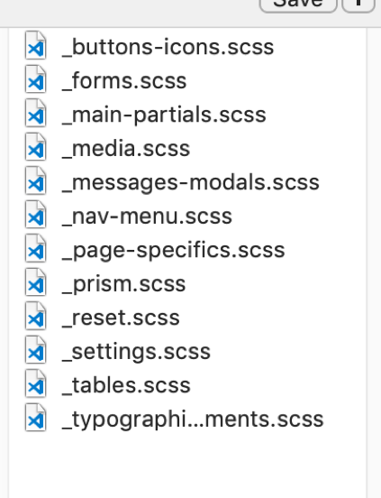

# Sass

---

### Sass is a preprocessor

---

You write Sass, some clever stuff happens, it turns it into CSS for you

You have a CSS file for your browser

---

A browser can not read a Sass file

Before you ask .scss / .sass


###  CSS declaration


```css
p {
	color: #00e6b8;
}
h1, h2, h3 {
	color: #00e6b8;
}
button {
	background-color: #00e6b8;
}
input {
	border-color: #00e6b8;
}
```

---

### SASS variable

```css
$devme-teal: #00e6b8;

p {
	color: $devme-teal;
}
h1, h2, h3 {
	color: $devme-teal;
}
button {
	background-color: $devme-teal;
}
input {
	border-color: $devme-teal;
}
```

---

```css
$brand-font: Helvetica, sans-serif;
$brand-colour: #00e6b8;
$content-padding:	40px;

p {
	color: $brand-colour;
	font-family: $brand-font:
	padding: $content-padding 0;
}

```

---

### css Nesting

```css
nav ul {
	margin: 0;
	padding: 0;
	list-style: none;
}
nav ul li {
	display: inline-block;
}
nav ul li a {
	display: block;
	padding: 6px 12px;
	text-decoration: none;
}
```

---

### SASS is neater

```css
nav {
  ul {
    margin: 0;
    padding: 0;
    list-style: none;
  }
  li { display: inline-block; }
  a {
    display: block;
    padding: 6px 12px;
    text-decoration: none;
  }
}
```

---

You can even nest media queries!

No more than 3 maybe 4 levels deep as a rule

---

### Extends

Repeated styles? Use Extends!

‘%’ and ‘@’ – NEW SYNTAX!


```css
%green-background {
	background-color: green;
	background-image: linear-gradient(0deg, green, lighten(green, 10%);
}

.header-main {
	@extend %green-background;
}
.button {
	@extend %green-background;
}
```

---

### Functions

Did you notice

```
lighten(green, 10%)
```

There are colour functions, you can do maths...

```
width: 100px + $padding;
```

---

### Mixins

Like functions in Sass

```css
@mixin border-radius($radius) {
  -webkit-border-radius: $radius;
     -moz-border-radius: $radius;
      -ms-border-radius: $radius;
          border-radius: $radius;
}
.box { @include border-radius(10px); }
```
Class: Mixin Example
https://codepen.io/Rumyra/pen/a54bb414436dd336082d5da1ee4b702c?editors=0100


---

### Imports

This is actually CSS spec now... but

```css
@import 'reset.css';
@import '_settings.scss';
```

---

We're not going to have one file, we're going to have lots.

---

### A browser can not read a Sass file

---

### Start watching your files


```css
sass --watch {Sass CSS file input}:{CSS file output}
```

Navigate to your directory in terminal

```css
sass --watch css/theme.scss:css/theme.css
```

---
### How to organise your scss files:




