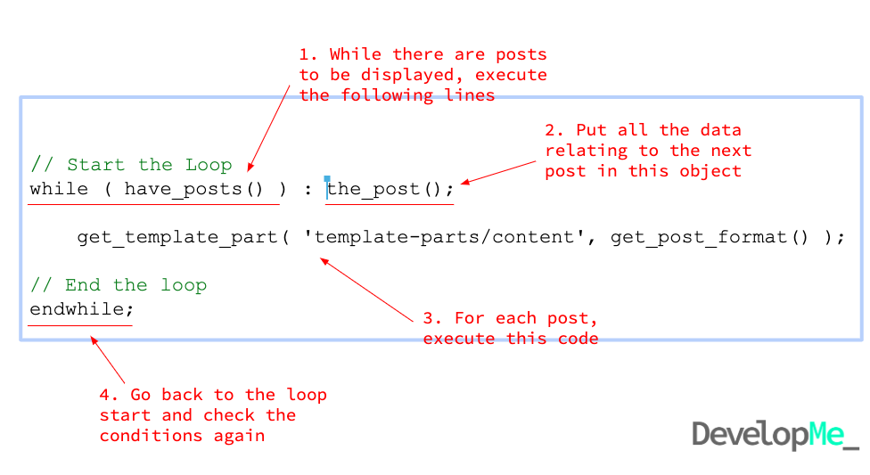

Week 7:
# CMS: WordPress


# Module Outline
**DAY ONE**
-  Why WordPress
-  WordPress installation
-  The admin interface
-  Content types
-  Start our own sites


**DAY TWO**
-  Themes
-  Partials
-  WP functions
-  Template hierarchy
-  Child themes
-  Git


**DAY THREE**
-  The loop
-  Hooks - actions/filters
-  Advanced Custom Fields
-  Custom Post Types
-  Continue with portfolio projects


**DAY FOUR**
-  Continue with portfolio projects


**DAY FIVE**
-  Migration / going live
-  Continue with portfolio projects


***START THINKING LIKE A CODER***
-  Being a good developer, requires more skills than just coding
-  Pay attention to the detail of the tasks
-  They might be deliberately vague in order to make you question the best solution or what you are actually being asked to do
-  If you’re not sure - ask me! 


## What is WordPress

A CMS supports the separation of content and presentation

Page content is stored separately eg in a database

Pages are built using templates written in HTML/CSS, PHP and Javascript and pulls in content from the SQL database, allowing content to be dynamic and updated


## What is a Content Management System (CMS)?


## Why use CMS?

A lot of the hard work is done for you by others

Easier for clients to manage the content as they might already know the framework

Create reusable blocks of code/content which reduces effort

## What is WordPress?

It’s probably the easiest and most powerful blogging and website CMS in existence

WordPress is an online, open source website creation tool
It started life as a blogging platform in 2003

## What can WordPress be used for?

Niche is blogging 

For SMEs, good for marketing sites or shops 

At enterprise level, good for blogs/articles/news 
Gaining popularity as a headless CMS due to its API

## How Popular is Wordpress?

Has 60% of the CMS marketshare

Over 34% of the internet is a WordPress site

https://wordpress.org/showcase/

Your use of WordPress is only limited by your imagination!

## What’s the difference between wordpress.org and wordpress.com?

WordPress.org is the open source community behind the software. It’s all free.

WordPress.com is a company owned by Automattic who sell WordPress as a managed service with a free, entry level package


## The WordPress code ecosystem


## Installing Wordpress - an overview

-  Prepare a server (online or local)
-  Get the WordPress files from WordPress.org
-  Put the WordPress files on your server
-  Create a database
-  Complete the installation


## Installation using Vagrant

**Step 1.** 
Set up server
Refresher of your week 6 PHP notes
-  We can use ScotchBox as that provides the LAMP stack we need
-  LAMP = Linux, Apache, MySQL and PHP

**Local installs - Vagrant**

[MAMP](https://local.getflywheel.com/), [WAMP](https://sourceforge.net/projects/wampserver/) or [XAMP](https://www.apachefriends.org/)
[Flywheel Local](https://local.getflywheel.com/)
Local installs - other options

 Vagrant - 
1. Setup a new project folder to contain vagrant and server files.
2. Create a folder for your wordpress install, suggested name ‘wordpress’
3. Open cmd/terminal and navigate to this project directory with $ cd [path to your folder]

4. Download Scotch Box, an Ubuntu-based LAMP box, unzip, and put the files into your project folder. *need to do this everytime you createra  new project*.

5. Create your Vagrant box (virtual machine).
6. move all dowloaded wordpress files to your project folder.public is where you will put your files (PHP, HTML, CSS). BEWARE index.php may already exist  - REPLACE IT.
7. Vagrantfile defines what machine that Vagrant will build.
8. Turn on your machine (box)
'Spin up' (turn on) your box with `$ vagrant up`

9. Test your box is working. visit ip address eg.
Visit http://192.168.33.10/
Verify "Welcome to Scotch Box"
!! Watch out for two boxes running on your machine with the same IP address. More in a bit.


-  Vagrant clashes if you have more than one box running with the same IP address. Change IP address in vagrant file to have two different servers running
Gotchas!


## Wordpress file Download 

Download WordPress from wordpress.org
There are different versions of WordPress available for download, depending on what language you want
British English version is at en-gb.wordpress.org/download/

Local install - download files


Locate the wordpress.zip file you just downloaded to your computer and unarchive it (you might need a special program like 7-Zip to do this)

Extract the files to a location you can get to
Unzipping


### Step 3.
Put the WordPress files on your server
15:30 - 10 mins to finish installation

Add all the files inside the unzipped folder (not the folder itself) to the server
Move them to your Vagrant box’s public folder
You may get a conflict with index.php - copy over the existing one with the WordPress index.php

Place all WordPress files on the server


Remote:	{server}/wordpress/
WP URL:	http://mywebsite.com/wordpress/

Not ideal!
If you do upload the folder by accident your URL is affected

### Step 4.
Create a database

MySQL on your vagrant box
SSH into your virtual server:$ vagrant ssh
Password might be vagrant (if you need it)
Access MySQL with the root user account$ mysql -u root -p
Password is root


mysql> CREATE DATABASE wordpress;
Create a new database
Don’t forget the ; or it won’t work

mysql> exit

Exit MySQL

DB_NAME				database to connect to
DB_USER				database user
DB_PASSWORD			database password for user
DB_HOST				database host to connect to
						(normally localhost)
Make a note of these values


DB_NAME				wordpress
DB_USER				root
DB_PASSWORD			root
DB_HOST				localhost
For vagrant the values are:


Step 5.
Complete installation

Complete the installation	
Now visit your webpage - http://192.168.33.10/
You will see the following screen


wp-config.php gets updated 
// ** MySQL settings - You can get this info from your web host ** 
/** The name of the database for WordPress */
define('DB_NAME', 'database_name_here');

/** MySQL database username */
define('DB_USER', 'username_here');

/** MySQL database password */
define('DB_PASSWORD', 'password_here');

/** MySQL hostname */
define('DB_HOST', 'localhost');

/** Database Charset to use in creating database tables. */
define('DB_CHARSET', 'utf8');

/** The Database Collate type. Don't change this if in doubt. */
define('DB_COLLATE', '');

WordPress then creates the tables it needs to work
To access database tables

$ mysql -h localhost -u root -p
$ USE mysql;
$ show databases;
$ use wordpress;
$ show tables;

Even locally, make it a good strong password 
- every time.

Site title	=	the name of your website (can edit later)
Username		=	admin username
Password		=	password used to log in to admin area
Your email	=	for account recovery and notifications


Setup information


Exercise

Set-up your own installation locally using Vagrant

Exercise (extension)

Try another methodology
Run another install using a different technique and see if you think it’s quicker or better
https://wpdistillery.org/
MAMP, WAMP or LAMP
FlyWheel


Remote installs

Step 1. 
Set up server
15:15 - 10 mins

To make your install accessible by others it’ll need hosting somewhere
Usually it’s a paid service, but you can self-host
Ensure it has the necessary LAMP stack, which is pretty standard
Online installs - online server

Step 2.
Download the WordPress files
15:25 - 5 mins

Some hosting companies might provide a WordPress auto-install in their cpanel
The cpanel is the interface you use for managing your servers
It’s a few clicks to install WordPress and means you don’t need to do step 2, 3 or 4
Online installs - auto-install

Step 3.
Put the WordPress files on your server
15:30 - 10 mins to finish installation

FileZilla is a free FTP solution that works on Windows and Mac machines

Download it here:
https://filezilla-project.org/download.php

Online install - setting up FTP software

Transferring the files with FTP
Typically you need:
Server name (sometimes a URL or sometimes an IP address)
FTP Username
FTP Password 


Step 4.
Create a database

Online hosting - use cpanel to create a database

Step 5.
Complete installation

Logging into the admin interface
10.25 - 20 mins to do slides and exercise

The login page is at /wp-login.php
Put that at the end of the URL

Eg visit, http://192.168.33.10/wp-login.php
WordPress login page


The admin area is at /wp-admin/

You are automatically redirected here after logging in
WordPress admin area

Paying attention to the URL can often tell you where you are or give you clues
You can also shortcut by typing in URLs - example of when this is useful later
URLs

Exercise
11:20 - 20 mins

Login to your local site

WordPress content types
10:45 - 15 mins to include exercise

WordPress is a CMS - CONTENT mgt system
It can hold and display many different types of content that can be reused:
Posts (also powers pages)
Users
Comments
Media files (images, videos)
Content types

WordPress content types
Posts
Comments
Users
Media 
Saved in the database
Saved on the server
images
videos
pdfs
posts
pages
custom post types
KEY:

Posts, posts and pages
11:00 - 15 mins

A Post is the most important type of WordPress content - it’s the bedrock of WordPress
The Post content type powers both pages and (blog) posts
The vast majority of your site’s content will be a Post, either posts or pages

What is a Post content type?

Consider Posts as a species of content type

The descendants of which are similar to one another but have some distinct differences and behave in different ways - a bit like birds

Use the right content type (eg post or page) for the right thing

What is a Post content type


Title
Content
Customise slug / permalink
Discussion Options
Featured Image
Privacy Settings
Version control - rollback to previous versions
Preview and publish


What posts and pages have in common
We say that posts and pages inherit these features from the Post content type

Title
Content
Preview / publish
Slug / permalink
Featured image
Discussion options
Privacy

They have categories and tags
They have an excerpt
In the code, you can tell WordPress to display multiple posts in archives
Archives display multiple posts
Archives do not necessarily mean old or        no longer relevant posts
Things unique to posts - their killer features

Categories & 
tags
Excerpt
Things unique to posts

https://www.stateofliberty.com/blog/
https://neilpatel.com/blog/
https://www.drive-electric.co.uk/vehicle/
Very different archive examples

Hierarchy - you can make one page the parent of another
This alters the URL structure of the child, to include the parent in its URL
Useful for sections of content / SEO

Things unique to pages - the killer features

Page parent
Things unique to pages

Editing content in the (new) Gutenberg editor

Select “New” from the admin bar at the top


You can also go to Dashboard > Pages > Add New
How to create a new post or page

https://drive.google.com/open?id=1aGPkIt1r3iyT3rVwvlZjJpZsSxC3IiK3

Editing content in the (old) Classic Editor 

Version 5.0 brought Gutenberg
Version 5.0 was a major upgrade
The editing interface changes loads
Many many WordPress sites won’t be using Gutenberg yet for various legitimate reasons
Can install ‘Classic editor’ plugin to force WordPress to use the old style

The basics of how to edit, preview and publish a page
1. Add a title
2. Put some content into the large box using the WYSIWYG (what you see is what you get)
3. Preview your content - ALWAYS do this
4. Publish your content


After adding a title, the permalink box appears and generates a permanent link to your page


Permalinks
You can change the way these are generated in Settings -> Permalinks

The end part is called the slug, useful to remember this, it crops up quite a lot 
Slugs

The basics of how to edit, preview and publish a post
1. Add a title
2. Put some content into the large box using the WYSIWYG (what you see is what you get)
5. Preview your content - ALWAYS do this
6. Publish your content

3. Add categories

4. Add a featured image


Extension exercise

Install the Classic Editor plugin
Have a play and see what you think

The Media Library
adding images and featured images
11:15 - 10 mins

Adding an image

Add new files in this tab
Select images you have already uploaded in this tab 
- you will automatically end up on this tab after uploading new images
The Media Library screens

If you don’t own the image, you need to check who does and if you have permission to use it on your site
You shouldn’t just nick images from Google!
There are plenty of free images out there, try using https://pixabay.com/
Be careful where you get your images from

Exercise
11:20 - 20 mins

Create an ‘About’ page
Create a page - give it the title of ‘About’
Add some text
Add an image to the content (use Pixabay?)
Play around with the other available blocks (columns?)
Preview it
Save it


How WordPress handles images

On uploading, WordPress makes several different sized versions of your images called thumbnails
You can make use of the different sizes in your content
Within your theme you can make use of  to serve up the best sized images
How WordPress handles images


WordPress content types
Posts
Comments
Users
Media 
Saved in the database
Saved on the server
images
videos
pdfs
posts
pages
custom post types
KEY:

WordPress root folder
Images stored by year and month

Exercise
11:20 - 20 mins

Find your uploads folder
Navigate to your uploads folder (in a finder window or in terminal)
Have a look at the image you just uploaded for your About page


Comments
11:15 - 10 mins

Comments
You decide whether users can leave comments on pages or posts
By default, they are held in the ‘pending’ status so you can approve them
Change this if you want, they can auto-publish
Manage this in 
Settings -> Discussion -> Default article settings 
or on an individual page/post basis


Users and permissions
11:15 - 10 mins

Overview of the different roles
Administrator – somebody who has access to all the administration features within a single site (the first user created is always an admin)
Editor – somebody who can publish and manage posts including the posts of other users
Author – somebody who can publish and manage their own posts
Contributor – somebody who can write and manage their own posts but cannot publish them
Subscriber – somebody who can only manage their profile.

Menus
11:45 - 10 mins

Menus are managed in admin

Give your menu a title and click ‘Create menu’
The title ‘Main menu’ is a good name
Creating a menu

Creating a menu
2. Select ‘top menu’ in menu settings to display your menu somewhere

3. Save your menu

Name your menu (main menu)


Adding items to your menu
1. Select items from the left and click ‘Add to menu’
You can add pages, posts, custom links or (post) categories


2. Customise the title by pressing the down arrow and filling in the ‘navigation label’


3. Save your menu


Different themes have different menu locations

Exercise 1
11.55 - 10 mins

Create a menu
Add your about page
Save it
View your website
Create a new menu

Exercise 2

Create a new page called ‘The team’
Set it’s parent page to ‘About’
Add new menu item ‘The Team’ and drag it under the ‘About’ menu option so it’s indented


Save
View your site
Create a sub-menu

Themes
13:35 - 15 mins


They define the structure and appearance of content 
Colours
Page layouts
Widget positions
Menu locations

They consist of template files and function (php) files
Themes control how your site looks


WordPress comes with the most recent themes created by WordPress, already installed
For example twentyninteen, twentyseventeen, twentysixteen etc
They are not very exciting, but they are usually very reliable and stable and a recommended starting point
Default themes

Viewing and switching between installed themes


Hover over the theme and click ‘Activate’ 
Activating a new theme	

Choosing themes

This can be really hard as there are so many, most will only do 80/90% of what you want.
Be wary of chasing unicorns!

Choosing a theme

WordPress has a library of free themes 
There are also 'premium' paid-for themes which you need to upload yourself to your site
Premium themes should have regular updates, fast support, good documentation and will probably do something specialised, like a food blog
Free or paid for?

Less is more - you don’t need bloated themes that come with lots of features you won’t use, it just slows your site down
Look for themes with good reviews and regular updates
Use the filters on wordpress.org 
Choosing a theme

Installing new themes


For themes you have purchased, you will be required to upload a zip file of it 


Theme settings
13:35 - 15 mins

Customising your theme	
Most themes provide settings that allow you to customise things
NB Each theme is different, the way to find the settings might not always be like this

Change the site’s title and tagline
TwentyNineteen theme settings
Select a highlight colour

Another way to manage menus
Another way to manage widgets
Manage what’s displayed on your homepage (very useful)
Write your own CSS
(use child themes to do this ideally - more later)

In the theme options, click ‘Static front page’
Click ‘A static page’
In the front page dropdown select the page you’d like 
 
Setting the homepage

Because each theme will have different settings, you may lose some of your settings when you switch between themes.
Keep an eye on your menus, widget positions and logos.
 
Switching between themes

Exercise 1

Create a new page called Home and put some content in there
Set your homepage (front page) to be this new page
Add home to your menu
View your site
Create a homepage and add it to your menu

Exercise 2

Create a new page called Blog, but don’t add any content
Using theme settings set this new page to be your blog (archive page)
Add the new blog page to your menu
View your site
Use theme settings to set-up a blog

Exercise (extension)

Install a few themes
Pick some themes at random and see how they differ
Note the settings that you have to reapply each time you switch theme

Plugins
14:10 - 10 mins

Plugins bring functionality into WordPress
Functionality is any aspect of what the website can do for you (the administrator) or a site visitor
For example contact forms, image galleries, shop (WooCommerce), page builders 
What are plugins?

Plugins
WordPress comes with a few plugins installed, for example akismet and hello dolly


Installing new plugins

If you’ve bought a plug-in you may have a zip file, in which case upload it here
Most of the time, you’ll search for the plugin title here and then install it using the ‘install now’ button

Once you have installed a plugin, make sure you activate it!
Installing new plugins

How many active installs
When was it last updated
How many stars does it have, read some reviews
Is it tested with the version of WordPress you’re using
View ‘more details’ and see if the documentation is any good
Tips for choosing plugins (or any 3rd party software)

Too many plugins will kill your site’s speed
It’s a good idea to try a few out, but always deactivate and delete those you are not using
Some plugins can interfere with each other and break your site - always test everything once you’ve added a new one in
Common plugin pitfalls	

If you start having issues with your site
Deactivate all your plugins
Change back to a stable WordPress theme eg 2017
Activate each plugin one at a time
Test 
Eventually you’ll see what’s causing it 
Debugging

A shortcode is WordPress-specific code that lets you call complex code to appear in a page or post
Easy to recognise, they are in square brackets
[gallery]

A lot of plugins use shortcodes, but now we have Gutenberg we’ll start to see these replaced with blocks
Shortcodes = shortcut

Exercise
14:20	- 20 mins


Install "Contact Form 7" plugin 
Activate it
Create a contact page and add it to your menu
Add the default contact form to the contact page using the shortcode
Explore the form’s settings and get a submission sent to your email.
Install and activate a plugin

Exercise (extension)

Try out some more plugins
Popular plugins that I install on almost every site:
Yoast - SEO, defo worth checking out
Social media plugins - Twitter, Instagram, FB - try plugins by Smash Balloon 
GoogleMaps - try WP GoogleMaps
Smush - reduces sizes of photos

Widgets
13:15 - 10 mins


Widgets are tools that allow a user to add and control features or content to pre-defined areas of a site - usually header, footer or sidebar
A user can drag and drop a widget into a desired location
What is a widget?

The pre-defined areas

On the widgets page, drag and drop a widget from the ‘available widgets’ column on the left to the ‘blog sidebar’ widget on the right

Adding a widget to the sidebar	
Then click the little arrow on the right to expand the options
Click ‘Save’ on each widget when done


The default WordPress install comes with some widgets
Widgets are installed as plugins
Some themes come installed with their own widgets 
The theme defines what widget positions your site has
Installing new widgets	

Add them with code in functions.php:
https://codex.wordpress.org/Widgetizing_Themes

Creating new widget positions

Likely they will be replaced with Gutenberg blocks in the future
The future of widgets

Exercise

Add a text widget to your footer

Exercise (extension)

Add a text widget to the sidebar
See what pages it displays on
Can you figure out why it only displays on some pages and not others?

Running WordPress projects

Plan - purpose and audience
UX design - how are you going to organise and present info
Copy - text, what are you going to say
Design - detailed layout, pretty pictures, colours etc
Build - skills from this course
Test - get customers or friends to help
Make changes - inevitable
Go live - fun and scary at the same time
Market and promote - really hard work!!!!
A typical project 

Watch out for split brain (my terminology)

Plan on paper with a pencil - going back to basics really helps you think creatively, you can make it electronic and look cool later
Test your thoughts with others - speak your plans out loud, listen to what they say, try and test with your target audience
Think about your MVP - minimal viable product, projects that try and do everything all at once are likely to fail
Top tips

Picking a colour scheme
https://htmlcolorcodes.com/color-picker/
https://color.adobe.com/explore/

Exercise

Begin your own project
Develop a site for a business or your own CV

Plan your content and copy, before themes
Refer back to weeks 1 and 2
It might take a while
Don’t worry if you don’t know how to get WordPress to do it yet

Then pick a suitable theme to develop
More on customising themes tomorrow

DAY TWO

Theming
10,000+ themes are great, but they never quite do exactly what we want.

Let's learn how themes work and ways to alter them

Theme file basics

Recap - where theme files live
These are all the installed themes - each in their own folder

Themes are a collection of files
PHP & HTML
CSS
Javascript
Assets such as images or icons


Twenty Sixteen theme

style.css
index.php

Minimum required theme files

Doesn’t need to have any CSS in it!
It’s there to tell WordPress the theme exists and a few bits about it, like its name 
It’s a way of documenting what the theme is about.
Your style.css starts with a comment block with these key details in it
style.css

/*
* Theme Name: Starter theme
* Theme URI: https://basictheme.com/
* Author: A. N Other
* Author URI: https://another.com/
* Description: A very simple WordPress theme.
* Version: 1.0
*/

style.css comment block

A file that renders the page’s content
Usually makes calls to WordPress functions or other files - more to follow
index.php

Copy and paste this code from the speaker notes 👇
<?php
get_header();
if (have_posts()) :
    while (have_posts()) : the_post();
        ?>
        <h2><a href=<?php echo the_permalink(); ?>><?php the_title(); ?></a></h2>
        <em>Published on <?php the_time(); ?> by <?php the_author(); ?></em>
        <?php the_content(); ?>
        <?php comments_template(); ?>
        <?php
    endwhile;
else :
    ?>
    <h2>No Posts Found</h2>
    <p>Sorry, there are no posts yet.</p>
<?php
endif;
get_sidebar();
get_footer();
?>


A word of caution!	
I wouldn’t try and create your own theme from scratch in this way
There are lots of starter themes out there you can use as a starting point
More on this later...

Exercise

Make your own theme
Create a folder for your theme in the themes folder - call it starter-theme
Create style.css and copy the code in
Create index.php and copy the code in
In the admin screen go to Appearance -> Themes
Activate your new theme
Check it’s working

Partials

Any good code base will be made up of lots of reusable parts - the premise of functions
Themes are no different
Most themes will call on lots of different partials (files) to render a complete page
Many of these partials can be reused in lots of different circumstances
Good themes make use of partials

header.php
footer.php
index.php

Twenty Sixteen theme

Use in-built WP functions for base partials like header, footer, sidebar
Eg get_header();    get_footer();    get_sidebar();

For bespoke partials we can use:
get_template_part();
How to call a partial 

get_template_part( string $slug, string $name = null )


https://developer.wordpress.org/reference/functions/get_template_part/


get_template_part() 
The file name, can be a path relative to the root of your theme or just a file name
Optional parameter. Allows us to call a specialised part - examples follow


Call a file in /template-parts called content.php


We don’t need to add the file extension eg .php
WordPress already knows it will be a .php file
Example 1


Call a file in the theme’s /template-parts folder called content-page.php

The function puts the two variables together with a hyphen in between
It automagically creates the right file name eg content-page.php
Example 2


We can keep standard naming conventions for our files
We can detect the content type and automagically select the correct partial for that content type
Why is this useful

In-built WP functions

WP functions 
WordPress is full of functions we can make use of
Part of being a good developer is researching what functions exist and figuring out how to make use of them
Someone will likely have done the hard work for you - reuse it and bask in the glory!

get_template_part();

get_post_format();

A full reference of WordPress functions:
https://developer.wordpress.org/reference/functions
We’ve already seen some examples

Special functions that output common partials 
get_header();							--> header.php
comments_template();				--> comments.php
get_footer();							--> footer.php
get_template_part( 'content' );	--> content.php


Exercise

Investigate some functions
Active twentysixteen theme
Locate page.php
Comment out the call to get_header(); function
See what happens
Uncomment out the call so the file is as it was

Template hierarchy -how WP knows which files to load

With so many files in a WordPress theme, how does WordPress know where to start? 
eg which file should it load first
It uses the template hierarchy:
https://developer.wordpress.org/themes/basics/template-hierarchy 
and https://wphierarchy.com
Template hierarchy

In-built to WP are a set of rules to figure out what file (template) in your theme it should use to render your content as a starting point
These rules are based on the content type, content meta-data and the slug the user wants to view in the front-end
It will combine these 3 factors in different ways to generate possible file names

The template hierarchy is a bunch of rules
Content meta-data might include the post id, the author’s name or post category

If WP finds a file that matches a very specific naming convention it is looking for, it stops. 
If doesn’t find the file, it looks at the next option.
The next option will be more generic. And so on.
Essentially we have fall-back options, and eventually result in a default option: index.php
Outline of the rules

Our basic starter theme had style.css and index.php.
Now we know why it only needed index.php
index.php is the default fallback option for displaying everything whatever the content type, slug or the content meta-data
Our basic starter theme


Work LEFT -> RIGHT
Select the content type from the leftmost column and follow the lines
The right most file names are the most generic / fallback options
How to use the diagram

Some parts of the diagram use variables to help you decipher the file name

Interpreting the diagram
Replace $slug with the actual slug in question

Eg page-about.php
Replace $id with the id of the post being viewed

Eg page-2.php

$slug 			-> end of the URL being visited
$posttype		-> a content type name such ‘post’ or ‘page’
$id				-> the id of the post in the database

There are a few others 
Go to https://wphierarchy.com and click on the boxes to read the documentation
Some of the most used variables in the diagram

We want to create a template in our starter theme to present all the posts for given author
The URL would look like:
192.168.33.10/author/admin 
Some of the content meta-data would be the author’s name = “admin” and id = 1 

An example

Does the file author-admin.php exist? No…
Does the file author-1.php exist? No…
Does the file author.php exist? No…
Does the file archive.php exist? No…
Does the file index.php exist? Yes!
An example

"What template file is this?!"
“What The File” plugin is great for working out which theme files are actually being used to build a page.


Exercise

Identify About template file
Use the template hierarchy to make an educated guess about the file name your About page is using in the TwentySixteen theme
Use What the File to verify if you are right or not

Tips on finding the file now you know its name


A theme you’re unfamiliar with could be quite complex and have a bespoke design pattern
There might be lots of folders and sub-folder
You might have got the filename right, but where the hell is it so you can edit it?
Woah, there’s a lot of files in this theme!

Use What The File to confirm the file name
Navigate the theme directory and use your eyes click around to find it
Search in the theme directory for unique looking CSS classes or ids or HTML snippets
Check plugins directories
Tips on locating the right file in a complex theme or WP build 

Starter themes - making your own theme from scratch 


Well commented theme to help you get started
Includes Bootstrap 4
Comes ready with SASS
Has a lot of other gulp processes ready installed
Good for mobile first
https://understrap.com/
Understrap

Bones theme	
Mobile first design
CSS is all set up using SASS
Lots of comments and guidance to help you make great themes
You don’t need to make a child theme of this
https://themble.com/bones/
https://github.com/squibbleFish/theme-bones


Child themes

Creating a child theme is a technique for 
customising / changing an existing theme 
in a safe, future-proof manner

A child theme is a theme that is linked to another theme - it’s parent
A child theme inherits all the files from the parent theme
And allows you override any file, or add a new one by including it in the child theme 
What is a child theme?

A child theme adds new rules for WP to follow
If there is a child theme activated, WP will first look in the child theme directory for the most specific file name
If it doesn’t find it there, it next looks for the same file name in the parent directory
Then it looks at the next possible file name, first in the child theme and then the parent theme.
Child themes and template hierarchy rules

Does the file author-admin.php exist in the child? No…
Does the file author-admin.php exist in the parent? No…
Does the file author-1.php exist in the child? No…
Does the file author-1.php exist in the parent? No…
Does the file author.php exist in the child? No…
Does the file author.php exist in the parent? No…
etc etc...
Our example

Creating a child theme

What bits make a child theme?
Parent theme
Child theme directory
Stylesheet, must be style.css, in child theme folder
functions.php file in child theme folder

Comparing our starter theme files with a child theme’s files
Essential / required files
Theme folder
Parent theme
style.css
index.php
functions.php
Starter theme
✅
❌
✅
✅
❌
Child theme
✅
✅
✅
❌
✅

It is recommended that the name of your child theme directory ends with -child for clarity
Eg parentthemename-child
Child theme directory names should have no spaces, as this may result in errors
Theme folder

The first thing in your style.css is a comment block
The comment block tells WordPress which theme is your parent theme
WordPress is magic and knows that a comment block at the top of this file is important and means something
style.css - setting it up for child themes

style.css - for child themes
/*
 Theme Name:   My Child Theme
 Author:       John Doe
 Description:  This is the first theme created by John a child theme of WordPress' Twenty Seventeen theme
 Template:     twentyseventeen
*/

functions.php is necessary to enqueue (load) styles correctly

It contains a few lines of PHP that tells WordPress what stylesheet to load


functions.php


<?php
add_action( 'wp_enqueue_scripts', 'theme_enqueue_styles');

function theme_enqueue_styles() {
    wp_enqueue_style( 'parent-style', get_template_directory_uri() . '/style.css' );
}
functions.php

WordPress website has documentation on child themes

http://codex.wordpress.org/Child_Themes

It is also a great resource for anything you want to do with WordPress, as is the Support Forum.

Exercise

Create a child theme for twentysixteen
Create the required files
Change the theme name, so it displays differently in the admin interface
Activate the child theme in WordPress admin panel

Git

What we DON’T put into git
All of the WordPress core files
They are version controlled by WordPress central - it’s a waste of time
This includes our media files
The database
Parent plugins or themes

Custom theme or child themes
Child plugins (it’s way harder to make child plugins by the way!)
What we DO put into git

Exercise

Put your child theme into git
Initiate your git repo
Put 2 files in the repo only, not the directory style.css and functions.php 

Refer to week 5 notes, hopefully you made a git cheatsheet.
If you didn’t now is the time to make one!

Overriding the parent theme

How to override a parent theme file
Locate the right file in the parent directory
Copy the file over to the child folder, maintaining the same folder structure.
Rename file if necessary to make it specific and only used in the circumstances you want
Make your changes to the file in the child theme

Only copy the files you need to change / edit
Your child theme should be a slim as possible
More overriding means more work = slow websites
Child themes should be slim

Exercise 1

Customise About page with some text after the title
Figure out which template/s are being used in the parent theme for your About page in TwentySixteen
Copy it to your child theme
Rename it so it only applies to your About page
Change the copied file in your child theme by adding some text after the page title

Exercise 2

Customise homepage, add some custom text after the title
Figure out which template/s are being used for your home page in the parent theme
Copy that file to your child theme 
Rename it so it only works on your home page / front page
Make some changes - again add some text in after the title 

How do I know if my code is right?

# DEBUGGING = Four questions to ask yourself...when your writing ANY code!!!
*Does it work? 
*Are there any unintended consequences? TEST!!
*Are the content types relevant?
*Is it understandable to someone else?
..*Do variables etc have meaningful names?
..*Do I need to comment stuff?
*Did I pick a simple solution?
..*Can someone else maintain (make changes) to this code six months later when I’m on holiday

#Customising styling

###Reminder of stylesheet order
```html
<html>
<head>
<link href='/wp-content/themes/twentysixteen/style.css' type='text/css' />
<link href='/wp-content/themes/twentysixteen-child/style.css' />
</head>
<body>

</body
</html>
```

###Parent stylesheet loaded first
###Child stylesheet loaded next

##Child overrides parent
Changes can be made in the child theme’s stylesheet, to either override or supplement the parent theme’s styling.

#Picking the right selectors

A lot of the same classes and HTML structure is  used in posts and pages
WordPress inserts lots classes in the body tag to help us specifically target different post types or even templates
Picking the right selectors 

Exercise

Change home page text colour
Change the text colour of the page content to red 
color: red;

```
.home .entry-content {
	color: red;
};
```
this makes sure it only changes the entry content (not title!) on the home page, not all pages
 

#Page templates (global templates) 
- extension / non essential content

Page templates	
In the admin interface you can select different templates for pages to use
This only applies to pages, not posts as well

https://developer.wordpress.org/themes/template-files-section/page-template-files/


In the last section we learnt about template files
These templates are not the same!
We are talking about page templates (sometimes called global templates)
Page templates not template files

To allow your clients (content editors) to select different layouts themselves
Up until now, we have been learning how to make changes to templates in the code
But clients are unlikely to be able to do this themselves - they will want a solution in the admin interface

Why create page (global) templates?

To create a global template, write an opening PHP comment at the top of the file that states the template’s name.

<?php /* Template Name: Example Template */ ?>
Defining our own templates

Make sure the template name is understandable
Put all of these kinds of templates in a folder called /templates
Conventions

Exercise

Create a page template for ‘The team’
Create a page template called “Team Page”
Set the team page to use it
Make the background colour for the template green

DAY THREE

The Loop


The Loop is PHP code used to display Posts. 

Using The Loop, WordPress processes each Post to be displayed on the current page.

Any code in the Loop (HTML/PHP) will be processed on each Post. 
The Loop
Note the capital ‘P’, we are talking about posts AND pages AND CPTs 

WordPress content types
Posts
Comments
Users
Media 
Saved in the database
Saved on the server
images
videos
pdfs
posts
pages
custom post types
KEY:

Depending on the arguments it receives, it may display one or many Posts

It’s a really fundamental part of the WordPress core

https://codex.wordpress.org/The_Loop
## The Loop





What is the colon all about? It’s a shorthand instead of using curly braces, instead we end the while loop with an endwhile; statement. Designed to be more readable to non-developers

http://php.net/manual/en/control-structures.alternative-syntax.php


// Start the Loop
```
while ( have_posts() ) : the_post();

    get_template_part( 'template-parts/content', get_post_format() );

// End the loop
endwhile;
```


## Debugging

Don’t forget you can use var_dump() to output any array or object to see what’s going on at any point

```
var_dump( have_posts() ); 

var_dump( the_post() ); 
```
the_post() = this function fetches relevant data from the database and stores it into a variable called $post.

## Displaying post content 

There are over 100 functions that will only work inside the Loop
```
the_title();
the_content();
the_category();
```

https://codex.wordpress.org/Template_Tags


## Exercise - Understanding the loop

1. Take a look at the TwentySixteen single.php
2. Identify where the body (all the text) of the post is being drawn in
3. Remove it from the template and see what happens
4. Then put it back

## Making loops

**Why would we want to make our own loop?**

-  You may want to display some blog titles inside a page (loop within the loop)
-  You might want to be selective about which blog posts you are pulling out (odd numbered posts, posts written before a specific date)
-  common to featurea few blog posts on your homepage - therefore a mini archive page within you homepage

## Making our own post queries

```have_posts()``` actually calls ```$wp_query->have_posts() ```

If we want to make our own post queries then we can make use of ```$wp_query ```ourselves


https://codex.wordpress.org/Class_Reference/WP_Query

```
$query_args = array(
			'category_name' => 'employer-voice',
			'post_type' => 'post', // could be post/page/custom
			'posts_per_page' => 10, // chooses number of post to be shown
			'orderby' => 'rand' // order by which they are shown, could be date/ alpabetically etc
		);

$result = new WP_Query( $query_args ); // results of query. (wp default loops store date in $wp_query variable)

```

## Outputting query results

```

	while ( $result->have_posts() ) : $result->the_post();

<-- Does $result have any posts stored in it? if so, store it in $post.  while loop will keep on running until no posts are found in £result -->       
        
       ?>
<h1><?php the_title(); ?></h1>

<div class="entry-content">
			<?php the_content(); ?>
	</div>

<?php
// End the loop
endwhile;
...

```

## Resetting the query

Becasue you change the global $post in your custom loop, you will need to reset it for the origional loopp to continue to run.

```
wp_reset_query();
```

At the end of the while loop we need to add this code to reset the query and allow our original loop to continue


## Outputting query results

```
	while ( $result->have_posts() ) : $result->the_post(); 
       ?>

<h1><?php the_title(); ?></h1>

<div class="entry-content">
			<?php the_content(); ?>
	</div>

// End the loop
<?php endwhile;
wp_reset_query();
?>

<?php
```

## Example of custom loop

funtion - outputting all the talks hannah's doing in the future

```
    $query_args = array(
        'post_type' => 'talk',
        'meta_key'  => 'date',
        'orderby'   => 'meta_value_num',
        'order'     => 'ASC'

    <-- this array is setting out all the criteria i want to be selecting data from the database -->
   );
  
   $the_query = new WP_Query( $query_args );
   <-- wordpress speaks to the database, creates some sql, and creates objects from the criteria you have set. and these objects are talks -->
  
    // The Loop
    if ( $the_query->have_posts() ) { ?>
    <-- did that query get any posts? -->
        <section class="talks-teasers">
  
            <h2>Listen to a talk</h2>
            <p>My next talks will be:</p>
                
            <?php
            while( $the_query->have_posts() ) : $the_query->the_post(); ?>

            <?php get_template_part( 'partials/teasers/talks-future' ); ?>
            <-- content of the talk -->

            <?php endwhile; // End the loop ?>

        </section>
       
   <?php
    wp_reset_query();
    } else {
        //get_template_part( 'template-parts/content', 'none' );
    } ?>
  ```


## Hooks: actions and filters

**WordPress loads in order**

-  Dependencies can be managed and your content is presented in the right order

-  For example WP needs to be loaded and ‘ready to receive’ before you can call a function to pull data out of the database

-  eg. The header should be loaded before the footer

-  The WP core manages this running oder for us

**A rough idea of the loading order - much is missed out!**

1. init();

2. wp_loaded();

3. get_header();

4. wp_enqueue_scripts();

5. loop_start();

6. the_post();

7. oop_end();

8. get_footer();


## Hooks - trap-doors into code where you append functionaility!

**What are hooks?**

Hooks are pre-defined places in that running order where you can add your own code

Using them we can change the default behaviour of WP

**Hooks are like doors**

WordPress is such a successful CMS because it allows developers to customise it’s inner workings with ease = its **extensible code**

The hooks are like doorways into the code and are scattered liberally throughout
We can access a lot of core code and alter it that otherwise could be overridden with updates 

An interesting read if you want to know more about hooks firing order
http://rachievee.com/the-wordpress-hooks-firing-sequence/

## Actions and filters

There are two types of hooks: 

1. **actions** (also called “action functions”) 
2. **filters** (also called “filter functions”)

Filters modify existing output, while actions can run some code when something happens.


## Action hook

These run code at particular events / times in WP

For example:
- When a post is published by an admin
- Send me an email
-  Before the footer is rendered
- Add an image

Adding an action hook

There are two parts, both go in *functions.php*:

1. The function definition - code we want to run
2. The hook that tells the function when to run - WHEN we want to run that code

**You need both parts**

## Actions

1. Create a function that does something 
```
function devme_action_example() {	echo "I was here";}
```
2. Hook the function into an action, so that WordPress knows WHEN to run it
```
add_action('wp_footer', 'devme_action_example');
<-- wp_footer is a predefined location in the ocde , name of function as a string -->
```

**Both parts of the action code**

```

function devme_action_example() {	echo "I was here";}

add_action('wp_footer', 'devme_action_example');
<-- WHEN , name of function as a string -->
}
```

## Another example OF ACTION

**Remember your child theme?**

The only child theme file required is style.css, but functions.php is necessary to enqueue styles correctly.

```
<?php
add_action( 'wp_enqueue_scripts', 'theme_enqueue_styles');

function theme_enqueue_styles() {
  wp_enqueue_style( 'parent-style', get_template_directory_uri() . '/style.css' );
}
```

## Action hooks	

A complete list of hooks:
https://codex.wordpress.org/Plugin_API/Action_Reference


## Filter hook

**Filters**

*Iinstead of adding, we will amend a variable that is laready there.*

Functions that WP passes data through to change it before something is done with it
For example:
-  When the post title is displayed
> Add the date to it
-  When the author URL is output
> Redirect it to LinkedIN

Same principle as actions, you need a function and a code line that add (or hooks) that function in somewhere

**You need both parts**

unlike actions, Filters **must always be passed something to work with (a parameter)** and should **return something**.

Otherwise how does it know what it is filtering?

for example: 
```
add_filter ('the_title', 'filter_example');
<-- ('place in the running order= WHEN we want to pass it', 'name of filter funtion')-->

function filter_example($title) {return 'Hooked: '.$title;}
<-- the parameter of the function will tell the function WHEN to execute -->
```

Exercise

Add the code from the previous slide into your funtions.php file in child theme.

What happens - any unintended/funny consequences?
```
add_filter ('the_title', 'filter_example');
function filter_example($title) {return 'Hooked: '.$title;}
```
Experiment with the_title filter

## Advanced Custom Fields

**create form fields in backend - NOT IN THE FRONT-END**

Add extra content fields to the backend edit screens, essentially creating new fields in the database for the site administrator to use.

making structured content the same every time. 

Great for making templated content really quickly
https://www.advancedcustomfields.com/


We can create backend editing fields for either:
Classic Editor
Gutenberg page editor (bespoke blocks)


We’ll focus on the Classic Editor for these exercises as you need a PRO license for the Gutenberg stuff.

## Why do we need ACF?

To avoid hardcoding info, hardcoding is bad, avoid whenever you can 
Users (clients) want to manage content themselves without having to pay you again
To ensure pages are consistently styled
NOTE: ACF is not about creating contact forms, this is a different kind of input field


Advanced Custom Fields


To make it work you need to:
1. Install the plugin - find it in wordpress
2. Decide whats fiels are gonna be.
3. Create the fields and assign them to display on the editing screen of the correct Post type
3. Edit the relevant theme and define how we want this form to display the information in the front-end

Creating the fields in the backend does not display them in the front end.

You must write some PHP so WordPress knows how to display the info that has been added.
Editing the template to display the ACF output


## ACF output inside the loop

To retrieve a field value as a variable, use the get_field() function. and store is as a variable

To display a field, use the the_field(). Simply displays value of input

They accept a string as an argument which is the field name of your ACF field.

## Advanced Custom Fields output

If your "field label" is 'Email address' then "field name" is email_address (look for the underscores)
get_field('email_address')


```
<?php
if ( get_field( 'field_name' ) ){  ?>
	<--Testing to see if the field has anything in it -->
	
    <h2> <?php the_field( 'field_name' )?> </h2>
    <-- Outputting the field’s value (the_field has inbuilt echo in it) -->
<?php } ?>
```
get_field() retrieves data from field_name and stores it as a variable


## Exercise 1
A phone number field for an about page
1. Create a new set of fields in the ACF area
2. Create a field for a phone number
3. Set field to only display on the about page
4. Populate the field when editing the about page
5. Change the template (in the child theme) to output the fields' content


## Exercise 2 (extension)
About page for a company
1. Add and display fields for:
2. Contact email address
3. Company logo
4. Postal address

## Custom Post Types


https://codex.wordpress.org/Post_Types


## Custom post types (CPT)
creating a standing editing interface for the user. eg adding a new art pice with price, date, name etc

We can extend the built-in functionality of a Post to provide custom templated pages for other types of data
-  Events
-  Products
-  Jobs
-  Case studies

https://codex.wordpress.org/Post_Types#Custom_Post_Types

CPTs appear in the main menu under collections
Here’s one I made earlier


## Why create CPTs?

To group similar types of content together 

To separate it’s display, eg into its own archive

To make certain content types behave uniquely

To help clients figure out where their content is and help template it so they always achieve consistent layouts 

It’s good info architecture

**Defined programmatically**

The definitions are made in your functions.php file

There are plugins to help you do this, but we prefer the code way!

Define naming or labels
Define the options (or the functionality bits)
Create the action hook
Update permalinks
The four steps to defining your own CPT

## 1. Define naming
```
function create_custom_post_type_event(){
	$labels = array(
		'name' => 'Events',
		'singular_name' => 'Event',
		'add_new' => 'Add New',
		'add_new_item' => 'Add New Event',
		'edit_item' => 'Edit Event',
		'new_item' => 'New Event',
		'view_item' => 'View Event',
		'search_items' => 'Search Events',
		'not_found' => 'No events found',
		'not_found_in_trash' => 'No events found in Trash',
		'parent_item_colon' => '',
	);
	
	$args = array(
		...
	);
}
```

Give your function a useful name - you’ll need it for the hook shortly

## 2. Define options
```
function create_custom_post_type_event(){
	...	
	$args = array(
		'label' => __('Events'),
		'labels' => $labels, // from array above
		'public' => true,
		'can_export' => true,
		'show_ui' => true,
		'_builtin' => false,
		'capability_type' => 'post',
		'menu_icon' => 'dashicons-calendar', // from this list
		'hierarchical' => false,
		'rewrite' => array( "slug" => "events" ), // defines URL base
		'supports'=> array('title', 'thumbnail', 'editor', 'excerpt'),
		'show_in_nav_menus' => true,
		'taxonomies' => array( 'event_category', 'post_tag') // own categories
	);
```

	register_post_type('events', $args); // used as internal identifier
}

Should be lowercase-with-no-spaces

## 3. Create the action hook


 Define on initialisation of theme

add_action('init','create_custom_post_type_event'); // define event custom post type
// MUST add this to functions.php

function create_custom_post_type_event(){
	// define post type here
	// what we did in steps 1 and 2
}


##  4. Update Permalinks

Refresh link handling
1. Go to: Settings > Permalinks
2. Don't make any changes
Click "Save Changes"


Exercise

Set up a Custom Post Type for case studies
Define the CPT programmatically
Update your permalinks
Create a case study and verify it works

Creating templates for custom post types


Custom Post Type templates

Single posts normally use the single.php template

To use a different template for your Custom Post Type set up the template file as single-{post type key}.php

Note: this post type key comes from defining the CPT:register_post_type('case-studies', $args);


Exercise

Create a bespoke theme file for your Custom Post Type in your child theme
Create a file in your theme that only your CPT uses (test for unintended consequences)
Add a name field using ACF to your post type
Modify your template to output these fields

Exercise (extension)

Set up an archive page
Set your Custom Post Type to have an archive by adding 'has_archive' => true to $args
Set up a list view of your case studies by building a new archive template for that Custom Post Type
Refresh links by saving Settings > Permalinks
Modify the archive page to show the image from the company logo field instead of the featured image


## Migration & going live

Ways to migrate your site
Making this as quick and easy as possible is a really important part of your workflow.
You can do it manually or use tools to help you.
Top tip: save time, make your life easier, get comfortable with some tools

ManageWP - 
https://orion.managewp.com

BackUp Buddy - 
https://ithemes.com/purchase/backupbuddy/

Migrate DB - https://deliciousbrains.com/wp-migrate-db-pro/

## Tools that can help with this

**Steps for migrating your site**
1. Copy your files and FTP them to the new server 
2. Copy your database (the content) to the new database
3. Update wp-config to point to the new database


## Copy database

-  To move content, you can either:
1. Export your existing content to an XML file with "Tools > Export" then import it into your new site with "Tools > Import"

2. Export (dump) the database, change the URLs and import it into new database on the web server

3. Create a database dump (export database)
**vagrant ssh**
Navigate to **cd /var/www/public/**
Dump the database with **mysqldump -u {USER} -p {DATABASE} > wordpress.sql**

4. Find and replace the URLs
Open up the SQL file in your code editor and do a find and replace (this is the easiest way)

5. Replace the old url with your new one
Old url: 192.168.5.43
New url: www.opcan.co.uk

If you don’t this when you visit your new URL you will get redirected to your old URL

The wp_posts table has all the post, page and menu content. Any links refer back to the old site.

Use this SQL for EVERY table (a bit time consuming right?)

update TABLE_NAME set FIELD_NAME = replace(FIELD_NAME, ‘find this string’, ‘replace found string with this string’);

6. Find and replace in database using SQL

7. Adding the new SQL file
-  Upload the SQL file with your FTP client (or put it in your vagrant public folder)
-  SSH into the server with ssh user@host
-  Navigate to **cd /var/www/public/**
-  Import the data into the database with **mysql -u {USER} -p {DATABASE} < wordpress.sql**

6. Update wp-config.php

Wp-config.php stores the database login credentials
You will need to change these so your new WordPress install knows about your new database
Wp-config.php	

7. Update wp-config.php with new db credentials

// ** MySQL settings - You can get this info from your web host ** //
/** The name of the database for WordPress */
define('DB_NAME', 'database_name_here');

/** MySQL database username */
define('DB_USER', 'username_here');

/** MySQL database password */
define('DB_PASSWORD', 'password_here');

/** MySQL hostname */
define('DB_HOST', 'localhost');

Maintaining your site
14:55 - 10 mins


Look after your site
If you owned a shop, it would need:
cleaning
the odd lick of paint/new carpet 
security upgrades
a makeover every so often to keep it looking fresh and appealing
A website is no different, it also needs maintaining

Looking after your site
Check your site regularly for updates - look for the red circles
Update the wordpress core, themes and plugins
Get rid of plugins you’re not using
Keep your content up to date especially links

Make sure you back up regularly
You’ll need a tool to help you (don’t try and do it manually)
Plugins like BackUp Buddy or tools like WPManage are good 
Backing up

Continuing to learn

Most major cities have their own WordPress meet-up group. 
Have a look at https://www.meetup.com/pro/wordpress/ for more details
You can find the Bristol group here - https://wpbristol.co.uk/

Join a FREE WordPress group

WordCamps are informal, community-organized events that are put together by WordPress users. 
Tickets usually cost around £25 - £40 for a whole weekend including food - what a bargain!
https://central.wordcamp.org/
				

Attend a VERY CHEAP WordCamp


# WordPress is a CMS - CONTENT mgt system

It can hold and display many different types of content that can be reused:

* Posts (also powers pages)
* Users
* Comments
* Media files (images, videos)


**Can’t save media in the database**

Post content type

Always with a capital P!

The Post content type powers both pages and (blog) posts

They have categories and tags
They have an excerpt – snippet of info.
In the code, you can tell WordPress to display multiple posts in archives (collection of posts)
•	Archives display multiple posts
•	Archives do not necessarily mean old or no longer relevant posts

 Archive is a page of a website that displays a collection of posts.

Archive ONLY shows you a summary of posts. REMEMBER Wordpress was designed to deal with blogs. Arhive pages just shows you all the posts that have been made.
Pages content type

Hierarchy - you can make one page the parent of another

This alters the URL structure of the child, to include the parent in its URL

Useful for sections of content / SEO /

Shortcodes

A shortcode is WordPress-specific code that lets you call complex code to appear in a page or post
Easy to recognise, they are in square brackets
[gallery]

A lot of plugins use shortcodes, but now we have Gutenberg we’ll start to see these replaced with blocks


How to plan a project?

•	Plan - purpose and audience
1# Sell Art – Buy Now
2# 
•	UX design - how are you going to organise and present info
•	Copy - text, what are you going to say
•	Design - detailed layout, pretty pictures, colours etc
•	Build - skills from this course
•	Test - get customers or friends to help
•	Make changes - inevitable
•	Go live - fun and scary at the same time
•	Market and promote - really hard work!!!!


Day 2

All themes need a style.css and index.php = absolute minimum requirement

Partials are components eg. header, footer, sidebar

In-built FUNCTIONS

get_header(), get_footer() = getting partials inserted into the page

for bespoke partials, we can use get_template_parts

What is the Template Hierarchy?

At its heart, the template hierarchy is the choice-structure WordPress uses to determine what file in the theme will be used to generate the full, final HTML for a given page of your WordPress website.

https://wphierarchy.com/

